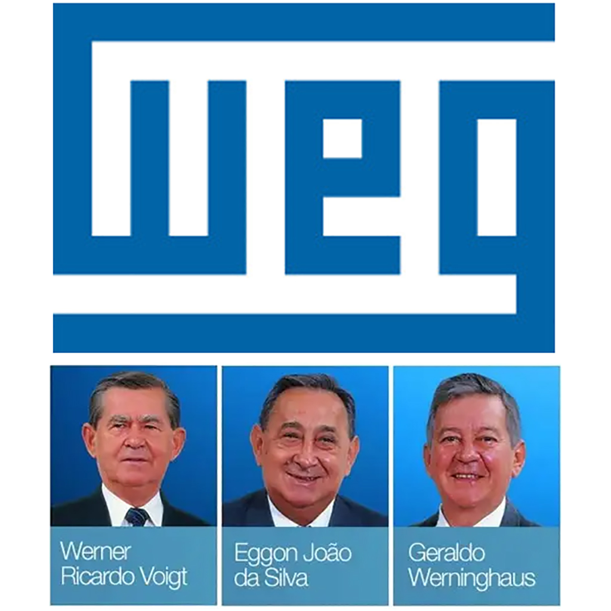
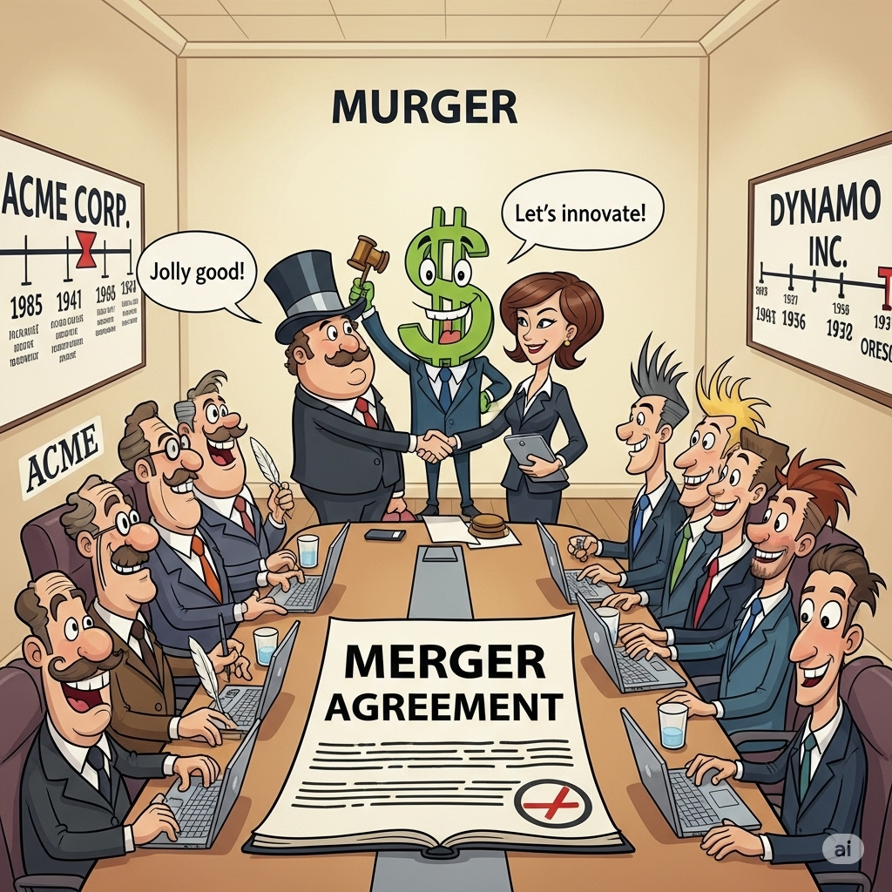
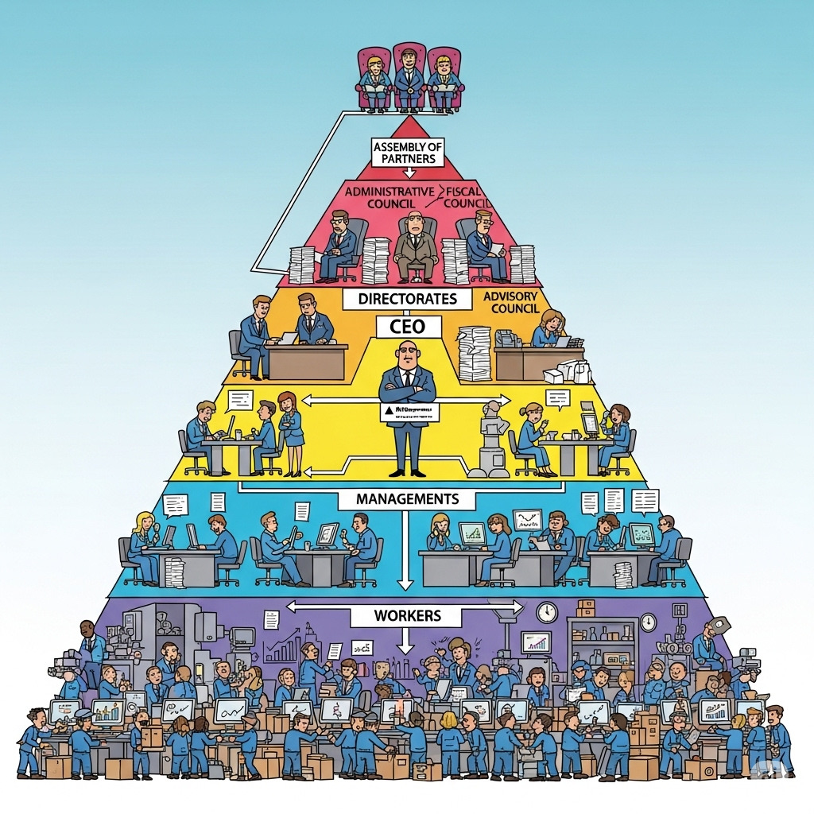

# Governança Corporativa - O topo da Pirâmide

#### 12/08/2025 - Campus Marquês {.unnumbered}

#### 13/08/2025 - Campus Chácara {.unnumbered}

------------------------------------------------------------------------

## O que é Governança Corporativa

No livro "Governança Corporativa", os autores **José Paschoal Rossetti e Adriana Andrade** dão a seguinte definição para Governaça Corporativa:

> **Um sistema pelo qual as sociedades empresárias são dirigidas e monitoradas, envolvendo os relacionamentos entre sócios/cotistas, conselho de administração, diretoria, auditoria independente e conselho fiscal. -** *Rossetti e Andrade -*

a

## Quais motivos criam a necessidade de Governança Corporativa ?

-   Quantidade de funcionários da empresa ?
-   Tamanho da corporação ?
-   Ramo de atividade da empresa ?
-   Faturamento mensal/anual da empresa ?

{width="259"} \| {width="122"}

------------------------------------------------------------------------

## O principal fator é o número efetivo ou potencial de sócios

-   **Efetivo:** NÚMERO DE SÓCIOS

| EFETIVO CASO DE GRANDE NÚMERO DE SÓCIOS |   |
|:--:|----|
| ***EMPRESA S/A (CAPITAL ABERTO)*** |  |

------------------------------------------------------------------------

## O principal fator é o número efetivo ou potencial de sócios

-   **Potencial:** futuro número de sócios !

    | POTENCIAL CASO DE AUMENTO DE SÓCIOS |   |
    |:--:|:--:|
    | **FUSÕES** | {width="237"} |
    | **AQUISIÇÕES** |  |
    | **INCORPORAÇÕES** |  |
    | **SUCESSÃO FAMILIAR** | {width="188"} |

------------------------------------------------------------------------

## Casos que normalmente demandam arquitetura de governança corporativa

-   Sucessão familiar que amplie significativamente o número de sócios\
    *(filhos – 1ª geração –, netos – 2ª geração – etc.)*

    {width="547"}

-   Fusão ou incorporação que amplie o número de acionistas ou cotistas

-   Sociedade que já nasça com grande número de acionistas ou cotistas

------------------------------------------------------------------------

## Arquitetura de Governança

-   Topo - Assembléia de Acionistas/Cotistas

-   2o Degrau - Conselhos (Administrativo, Fiscal e Consultivo)

-   3o Degrau - CEO

-   4o Degrau - Diretorias

------------------------------------------------------------------------

### ARQUÉTIPOS de Governança Corporativa

-   **SEPARAÇÃO DE PROPRIEDADE E GESTÃO**

-   Anglo-Saxão

-   Alemão

-   Francês

-   Japonês

-   Latino-Americano

------------------------------------------------------------------------

#### Modelo Anglo-Saxão de Governança Corporativa

{width="143"}

### Características definidoras

**Financiamento predominante** - Fonte principal: mercado de capitais - Ações (equity) como base da capitalização - Fundos de pensão com grande parte do patrimônio em ações - Orientação para o mercado

**Propriedade e controle acionário** - Estrutura patrimonial pulverizada - Raros acionistas com mais de 10% do capital nas maiores empresas

**Propriedade e gestão** - Dissociação entre propriedade e gestão

**Conflitos de agência** - Principal conflito: acionistas x gestores - Altos custos de agência

**Proteção legal a minoritários** - Forte, por leis e regulação do mercado

------------------------------------------------------------------------

#### Modelo Alemão de Governança Corporativa

{width="225"}

### Características definidoras

**Financiamento predominante** - Crédito bancário de longo prazo como principal fonte - Relação duradoura com bancos, reduzindo assimetria de informação

**Propriedade e controle acionário** - Estrutura patrimonial concentrada - Bancos e grandes acionistas controlam boa parte do capital

**Propriedade e gestão** - Bancos com grande poder, monitorando interesses dos credores

**Conflitos de agência** - Principal risco: expropriação de minoritários - Conflitos caros são raros

**Proteção legal a minoritários** - Não é prioridade; tendência de fortalecer o mercado de ações

------------------------------------------------------------------------

#### Modelo Japonês de Governança Corporativa

{width="205"}

### Características definidoras

**Financiamento predominante** - Bancos financiam via dívida de longo prazo - Relação duradoura entre bancos e empresas

**Propriedade e controle acionário** - Concentração peculiar: keiretsu com posse cruzada de ações

**Propriedade e gestão** - Sobreposição; predominância do consenso

**Conflitos de agência** - Custos e conflitos insignificantes

**Proteção legal a minoritários** - Sustentação de relações de longo prazo - Gestão voltada a múltiplos interesses

------------------------------------------------------------------------

#### Modelo Francês de Governança Corporativa

{width="198"}

### Características definidoras

**Financiamento predominante** - Indefinido, mas alavancagem relevante - Forte presença de empresas familiares fechadas

**Propriedade e controle acionário** - Controle concentrado

**Propriedade e gestão** - Sobreposição; gestão fechada - Conselhos com função mais consultiva

**Conflitos de agência** - Baixos conflitos devido à concentração - Risco de expropriação de minoritários

**Proteção legal a minoritários** - Fraca, com baixo enforcement - Mercados de capitais pouco desenvolvidos

------------------------------------------------------------------------

#### Modelo Latino-Americano de Governança Corporativa

{width="306"}

### Características definidoras

**Financiamento predominante** - Predomínio da dívida - Mercados de capitais pouco expressivos

**Propriedade e controle acionário** - Propriedade concentrada - Maior participação estrangeira nos últimos anos

**Propriedade e gestão** - Exercida pelos majoritários

**Conflitos de agência** - Entre acionistas majoritários e minoritários

**Proteção legal a minoritários** - Predominantemente fraca - Alta proporção de ações sem voto

## Exercícios

### Testes sobre Modelos de Governança Corporativa

------------------------------------------------------------------------

| Questão 1: |
|----|
| **Qual dos seguintes modelos de governança corporativa tem como principal fonte de financiamento o mercado de capitais, com as ações sendo a base da capitalização?** |
| a) Modelo Alemão |
| b) Modelo Anglo-Saxão |
| c) Modelo Japonês |
| d) Modelo Latino-Americano |
| e) Modelo Francês |

------------------------------------------------------------------------

| Questão 2: |
|----|
| **A estrutura de propriedade pulverizada, onde são raros os acionistas com mais de 10% do capital, é uma característica definidora de qual modelo?** |
| a) Modelo Alemão |
| b) Modelo Japonês |
| c) Modelo Francês |
| d) Modelo Anglo-Saxão |
| e) Modelo Latino-Americano |

------------------------------------------------------------------------

| **Questão 3:** |
|----|
| **Em qual modelo o conflito de agência fundamental ocorre entre acionistas e gestores, devido à separação entre propriedade e gestão?** |
| a) Modelo Latino-Americano |
| b) Modelo Japonês |
| c) Modelo Anglo-Saxão |
| d) Modelo Alemão |
| e) Modelo Francês |

------------------------------------------------------------------------

| **Questão 4:** |
|----|
| **O 'keiretsu', um grupo de empresas relacionadas pela posse cruzada de ações, é uma característica do controle acionário de qual modelo?** |
| a) Modelo Alemão |
| b) Modelo Anglo-Saxão |
| c) Modelo Francês |
| d) Modelo Latino-Americano |
| e) Modelo Japonês |

------------------------------------------------------------------------

| **Questão 5:** |
|----|
| **Qual modelo é caracterizado por uma fraca proteção legal aos acionistas minoritários, alta proporção de ações sem direito a voto e gestão exercida pelos acionistas majoritários?** |
| a) Modelo Anglo-Saxão |
| b) Modelo Alemão |
| c) Modelo Japonês |
| d) Modelo Latino-Americano |
| e) Modelo Francês |

------------------------------------------------------------------------

| **Questão 6:** |
|----|
| **O poder proeminente dos bancos, que monitoram os interesses dos credores e estabelecem relações duradouras com as empresas, é uma marca de qual modelo de governança?** |
| a) Modelo Alemão |
| b) Modelo Anglo-Saxão |
| c) Modelo Latino-Americano |
| d) Modelo Francês |
| e) Modelo Japonês |

------------------------------------------------------------------------

| **Questão 7:** |
|----|
| **Em qual dos modelos a sobreposição entre propriedade e gestão é a norma, com conflitos de agência sendo considerados 'insignificantes'?** |
| a) Modelo Anglo-Saxão |
| b) Modelo Japonês |
| c) Modelo Alemão |
| d) Modelo Francês |
| e) Modelo Latino-Americano |

------------------------------------------------------------------------

| **Questão 8:** |
|----|
| **A fraca proteção a minoritários, típica do Direito Civil francês e com baixo *enforcement*, resultando em mercados de capitais pouco desenvolvidos, é a descrição de qual modelo?** |
| a) Modelo Latino-Americano |
| b) Modelo Anglo-Saxão |
| c) Modelo Alemão |
| d) Modelo Francês |
| e) Modelo Japonês |

------------------------------------------------------------------------

| **Questão 9:** |
|----|
| **Qual é a principal diferença entre o conflito de agência do modelo Anglo-Saxão e o do modelo Latino-Americano?** |
| a) No Anglo-Saxão o conflito é entre credores e acionistas; no Latino-Americano é entre gestores e governo. |
| b) Não há diferenças significativas, ambos focam no conflito entre gestores e acionistas. |
| c) No Anglo-Saxão o conflito é entre acionistas e gestores; no Latino-Americano é entre acionistas majoritários e minoritários. |
| d) No Anglo-Saxão o conflito é insignificante; no Latino-Americano é muito alto. |
| e) No Anglo-Saxão o conflito é entre a empresa e os bancos; no Latino-Americano é entre as famílias controladoras. |

------------------------------------------------------------------------

| **Questão 10:** |
|----|
| **Comparando os modelos Alemão e Japonês, o que eles têm em comum em relação ao financiamento predominante?** |
| a) Ambos dependem primariamente do mercado de capitais e da emissão de ações. |
| b) Ambos têm um financiamento indefinido, com forte presença de empresas familiares. |
| c) Ambos são financiados predominantemente por dívidas, com os bancos desempenhando um papel central e estabelecendo relações duradouras com as corporações. |
| d) Ambos proíbem o financiamento via dívida, focando apenas em recursos próprios. |
| e) Ambos possuem mercados de capitais muito expressivos, que superam o financiamento bancário. |

------------------------------------------------------------------------

## Respostas dos exercícios

| Teste | Resposta |
|-------|----------|
| 1     | b        |
| 2     | d        |
| 3     | c        |
| 4     | e        |
| 5     | d        |
| 6     | a        |
| 7     | b        |
| 8     | d        |
| 9     | c        |
| 10    | c        |

## Referências

ROSSETTI, José Paschoal; ANDRADE, Adriana. *Governança Corporativa: Fundamentos, Desenvolvimento e Tendências*. São Paulo: Atlas, 7. ed., 2014. p. s.p.
