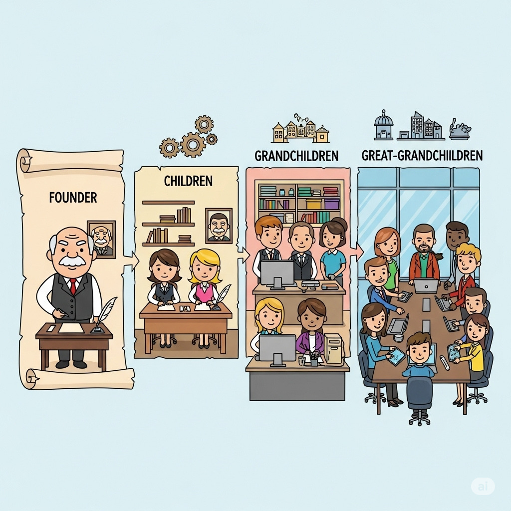

# Governança Corporativa - O topo da Pirâmide

#### 12/08/2025 - Campus Marquês {.unnumbered}

#### 13/08/2025 - Campus Chácara {.unnumbered}

------------------------------------------------------------------------

## O que é Governança Corporativa

Governança corporativa lida com o **processo decisório na alta gestão** e com os **relacionamentos** entre os principais personagens das organizações empresariais, notadamente **executivos**, **conselheiros** e **acionistas/cotistas**.

No livro "Governança Corporativa", os autores **José Paschoal Rossetti e Adriana Andrade** dão a seguinte definição para Governaça Corporativa:

> ***Um sistema pelo qual as sociedades empresárias são dirigidas e monitoradas, envolvendo os relacionamentos entre sócios/cotistas, conselho de administração, diretoria, auditoria independente e conselho fiscal*****. -** (Rossetti e Andrade - 2014*)*

Instituto Brasileiro de Governança Corporativa , **IBGC,** define governança corporativa como

> “***Sistema no qual as empresas são dirigidas, monitoradas e incentivadas envolvendo os relacionamentos entre sócios, conselho de administração, diretoria, órgãos de fiscalização e controle e demais partes interessadas***”. (IBGC, 2015)

No livro "Governança Corporativa no Brasil e no Mundo: Teoria e Prática", o autor **Alexandre Di Miceli da Silveira** fornece a seguinte definição para Governança Corporativa:

> ***"O conjunto de mecanismos que visam a fazer com que as decisões corporativas sejam sempre tomadas com a finalidade de maximizar a perspectiva de geração de valor de longo prazo para o negócio"*** (Di Miceli, Alexandre - 2021)

## Quais motivos criam a necessidade de Governança Corporativa ?

Os mecanismos de governança devem estar presentes em qualquer companhia em função da existência de três potenciais problemas na cúpula das empresas: conflito de interesses, limitações técnicas individuais e vieses cognitivos.

+---------------------------------+
| Os "3 Problemas" da alta cúpula |
+=================================+
| -   Conflito de Interesses      |
+---------------------------------+
| -   Limitações Técnicas         |
+---------------------------------+
| -   Viés Cognitivo              |
+---------------------------------+

: Mas nem todas as empresas vão apresentar necessidade imediata de implantação de uma estrutura de Governança Corporativa. Existem cenários uma característica torna a necessidade da implantação imediata.

Mas qual seria(m) essa(s) característica(s) ?

-   Quantidade de funcionários da empresa ?
-   Tamanho da corporação ?
-   Ramo de atividade da empresa ?
-   Faturamento mensal/anual da empresa ?

+----------------------------------------------------------+-----------------------------------------+-------------------------------------------------+
| CACAU SHOW                                               | WEG                                     | TRAMONTINA                                      |
+:========================================================:+:=======================================:+:===============================================:+
| MENOS DE 10 SÓCIOS                                       | 3 SÓCIOS FUNDADORES                     | 1 CASAL FUNDADOR - MARIDO SÓCIO ADMINISTRADOR   |
+----------------------------------------------------------+-----------------------------------------+-------------------------------------------------+
| EMPRESA FAMILIAR                                         | EMPRESA LIVRE INICIATIVA                | EMPRESA FAMILIAR                                |
+----------------------------------------------------------+-----------------------------------------+-------------------------------------------------+
| CAPITAL FECHADO - 2025                                   | CAPITAL ABERTO DESDE ANOS 1970          | CAPITAL FECHADO                                 |
+----------------------------------------------------------+-----------------------------------------+-------------------------------------------------+
|  |  |  |
+----------------------------------------------------------+-----------------------------------------+-------------------------------------------------+

------------------------------------------------------------------------

## O principal fator é o número efetivo ou potencial de sócios

-   **Efetivo:** NÚMERO DE SÓCIOS

|                                                              |
|:------------------------------------------------------------:|
|                        **PETROBRÁS**                         |
|            MUITOS, MUITOS SÓCIOS - CAPITAL ABERTO            |
|               EMPRESA SOCIEDADE ANÔNIMA (S/A)                |
| GOVERNO FEDERAL É O MAIOR ACIONISTA ( MAIS DE 50% DAS AÇÕES) |
|                 |

------------------------------------------------------------------------

## O principal fator é o número efetivo ou potencial de sócios

-   **Potencial:** futuro número de sócios !

    +-------------------------------------+--------------------------------------------------------------------+
    | POTENCIAL CASO DE AUMENTO DE SÓCIOS |                                                                    |
    +:===================================:+:==================================================================:+
    | **FUSÕES**                          | {width="237"} |
    +-------------------------------------+--------------------------------------------------------------------+
    | **AQUISIÇÕES**                      |                                                                    |
    +-------------------------------------+--------------------------------------------------------------------+
    | **INCORPORAÇÕES**                   |                                                                    |
    +-------------------------------------+--------------------------------------------------------------------+
    | **SUCESSÃO FAMILIAR**               | {width="188"} |
    +-------------------------------------+--------------------------------------------------------------------+

------------------------------------------------------------------------

## Casos que normalmente demandam arquitetura de governança corporativa

-   Sucessão familiar que amplie significativamente o número de sócios\
    *(filhos – 1ª geração –, netos – 2ª geração – etc.)*

    {width="547"}

-   Fusão ou incorporação que amplie o número de acionistas ou cotistas

-   Sociedade que já nasça com grande número de acionistas ou cotistas

------------------------------------------------------------------------

## Arquitetura de Governança

-   Topo - Assembléia de Acionistas/Cotistas

-   2o Degrau - Conselhos (Administrativo, Fiscal e Consultivo)

-   3o Degrau - CEO

-   4o Degrau - Diretorias

------------------------------------------------------------------------

## ARQUÉTIPOS DA GOVERNANÇA CORPORATIVA

-   **SEPARAÇÃO DE PROPRIEDADE E GESTÃO**

-   Anglo-Saxão

-   Alemão

-   Francês

-   Japonês

-   Latino-Americano

------------------------------------------------------------------------

#### Modelo Anglo-Saxão de Governança Corporativa

{width="143"}

### Características definidoras

**Financiamento predominante** - Fonte principal: mercado de capitais - Ações (equity) como base da capitalização - Fundos de pensão com grande parte do patrimônio em ações - Orientação para o mercado

**Propriedade e controle acionário** - Estrutura patrimonial pulverizada - Raros acionistas com mais de 10% do capital nas maiores empresas

**Propriedade e gestão** - Dissociação entre propriedade e gestão

**Conflitos de agência** - Principal conflito: acionistas x gestores - Altos custos de agência

**Proteção legal a minoritários** - Forte, por leis e regulação do mercado

------------------------------------------------------------------------

#### Modelo Alemão de Governança Corporativa

{width="225"}

### Características definidoras

**Financiamento predominante** - Crédito bancário de longo prazo como principal fonte - Relação duradoura com bancos, reduzindo assimetria de informação

**Propriedade e controle acionário** - Estrutura patrimonial concentrada - Bancos e grandes acionistas controlam boa parte do capital

**Propriedade e gestão** - Bancos com grande poder, monitorando interesses dos credores

**Conflitos de agência** - Principal risco: expropriação de minoritários - Conflitos caros são raros

**Proteção legal a minoritários** - Não é prioridade; tendência de fortalecer o mercado de ações

------------------------------------------------------------------------

#### Modelo Japonês de Governança Corporativa

{width="205"}

### Características definidoras

**Financiamento predominante** - Bancos financiam via dívida de longo prazo - Relação duradoura entre bancos e empresas

**Propriedade e controle acionário** - Concentração peculiar: keiretsu com posse cruzada de ações

**Propriedade e gestão** - Sobreposição; predominância do consenso

**Conflitos de agência** - Custos e conflitos insignificantes

**Proteção legal a minoritários** - Sustentação de relações de longo prazo - Gestão voltada a múltiplos interesses

------------------------------------------------------------------------

#### Modelo Francês de Governança Corporativa

{width="198"}

### Características definidoras

**Financiamento predominante** - Indefinido, mas alavancagem relevante - Forte presença de empresas familiares fechadas

**Propriedade e controle acionário** - Controle concentrado

**Propriedade e gestão** - Sobreposição; gestão fechada - Conselhos com função mais consultiva

**Conflitos de agência** - Baixos conflitos devido à concentração - Risco de expropriação de minoritários

**Proteção legal a minoritários** - Fraca, com baixo enforcement - Mercados de capitais pouco desenvolvidos

------------------------------------------------------------------------

#### Modelo Latino-Americano de Governança Corporativa

{width="306"}

### Características definidoras

**Financiamento predominante** - Predomínio da dívida - Mercados de capitais pouco expressivos

**Propriedade e controle acionário** - Propriedade concentrada - Maior participação estrangeira nos últimos anos

**Propriedade e gestão** - Exercida pelos majoritários

**Conflitos de agência** - Entre acionistas majoritários e minoritários

**Proteção legal a minoritários** - Predominantemente fraca - Alta proporção de ações sem voto

## Exercícios

### Testes sobre Modelos de Governança Corporativa

------------------------------------------------------------------------

Livro [Governança Corporativa no Brasil e no Mundo: Teoria e Prática - Alexandre Di Miceli da SILVEIRA](https://pdfcoffee.com/governana-corporativa-no-brasil-e-no-mundo-pdf-free.html)

Exercícios referentes ao capítulo 1 - Introdução à Governança Corporativa - pág 3 a 6 - Exercícios referentes ao capítulo 2 - Capítulo 2 – Estrutura de Governança Corporativa - pág 37 a 40 -

+-----------------------------------------------------------------------------------------------------------------------------------------------------------------------+
| Questão 1:                                                                                                                                                            |
+=======================================================================================================================================================================+
| **Qual dos seguintes modelos de governança corporativa tem como principal fonte de financiamento o mercado de capitais, com as ações sendo a base da capitalização?** |
+-----------------------------------------------------------------------------------------------------------------------------------------------------------------------+
| a)  Reduzir custos operacionais internos.                                                                                                                             |
+-----------------------------------------------------------------------------------------------------------------------------------------------------------------------+
| b)  Aumentar o valor da sociedade, facilitar acesso ao capital e garantir perenidade. \|                                                                              |
+-----------------------------------------------------------------------------------------------------------------------------------------------------------------------+
| c)  Eliminar a necessidade de auditoria independente.                                                                                                                 |
+-----------------------------------------------------------------------------------------------------------------------------------------------------------------------+
| d)  Diminuir a participação dos acionistas minoritários.                                                                                                              |
+-----------------------------------------------------------------------------------------------------------------------------------------------------------------------+
| e)  Facilitar apenas a sucessão familiar.                                                                                                                             |
+-----------------------------------------------------------------------------------------------------------------------------------------------------------------------+

------------------------------------------------------------------------

| **Questão 2**                                               |
|-------------------------------------------------------------|
| **A implantação de governança corporativa não depende de:** |
| a) Tamanho da empresa.                                      |
| b) Número efetivo ou potencial de sócios.                   |
| c) Fusões ou incorporações.                                 |
| d) Sucessão familiar.                                       |
| e) Aumento de acionistas minoritários.                      |

------------------------------------------------------------------------

+-------------------------------------------------------------------------------------------------------+
| **Questão 3**                                                                                         |
+=======================================================================================================+
| **Qual é o principal fator para decidir quando implantar uma arquitetura de governança corporativa?** |
+-------------------------------------------------------------------------------------------------------+
| a)  Lucro líquido.                                                                                    |
+-------------------------------------------------------------------------------------------------------+
| b)  Valor de mercado da empresa.                                                                      |
+-------------------------------------------------------------------------------------------------------+
| c)  Número efetivo ou potencial de sócios.                                                            |
+-------------------------------------------------------------------------------------------------------+
| d)  Estrutura de capital de giro.                                                                     |
+-------------------------------------------------------------------------------------------------------+
| e)  Taxa de juros do mercado.                                                                         |
+-------------------------------------------------------------------------------------------------------+

------------------------------------------------------------------------

+-------------------------------------------------------------------------------------+
| **Questão 4**                                                                       |
+=====================================================================================+
| **A sucessão familiar que amplia o número de sócios é um caso típico que demanda:** |
+-------------------------------------------------------------------------------------+
| a)  Expansão internacional.                                                         |
+-------------------------------------------------------------------------------------+
| b)  Arquitetura de governança corporativa.                                          |
+-------------------------------------------------------------------------------------+
| c)  Troca de CEO.                                                                   |
+-------------------------------------------------------------------------------------+
| d)  Criação de novas subsidiárias.                                                  |
+-------------------------------------------------------------------------------------+
| e)  Aumento do capital social.                                                      |
+-------------------------------------------------------------------------------------+

------------------------------------------------------------------------

Livro [Governança Corporativa no Brasil e no Mundo: Teoria e Prática - Alexandre Di Miceli da SILVEIRA](https://pdfcoffee.com/governana-corporativa-no-brasil-e-no-mundo-pdf-free.html)

Exercícios referentes ao Capítulo 3 – Modelos de Governança Corporativa no Mundo - pág 71 a 85 - - Modelo Anglo-Saxão - pág 71 - 74 - Modelo Alemão - pág 74 - 77 - Modelo Japonês - pág 77 - 80 - Modelo Francês - pág 80 - 82 - Modelo Latino-Americano - pág 82 - 85

------------------------------------------------------------------------

+----------------------------------------------------------------------------------+
| **Questão 5**                                                                    |
+==================================================================================+
| **No modelo anglo-saxão, a principal fonte de financiamento das corporações é:** |
+----------------------------------------------------------------------------------+
| a)  Crédito bancário de longo prazo.                                             |
+----------------------------------------------------------------------------------+
| b)  Mercado de capitais.                                                         |
+----------------------------------------------------------------------------------+
| c)  Recursos familiares.                                                         |
+----------------------------------------------------------------------------------+
| d)  Capital estatal.                                                             |
+----------------------------------------------------------------------------------+
| e)  Dívida de fornecedores.                                                      |
+----------------------------------------------------------------------------------+
| e)  Aumento do capital social.                                                   |
+----------------------------------------------------------------------------------+

------------------------------------------------------------------------

+----------------------------------------------------------------------+
| **Questão 6**                                                        |
+======================================================================+
| **No modelo alemão, o papel dos bancos é:**                          |
+----------------------------------------------------------------------+
| a)  Inexistente, pois prevalece a pulverização acionária.            |
+----------------------------------------------------------------------+
| b)  Secundário em relação aos fundos de pensão.                      |
+----------------------------------------------------------------------+
| c)  Central, como principais financiadores e monitores das empresas. |
+----------------------------------------------------------------------+
| d)  Consultivo, apenas assessorando conselhos.                       |
+----------------------------------------------------------------------+
| e)  Exclusivamente regulatório.                                      |
+----------------------------------------------------------------------+
|                                                                      |
+----------------------------------------------------------------------+

------------------------------------------------------------------------

+------------------------------------------------------------------------+
| **Questão 7**                                                          |
+========================================================================+
| **No modelo japonês, a estrutura de propriedade é caracterizada por:** |
+------------------------------------------------------------------------+
| a)  Total pulverização acionária.                                      |
+------------------------------------------------------------------------+
| b)  Forte controle estatal.                                            |
+------------------------------------------------------------------------+
| c)  Grupos keiretsu com posse cruzada de ações.                        |
+------------------------------------------------------------------------+
| d)  Predomínio de fundos de pensão.                                    |
+------------------------------------------------------------------------+
| e)  Participação estrangeira majoritária.                              |
+------------------------------------------------------------------------+
|                                                                        |
+------------------------------------------------------------------------+

------------------------------------------------------------------------

+---------------------------------------------------------------------------+
| **QUESTÃO 8**                                                             |
+===========================================================================+
| **No modelo francês, o conflito de agência é reduzido porque:**           |
+---------------------------------------------------------------------------+
| a)  A gestão é totalmente terceirizada.                                   |
+---------------------------------------------------------------------------+
| b)  Há forte proteção aos minoritários.                                   |
+---------------------------------------------------------------------------+
| c)  A concentração patrimonial gera sobreposição de propriedade e gestão. |
+---------------------------------------------------------------------------+
| d)  A legislação é baseada no modelo anglo-saxão.                         |
+---------------------------------------------------------------------------+
| e)  O mercado de capitais é muito desenvolvido.                           |
+---------------------------------------------------------------------------+
|                                                                           |
+---------------------------------------------------------------------------+

------------------------------------------------------------------------

+--------------------------------------------------------------------------------------+
| **Questão 9**                                                                        |
+======================================================================================+
| **No modelo latino-americano (brasileiro), qual é o principal conflito de agência?** |
+--------------------------------------------------------------------------------------+
| a)  Entre acionistas e gestores.                                                     |
+--------------------------------------------------------------------------------------+
| b)  Entre bancos e credores.                                                         |
+--------------------------------------------------------------------------------------+
| c)  Entre acionistas majoritários e minoritários.                                    |
+--------------------------------------------------------------------------------------+
| d)  Entre conselhos e diretoria executiva.                                           |
+--------------------------------------------------------------------------------------+
| e)  Entre empresas familiares e fundos de pensão.                                    |
+--------------------------------------------------------------------------------------+

------------------------------------------------------------------------

| **QUESTÃO 10**                                                   |
|------------------------------------------------------------------|
| **Em relação à proteção legal dos acionistas minoritários:**     |
| a) É forte e predominante no modelo latino-americano.            |
| b) É pouco relevante no modelo japonês.                          |
| c) É expressiva e garantida por regulação no modelo anglo-saxão. |
| d) É garantida pela concentração patrimonial no modelo francês.  |
| e) É inexistente no modelo alemão.                               |

------------------------------------------------------------------------

## Respostas dos exercícios

+-----------+--------------------------------------------------------------------------------------+
| Questão   | Alternativa Correta                                                                  |
+===========+======================================================================================+
| **1**     | b)  Aumentar o valor da sociedade, facilitar acesso ao capital e garantir perenidade |
+-----------+--------------------------------------------------------------------------------------+
| **2**     | a)  Tamanho da empresa                                                               |
+-----------+--------------------------------------------------------------------------------------+
| **3**     | c)  Número efetivo ou potencial de sócios                                            |
+-----------+--------------------------------------------------------------------------------------+
| **4**     | b)  Arquitetura de governança corporativa                                            |
+-----------+--------------------------------------------------------------------------------------+
| **5**     | b)  Mercado de capitais                                                              |
+-----------+--------------------------------------------------------------------------------------+
| **6**     | c)  Central, como principais financiadores e monitores das empresas                  |
+-----------+--------------------------------------------------------------------------------------+
| **7**     | c)  Grupos keiretsu com posse cruzada de ações                                       |
+-----------+--------------------------------------------------------------------------------------+
| **8**     | c)  A concentração patrimonial gera sobreposição de propriedade e gestão             |
+-----------+--------------------------------------------------------------------------------------+
| **9**     | c)  Entre acionistas majoritários e minoritários                                     |
+-----------+--------------------------------------------------------------------------------------+
| **10**    | c)  É expressiva e garantida por regulação no modelo anglo-saxão                     |
+-----------+--------------------------------------------------------------------------------------+

## Referências

ROSSETTI, José Paschoal; ANDRADE, Adriana. *Governança Corporativa: Fundamentos, Desenvolvimento e Tendências*. São Paulo: Atlas, 7. ed., 2014. p. s.p.

SILVEIRA, Alexandre Di Miceli da. *Governança Corporativa no Brasil e no Mundo: Teoria e Prática*. Rio de Janeiro: Elsevier, 2010.
