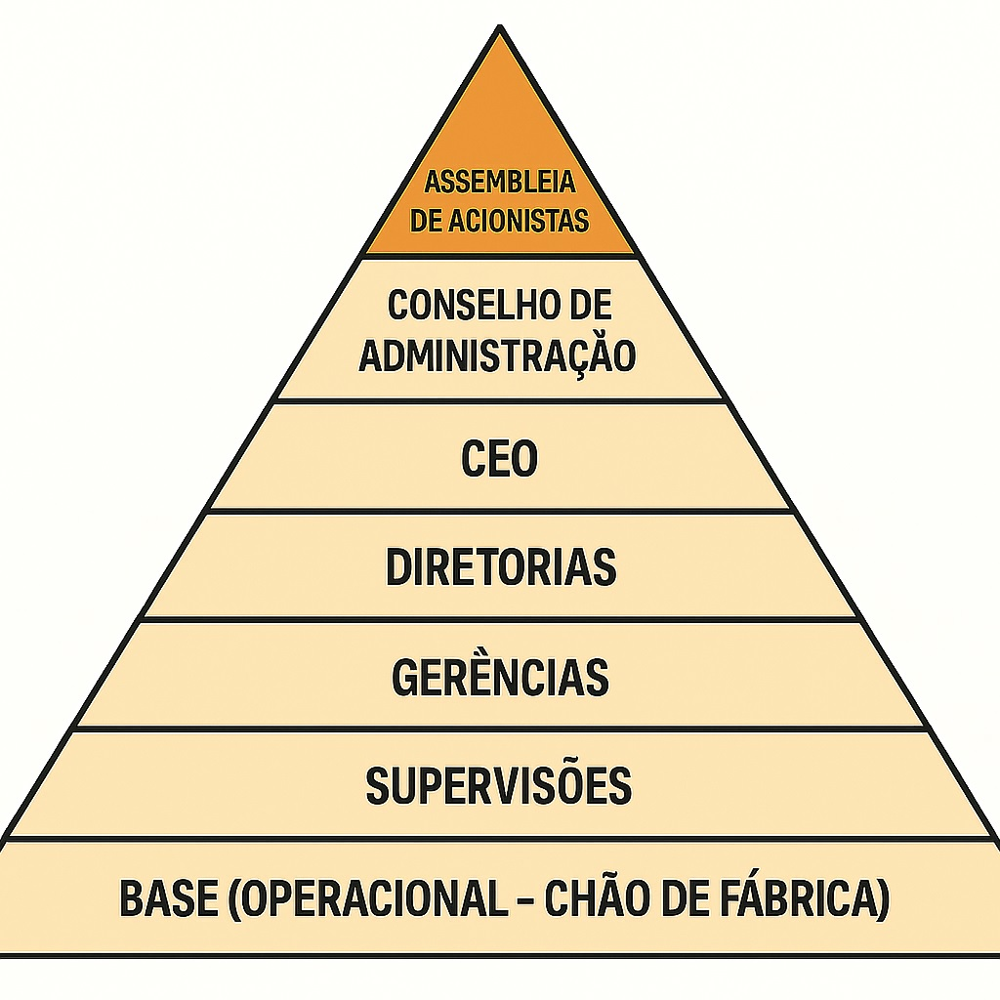
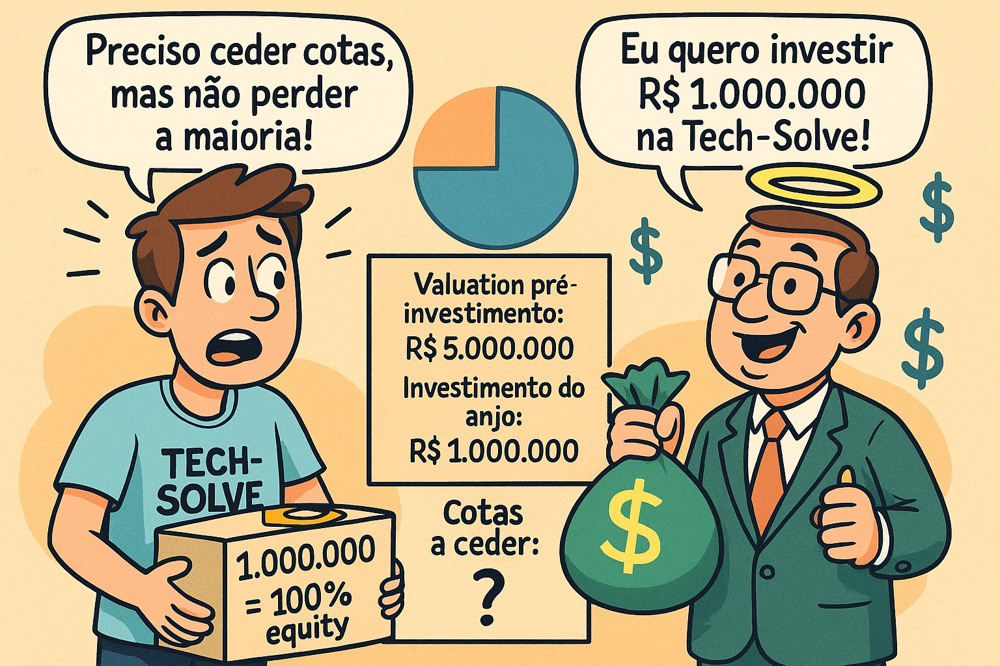
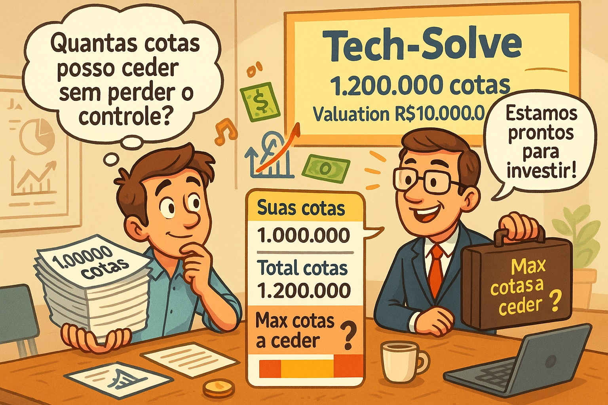

# Governança Corporativa - Assembléia dos Proprietários

#### 19/08/2025 - Campus Marquês {.unnumbered}

#### 20/08/2025 - Campus Chácara {.unnumbered}

### Livro "Governança Corporativa"

#### capítulo "A Assembleia Geral no processo de governança", pág 267

## **A Assembleia Geral**

{width="513"}

{width="515"}

É definida como a **reunião de acionistas ou cotistas**.

É considerada o **órgão soberano da organização**.

## **Principais Competências da Assembleia Geral**

As competências destacadas da Assembleia Geral incluem:

-   **Aumentar ou reduzir o capital social** e **reformar o estatuto/contrato social**.

-   **Eleger ou destituir**, a qualquer tempo, **conselheiros de administração e fiscais**.

-   Tomar, anualmente, as **contas dos administradores** e deliberar sobre as **demonstrações financeiras**.

-   Deliberar sobre **transformação, fusão, incorporação, cisão, dissolução e liquidação da sociedade**.

-   Deliberar sobre a **avaliação de bens** que venham a integralizar o capital social.

-   **Aprovar a remuneração dos administradores**.

## **Frequência e Modalidade das Assembleias**

A Assembleia Geral pode ser de dois tipos, elecandos abaixo:

### **Assembleia Geral Ordinária (AGO)**

Ocorre uma vez por ano com o objetivo de **aprovar as contas do exercício e o planejamento do ano seguinte**.

### **Assembleia Geral Extraordinária (AGE)**

Pode ocorrer a qualquer momento, **sendo convocada por administradores ou acionistas/cotistas**, de acordo com as regras previstas no estatuto social.

------------------------------------------------------------------------

## Participação Patromonial na empresa (Equity)

{width="222"}

#### Como calcular EQUITY após uma rodada de investimentos

Como um acionista pode calcular sua participação na empresa após uma rodada de investimentos ?

Basicamente, podemos fazer-lo aplicado a fórmula:

#### Participação percentual do sócio pós-seção de participação ao investidor

$$
Porcentagem\_Participacao\_Sócio\_Pós\_Investimento = \frac{Porcentagem\_Participacao\_Pré\_Investimento}{(1 - Participacao\_Percentual\_Investidor)}
$$

#### Participação percentual do investidor pós-investimento monetário

$$
Participação\_Percentual\_\_Investidor = (\frac{ Dinheiro\_Investido}{ CapitalSocial\_Pós\_Investimento}) * 100%
$$

## Equity - caso FACEBOOK

<https://www.youtube.com/watch?v=YR4eE9TVq44&t=194s>

{width="676"}

|  |  |
|----|----|
| {width="330" height="413"} | {width="380"} |

| Data (Estim) | Evento Chave | Equity Saverin(Estim) | Contexto e Ação |
|----|----|----|----|
| Fevereiro de 2004 | Fundação do Facebook | 30% a 34% | **Eduardo Saverin** investe **US\$ 15 mil** para ajudar a fundar a empresa. **Sua participação é a maior entre os sócios**, atrás apenas de **Mark Zuckerberg**. |
| Metade de 2004 | Mudança para Palo Alto | \< 30% | Desentendimentos entre Zuckerberg e Saverin. Zuckerberg começa a buscar novos investidores e a estruturar a empresa legalmente para uma nova rodada de investimento. |
| Junho de 2004 | Aporte de Peter Thiel | \~20% a 25% | **Peter Thiel** e **Reid Hoffman** (investidores-anjo) injetam **US\$ 500 mil** no Facebook. Esta é a primeira rodada de investimento que causa a diluição da participação dos fundadores. |
| Final de 2004 | Reestruturação e Exclusão | \< 10% | **Zuckerberg** cria uma **nova entidade legal** ("Thefacebook, Inc."), emite novas ações e, de forma controversa, **dilui a participação de Saverin** a uma porcentagem mínima **sem seu consentimento**. |
| Maio de 2005 | Rodada de Série A | \~10% | A **Accel Partners** e o co-fundador da PayPal investem **US\$ 12,7 milhões** na empresa. **Ações adicionais são emitidas**, **diluindo ainda mais todos os fundadores**, incluindo **Saverin**. |
| Setembro de 2005 | Processo Judicial de Saverin | \~10% | **Saverin** processa **Zuckerberg** e o Facebook, alegando que **foi diluído de forma ilegal** e **quebra de contrato**. |
| 2006 | Rodada de Série B | \< 10% | **Accel Partners**, **Greylock Partners** e outros **investem US\$ 27,5 milhões**. A diluição continua. |
| 2007 | Rodada da Microsoft | \< 5% | **A Microsoft investe US\$ 240 milhões**, avaliando o **Facebook em US\$ 15 bilhões**. A **emissão de novas ações dilui drasticamente a participação de todos os sócios**. |
| 2008 | Acordo com Saverin | \~4% | Saverin e Zuckerberg chegam a um acordo extrajudicial. Os termos exatos não são revelados, mas é noticiado que Saverin recebe uma quantia em dinheiro, suas ações são restauradas, e ele é readmitido como cofundador. |
| Maio de 2012 | IPO do Facebook | \~2% | No momento da **Oferta Pública Inicial (IPO)**, a participação de Saverin é amplamente divulgada como **estando em torno de 2%**. O **valor de sua fatia é estimado em cerca de US\$ 4 bilhões**. |
|  |  |  |  |

------------------------------------------------------------------------

## Exemplo

------------------------------------------------------------------------

## Exercício Resolvido 1

(Etapa 2 de Investimento: tipo Seed Capital -\> Investidor "Anjo")

{width="684"}

+-------------------------------------------------------------------------------------------------------------------------------------------------------------------------------------------------------------------------------------------------------------------------------------------------------------------------------------------------------------------------------------+
| EXEMPLO 1 - Você é o único fundador da startup "**Tech-Solve**" e possui 1.000.000 (um mihão) de cotas da empresa, que representam 100% do **EQUITY**. Um investidor anjo (seed capital) se interessa em investir. O valuation (valor da empresa antes do investimento) é de **R\$ 5.000.000,00** . O investidor quer injetar um capital de **R\$ 1.000.000** na empresa. Descubra: |
|                                                                                                                                                                                                                                                                                                                                                                                     |
| I)  Com quantas cotas o fundador original ficou após o aporte (investimento) de R\$ 1.000.000,00 (um milhão de reiais) ?                                                                                                                                                                                                                                                            |
|                                                                                                                                                                                                                                                                                                                                                                                     |
| II) Qual a participação no Capital Social da empresa de cada sócio após o investimento ?                                                                                                                                                                                                                                                                                            |
|                                                                                                                                                                                                                                                                                                                                                                                     |
| III) Quantas cotas receberá o investidor ( então novo sócio da **Tech-Solve**) após o seu investimento ?                                                                                                                                                                                                                                                                            |
|                                                                                                                                                                                                                                                                                                                                                                                     |
| IV) Qual o valor máximo que um investidor poderia aportar (colocar na empresa), sem que o dono original perca a majoridade ?                                                                                                                                                                                                                                                        |
|                                                                                                                                                                                                                                                                                                                                                                                     |
| Para **não perder a maioria**, qual o **número máximo de cotas** você pode ceder a ele, considerando que cada cota tem um valor unitário?                                                                                                                                                                                                                                           |
+-------------------------------------------------------------------------------------------------------------------------------------------------------------------------------------------------------------------------------------------------------------------------------------------------------------------------------------------------------------------------------------+

### Resolução do Exercício I:

#### Item I - Com quantas cotas o fundador original ficou após o aporte (investimento) de R\$ 1.000.000,00 (um milhão de reiais) ?

+-------------------+-----------------+------------------------+---------------------------------------+
| Sócio em Análise  | COTAS ANTES     | INVESTIMENTO           | COTAS DEPOIS                          |
+===================+:===============:+:======================:+:=====================================:+
| Sócio original    | ***1.000.000*** | N/A                    | ***1.000.000***                       |
|                   |                 |                        |                                       |
| (Sócio-Fundador)  |                 |                        |                                       |
+-------------------+-----------------+------------------------+---------------------------------------+
| Sócio atual       | **0**           | ***R\$ 1.000.000,00*** | (ainda não sabemos) - calcular depois |
|                   |                 |                        |                                       |
| (Investidor-Anjo) |                 |                        |                                       |
+-------------------+-----------------+------------------------+---------------------------------------+

#### RESPOSTA ITEM I : "O antigo dono continuar com 1.000.000 (um milhão) de cotas".

------------------------------------------------------------------------

#### Item II - Qual a participação no Capital Social da empresa de cada sócio após o investimento ?

A participação do investidor é a porcentagem que o valor do aporte representa no valor da empresa após o aporte.

+-------------------+------------------------+------------------------+------------------------+
| Sócio em Análise  | CAPITAL SOCIAL ANTES   | INVESTIMENTO           | CAPITAL SOCIAL DEPOIS  |
+===================+:======================:+:======================:+:======================:+
| Sócio original    | ***R\$ 5.000.000,00*** | N/A                    | ***R\$ 5.000.000,00*** |
|                   |                        |                        |                        |
| (Sócio-Fundador)  |                        |                        |                        |
+-------------------+------------------------+------------------------+------------------------+
| Sócio atual       | **R\$ 0,00**           | ***R\$ 1.000.000,00*** | ***R\$ 1.000.000,00*** |
|                   |                        |                        |                        |
| (Investidor-Anjo) |                        |                        |                        |
+-------------------+------------------------+------------------------+------------------------+

: CAPITAL SOCIAL DA EMPRESA Total após o investimento: ***R\$ 6.000.000,00.***

$$
\textbf{INICIALMENTE} \\
\text{ } \\
\text{ Capital Social total ORIGINAL (todo patrimônio do único dono original) } \\ 
R\$ 5.000.000,00 \quad \rightarrow  100\%
\text{ } \\
\text{ } \\
\textbf{AGORA - APÓS ENTRADA DO NOVO SÓCIO} \\
\text{ } \\
\text{Capital Social total FINAL (após o investimento de 1 milhão) } \\ 
R\$ 6.000.000,00  \quad \rightarrow  100\%
$$

6 milhões é o dinheiro dos dois sócios somados. Destes R\$ 6 milhões totais, a parte do sócio original continua sendo R\$ 5 milhões.

Assim podemos usar a regra de 3

$$
\frac{R\$ 6.000.000,00}{R\$ 5.000.000,00} = \frac{100\%}{x}
$$

Resolvendo:

$$
\textbf{Calculando a fatia de participação do dono original.} \\
\text{ } \\
x = \frac{(R\$ 5.000.000,00) \times 100}{R\$ 6.000.000,00} \\
x = (\frac{5}{6}) \times 100 \\
x \quad = \quad (0,8333 \times 100) \quad = \quad 83,33\%  \\
\textbf{Portanto, 83,33% é agora participação de capital social restante ao dono original.} \\
\text{ } \\
ParticipaçãoInvestidor = (\frac{ R$ 1.000.000}{ R$ 6.000.000}) * 100% \\
$$

$$
\text{-----------------------------------------} \\
\text{ CAPITAL SOCIAL DA EMPRESA INICIALMENTE  } \\
\text{-----------------------------------------} \\
\text{ } \\
\text{Capital Social total ORIGINAL todo patrimônio do unico dono original } \rightarrow \text{ R \$ 5.000.000,00 } \rightarrow \text{ 100\% } \\
\text{ } \\
\text{-------------------------------------------------------} \\
\text{ CAPITAL SOCIAL DA EMPRESA  APÓS ENTRADA DO NOVO SÓCIO } \\
\text{-------------------------------------------------------} \\
\text{ } \\
\text{Capital Social total FINAL (após o investimento de 1 MILHÃO ) } \rightarrow \text{ R\$ 6.000.000,00} \rightarrow \text{ 100\% } \\
\text{ } \\
\text{6 milhões é o dinheiro dos DOIS SÓCIOS SOMADOS} \\
\text{ } \\
\text{ } \\
\text{----------------------------------------------------------------} \\
\text{ PARTICIPAÇÃO DO ANTIGO SÓCIO NO NOVO CAPITAL SOCIAL DA EMPRESA } \\
\text{----------------------------------------------------------------} \\
\text{ } \\
\text{ aplicamos Regra de 3 } \\
\text{ } \\
\text{----------------} \\
\qquad\frac{ R\$ 6.000.000,00 }{ R\$ 5.000.000,00}= \frac{ 100 \% }{x} \qquad \Rightarrow \qquad
x=\frac{ [ (R\$ 5.000.000,00) * (100) ] }{ R\$ 6.000.000,00 } \\
\text{ } \\
x=\frac{ 5 }{6} * 100 \\
\text{ } \\
x= (0,833333) * 100 \\
\text{ } \\
x= 83,33\% \\
\text{ O antigo dono, agora um sócio-fundador, possui } \quad \textbf{83,33%} \quad \text{de participação na empresa} \\
\text{ } \\
\text{----------------------------------------------------------------------------------------------} \\
\text{ PARTICIPAÇÃO DO NOVO SÓCIO (o que entrou como investidior) NO NOVO CAPITAL SOCIAL DA EMPRESA } \\
\text{----------------------------------------------------------------------------------------------} \\
\text{ } \\
\text{ aplicando novamente Regra de 3 } \\
\text{ } \\
\text{----------------} \\
\qquad\frac{ R\$ 6.000.000,00 }{ R\$ 1.000.000,00}= \frac{ 100 \% }{x} \qquad \Rightarrow \qquad
x=\frac{ [ (R\$ 1.000.000,00) * (100) ] }{ R\$ 6.000.000,00 } \\
\text{ } \\
x=\frac{ 1 }{6} * 100 \\
\text{ } \\
x= (0,16666666666) * 100 \\
\text{ } \\
x= 16,6666\% \\
\text{ O novo sócio, agora um sócio-investidor, possui } \quad \textbf{16,66%} \quad \text{de participação na empresa} \\
\text{ } \\
$$

+---------------+----------------------------------------------+----------------------------------------------------+
| Sócios        | Posse do Capital Social                      | Posse do Capital Social                            |
|               |                                              |                                                    |
|               | Antes do Investidor ejetar dinheiro (aporte) | Depois do novo investidor ejetar dinheiro (aporte) |
+===============+==============================================+====================================================+
| Dono Original | **100%**                                     | **83,33 %** da participação                        |
+---------------+----------------------------------------------+----------------------------------------------------+
| Novo sócio    | **0%**                                       | **16,67 %** da participação                        |
+---------------+----------------------------------------------+----------------------------------------------------+

: Divisão de Percentual de Capital Social

#### RESPOSTA ITEM II : "O primeiro sócio ficou com 83,33% de participação e o novo sócio (investidor) ficou com 16,66% de participação".

------------------------------------------------------------------------

#### Item III - Quantas cotas receberá o investidor ( então novo sócio da **Tech-Solve**) após o seu investimento ?

$$
\text{ } \\
\text{ TOTAL_COTAS_APOS_INVESTIMENTO } = \frac{ ( TOTAL\_COTAS\_ORIGINAIS )}{(100\% - PARTICIPACAO\_NOVO\_INVESTIDOR\%)}
\text{ } \\
\text{TOTAL_COTAS_ORIGINAIS} \Rightarrow \quad \textbf{1.000.000} \quad  \text{ (um milhão de cotas) }
\text{ } \\
\text{PARTICIPACAO_NOVO_INVESTIDOR } \quad \Rightarrow \quad \textbf{16,67\%}
\text{ } \\
\text{TOTAL_COTAS_APOS_INVESTIMENTO} = \frac{1.000.000}{ (100\% - 16,67\%}
\text{ } \\
\text{TOTAL_COTAS_APOS_INVESTIMENTO} = \frac{1.000.000}{ 1 - 0,1667}
\text{ } \\
\text{TOTAL_COTAS_APOS_INVESTIMENTO} = \frac{1.000.000}{ 0,83}
\text{ } \\
\text{TOTAL_COTAS_APOS_INVESTIMENTO} = \text{1.200.000 quotas}
\text{ } \\
\text{ Sabendo que a quantidade de cotas totais é de 1.200.000 (um milhão e duzentas cotas) e } \\
\text{ } \\
\text{ a participação do novo investidor é de 16,66% } \\
\text{ } \\
\text{ vamos usar a REGRA DE 3 para descobrir a quantidade cotas dele } \\
\text{ } \\
\qquad\frac{ 1.200.000 }{ x}= \frac{ 100 \% }{16,6666\%} \qquad \Rightarrow \qquad
\frac{ [ ( x ) \times (100) ] }{ [ (16,6666 \%) \times (1.200.000) ] } \\
100*x = (16,6666 ) \times (1.200.000) \\
100*x = (16,6666 ) \times (1.200.000) \\
\text{ } \\
x=\frac{ [(1.200.000) \times (16,6666)] }{100}  \\
\text{ } \\
x= \frac{19.999.999,92}{100} \\
x= 199.999,99 \\
\text{ arredonda para} \quad \text{ x= 200.000 cotas } \\
\text{ } \\
x= 200.000
\text{ O novo sócio, agora um sócio-investidor, possui } \quad \textbf{ 200.000 } \quad \text{cotas da empresa} \\
\text{ } \\
$$

#### RESPOSTA ITEM III : "O novo sócio (investidor) recebeu 200.000 (duzentas mil) cotas da empresa."

------------------------------------------------------------------------

#### Item IV - Qual o valor máximo que um investidor poderia aportar (colocar na empresa), sem que o dono original perca a majoridade ?

$$
\text{ O INVESTIDOR ORIGINAL SÓ PERDE A MAJORIDADE SE FICAR COM MENOS DE 51% DO CAPITAL SOCIAL} \\
\text{ } \\
\text{ COMO VIMOS NO EXERCÍCIO, ELE POSSUI 5 MILHÕES DE PARTICIPAÇÃO NO CAPITAL SOCIAL } \\
\text{ } \\
\text{ APÓS O NOVO SÓCIO TER INVESTIDO 1 MILHÃO, A EMPRESA PASSOU A TER 6 MILHÕES DE CAPITAL SOCIAL } \\
\text{ } \\
\text{ SENDO QUE DESTES 6 MILHÕES, 5 MILHÕES SÃO DO ANTIGO DONO (5 MILHÕES REPRESENTAM 83,33% DO VALOR TOTAL) } \\
\text{ } \\
\text{ A PERGUNTA AGORA SERIA: "QUAL VALOR TOTAL ONDE 5 MILHÕES REPRESENTAM 51% DELE") } \\
\text{ } \\
\text{ VAMOS UTILIZAR NOVAMENTE A REGRA DE 3} \\
\text{ } \\
\qquad\frac{ x }{ 5.000.000 }= \frac{ 100 \% }{51 \%} \qquad \Rightarrow \qquad
\frac{ [ ( x ) \times (51) ] }{ [ ( 5.000.000 ) \times (100) ] } \\
51*x = (5.000.000 ) \times (100) \\
51*x = (500.000.000) \\
\text{ } \\
x=\frac{ 500.000.000 }{51}  \\
\text{ } \\
x= 9.803.921,5687 \\
\text{ R\$ 9.803.921,5687 é o valor total de dinheiro em caixa onde R\$ 5.000.000,00 representam 51% deste valor } \\
\text{ } \\
\text{ Assim, sabendo que já tinhamos R\$ 5.000.000,00 em caixa, se o investidor investisse mais 4.803.921,5687 } \\
\text{ o total em caixa chegava a R\$ 9.803.921,5687 DE CAPITAL SOCIAL , quantidade máxima de capital social total para que os 5 milhões do antigo dono } \\
\text{ representassem 51% da participação na sociedade. } \\
\text{ Um investidor pode investir no máximo } \textbf{R\$ 4.803.921,56 } \text{ para que o antigo dono ainda seja mandatário na empresa } \\
\text{ } \\
$$

#### RESPOSTA ITEM IV : "o novo sócio poderia investir no máximo R\$ 4.803.921,56" para que o antigo sócio ainda continuasse mandatário da empresa.

------------------------------------------------------------------------

Você pode continuar a praticar com os próximos exercícios se quiser! Eles vão aprofundar a sua compreensão sobre como a diluição e o controle de propriedade funcionam ao longo do tempo.

------------------------------------------------------------------------

## Exercícios

### **Exercício 2:**

### (Investimento do tipo Venture Capital -\> Investidor "profissional" )

{width="675"}

+-----------------------------------------------------------------------------------------------------------------------------------------------------------------------------------------------------------------------------------------------------------------------------------------------------------------------------------------------------------------------------------------------------------------------------+
| Exercício 2 - Após o aporte inicial, sua startup "Tech-Solve" tem agora 1.200.000 cotas e um Capital Social (valuation) de R\$ 10.000.000. Você ainda detém 1.000.000 de cotas. Um fundo de Venture Capital se propõe a investir R\$ 3.000.000. Para que você mantenha o controle majoritário da empresa (mais de 51% ou mais das cotas após o aporte), qual o número máximo de cotas que você pode ceder neste novo round? |
+-----------------------------------------------------------------------------------------------------------------------------------------------------------------------------------------------------------------------------------------------------------------------------------------------------------------------------------------------------------------------------------------------------------------------------+
| a)  500.000 cotas                                                                                                                                                                                                                                                                                                                                                                                                           |
+-----------------------------------------------------------------------------------------------------------------------------------------------------------------------------------------------------------------------------------------------------------------------------------------------------------------------------------------------------------------------------------------------------------------------------+
| b)  428.571 cotas                                                                                                                                                                                                                                                                                                                                                                                                           |
+-----------------------------------------------------------------------------------------------------------------------------------------------------------------------------------------------------------------------------------------------------------------------------------------------------------------------------------------------------------------------------------------------------------------------------+
| c)  300.000 cotas                                                                                                                                                                                                                                                                                                                                                                                                           |
+-----------------------------------------------------------------------------------------------------------------------------------------------------------------------------------------------------------------------------------------------------------------------------------------------------------------------------------------------------------------------------------------------------------------------------+
| d)  250.000 cotas                                                                                                                                                                                                                                                                                                                                                                                                           |
+-----------------------------------------------------------------------------------------------------------------------------------------------------------------------------------------------------------------------------------------------------------------------------------------------------------------------------------------------------------------------------------------------------------------------------+
| e)  760.784 cotas                                                                                                                                                                                                                                                                                                                                                                                                           |
+-----------------------------------------------------------------------------------------------------------------------------------------------------------------------------------------------------------------------------------------------------------------------------------------------------------------------------------------------------------------------------------------------------------------------------+

### Resolução do Exercício II:

A empresa valorizou gerando valor por faturamento. Antes, eu e meu sócio-investidor tinhamos em caixa R\$ 6 milhões de CAPITAL SOCIAL.

Agora, após faturamento de produção e crescimento orgânico, o CAPITAL SOCIAL da empresa aumentou de R\$ 6 milhões para R\$ 10 milhões.

De toda forma, segundo o enunciado do exercício, eu continuo tendo 1.000.000 de cotas (83,333% de participação no CAPITAL SOCIAL), enquanto que o outro sócio (sócio-investidor do exercício anterior) continua tendo 200.000 cotas (que representam os mesmos 16,67% do capital social).

Como o CAPITAL SOCIAL aumentou de R\$ 6 milhões (total do exercício anterior) para R\$ 10 milhões agora, preciso saber quanto destes R\$ 10 mihões são a minha parte ( "em reais" ) e quanto é a parte do meu sócio investidor atualmente.

$$
\begin{array}{c|c}
\textbf{Quadro Societário}    & \textbf{Capital Social Original (R\$)} & \textbf{Capital Social Valorizado (R\$)} \\ 
\hline 
Sócio-FundadorOriginal        & 5.000.000,00 \quad (83,33\%) & ? \quad (83,33\%) \\
Sócio-Investidor-1            & 1.000.000,00 \quad (16,67\%) & ? \quad (16,67\%) \\
\hline
\textbf{Total} & 6.000.000,00 \quad (100\%) & 10.000.000,00 \quad (100\%)
\end{array}
$$

Vamos preencher a tabela

$$
\text{ 83,33% de R\$ 10.000.000,00 = R\$ 8.333.333,33} \\
\text{ 16,66% de R\$ 10.000.000,00 = R\$ 1.666.666,66}
\text{ } \\
\text{Portanto, a tabela de capital social atual da empresa é a seguinte: } \\
\text{ } \\
\begin{array}{c|c}
\textbf{Quadro Societário}    & \textbf{Capital Social Valorizado (R\$)} & \textbf{Cotas equivalentes} \\ 
\hline 
Sócio-FundadorOriginal        & 8.333.333,33 \quad (83,33\%) & 1.000.000 \\
Sócio-Investidor-1            & 1.666.666,66 \quad (16,67\%) & 200.000 \\
\hline
\textbf{Total}  & 10.000.000,00 \quad (100\%) & 1.200.000
\end{array}
$$

Agora temos um novo investidor, ou seja, candidato a terceiro sócio. Esse novo sócio quer investir R\$ 3.000.000,00 (três milhões de reais).

$$
\text{-----------------------------------------------} \\
\text{ CENÁRIO DA ENTRADA DO TERCEIRO SÓCIO:         } \\
\text{-----------------------------------------------} \\
\text{ } \\
\text{ ? % de R\$ 13.000.000,00 = R\$ 8.333.333,33} \\
\text{ ? % de R\$ 13.000.000,00 = R\$ 1.666.666,66} \\
\text{ ? % de R\$ 13.000.000,00 = R\$ 3.000.000,00} \\
\text{ } \\
\text{Portanto, a tabela de capital social atual da empresa é a seguinte: } \\
\text{ } \\
\begin{array}{c|c}
\textbf{Quadro Societário}    & \textbf{Capital Social Valorizado (R\$)} & \textbf{Cotas equivalentes} \\ 
\hline 
Sócio-FundadorOriginal        & 8.333.333,33 \quad (? \%) & 1.000.000 \\
Sócio-Investidor-1            & 1.666.666,66 \quad (? \%) & 200.000 \\
Sócio-Investidor-2            & 3.000.000,00 \quad (? \%) &  ? \\
\hline
\textbf{Total}  & 13.000.000,00 \quad (100\%) & ?
\end{array}
$$

Vamos descobrir qual a participação do novo sócio no capital social da empresa. Desta forma, em seguida, podemos descobrir quantas cotas iremos emitir para ele.

$$
\text{ ? % de R\$ 13.000.000,00 = R\$ 8.333.333,33} \\ 
\text{ ? % de R\$ 13.000.000,00 = R\$ 1.666.666,66} \\ 
\text{ ? % de R\$ 13.000.000,00 = R\$ 3.000.000,00} \\ 
\text{ } \\ 
\text{-----------------------------------------------} \\ 
\text{ REGRA DE 3:                                   } \\ 
\text{-----------------------------------------------} \\ 
\text{ } \\ 
\frac{13.000.000,00}{3.000.000,00} = \frac{100\%}{x\%} \\ 
x=\frac{[ (3.000.000,00) \times (100) ]}{13.000.000,00} \\ 
x=\frac{300.000.000,00}{13.000.000,00} \\ 
x= 23,07692 \% 
\text{ } \\ 
\text{ AGORA, SABENDO DA PARTICIPAÇÃO DO TERCEIRO SÓCIO, PODEMOS SABER QUANTAS COTAS DEVEMOS EMITIR PARA ELE } \\ 
\text{ } \\
\text{ TOTAL_COTAS_APOS_INVESTIMENTO } = \frac{ ( TOTAL\_COTAS\_ORIGINAIS )}{(100\% - PARTICIPACAO\_NOVO\_INVESTIDOR\%)} 
\text{ } \\ 
\text{TOTAL_COTAS_ORIGINAIS} \Rightarrow \quad \textbf{1.200.000} \quad \\ 
\text{ (um milhão duzentas mil cotas) } \\ 
\text{ } \\ 
\text{PARTICIPACAO_NOVO_INVESTIDOR } \quad \Rightarrow \quad \textbf{23,07692\%} \\ 
\text{ } \\ 
\text{TOTAL_COTAS_APOS_INVESTIMENTO} = \frac{1.200.000}{ (100\% - 23,07692\%} \\ 
\text{ } \\ 
\text{TOTAL_COTAS_APOS_INVESTIMENTO} = \frac{1.200.000}{ 1 - 0,2307692} \\ 
\text{ } \\ 
\text{TOTAL_COTAS_APOS_INVESTIMENTO} = \frac{1.200.000}{ 0,7692308} \\ 
\text{ } \\ 
\text{TOTAL_COTAS_APOS_INVESTIMENTO} = \text{1.560.000 quotas} \\ 
\text{ } \\ 
\text{ Cotas ao novo investidor } = \text{Total de Cotas atuais - Total de cotas anteriores} \\ 
\text{ } \\ 
\text{ Cotas ao novo investidor } = \text{ 1.560.000 - 1.200.000 } \\ 
\text{ } \\ 
\text{ Cotas ao novo investidor } = \textbf{ 360.000 } \text{cotas.}
\text{ } \\
\text{ } \\ 
\begin{array}{c|c}
\textbf{Quadro Societário}    & \textbf{Capital Social  (R\$)} & \textbf{Cotas equivalentes} \\ 
\hline 
Sócio-FundadorOriginal        & 8.333.333,33 \quad (64,1025 \%) & 1.000.000 \\
Sócio-Investidor-1            & 1.666.666,66 \quad (12,8205 \%) & 200.000 \\
Sócio-Investidor-2            & 3.000.000,00 \quad (23,0769 \%) & 360.000 \\
\hline
\textbf{Total}  & 13.000.000,00 \quad (100\%) & 1.560.000
\end{array}
$$

E para finalizar, a pergunta do exercício:

$$
\text{ O INVESTIDOR ORIGINAL SÓ PERDE A MAJORIDADE SE FICAR COM MENOS DE 51\% DO CAPITAL SOCIAL} \\ 
\text{ } \\ \text{ COMO VIMOS neste EXERCÍCIO, ELE POSSUI R\$ 8.333.333,33 MILHÕES DE PARTICIPAÇÃO NO CAPITAL SOCIAL } \\ 
\text{ } \\ \text{ APÓS O NOVO SÓCIO TER INVESTIDO 3 MILHÃO, A EMPRESA PASSOU A TER 13 MILHÕES DE CAPITAL SOCIAL } \\ 
\text{ } \\ 
\text{ SENDO QUE DESTES 13 MILHÕES, R\$ 8.333.333,33 MILHÕES SÃO DO ANTIGO DONO (R\$ 8.333.333,33 MILHÕES REPRESENTAM 64,1025\% DO VALOR TOTAL) } \\ 
\text{ } \\ 
\\text{ A PERGUNTA AGORA SERIA: "QUAL VALOR TOTAL ONDE 5 MILHÕES REPRESENTAM 51\% DELE") } \\ 
\text{ } \\ \text{ VAMOS UTILIZAR NOVAMENTE A REGRA DE 3} \\ 
\text{ } \\ \qquad\frac{ x }{ 8.333.333,33 }= \frac{ 100 \% }{51 \%} \qquad \Rightarrow \qquad \frac{ [ ( x ) \times (51) ] }{ [ ( R\$ 8.333.333,33 ) \times (100) ] } \\ 
51*x = (R\$ 8.333.333,33 )* \times (100) \\ 
51x = (R\$ 8.333.333,33) \\ 
\text{ } \\ 
x=\frac{ 833.333.333,00 }{51} \\ 
\text{ } \\ 
x= 16.339.869,27451 \\ 
\text{ R\$ 16.339.869,27451 é o valor total de dinheiro em caixa onde R\$ 8.333.333,33 representam 51\% deste valor } \\ 
\text{ } \\ 
\text{ Assim, sabendo que já tinhamos R\$ 10.000.000,00 em caixa, se o investidor investisse mais R\$ 6.339.869,27451 } \\ 
\text{ o total em caixa chegava a R\$ 16.339.869,27451 DE CAPITAL SOCIAL , quantidade máxima de capital social total para que os 5 milhões do antigo dono } \\ 
\text{ representassem 51\% da participação na sociedade. } \\ 
\text{ Um investidor pode investir no máximo } \textbf{R\$ R\$ 6.339.869,27451 } \text{ para que o antigo dono ainda seja mandatário na empresa } \\ 
\text{ } \\
$$

Quantas cotas esse ivestimento de R\$ 6.339.869,27451 produziria ao novo investidor ?

$$ 
\text{-----------------------------------------------} \\ 
\text{ REGRA DE 3:                                   } \\ 
\text{-----------------------------------------------} \\ 
\text{ } \\ 
\frac{16.339.869,27}{6.339.869,27} = \frac{100\%}{x\%} \\ 
x=\frac{[ (6.339.869,27) \times (100) ]}{16.339.869,27} \\ 
x=\frac{633.986.927}{16.339.869,27} \\ 
x= 38,80 \% \text{ } \\ 
\text{ } \\
\text{ AGORA, SABENDO DA PARTICIPAÇÃO HIPOTÉTICA DO TERCEIRO SÓCIO, PODEMOS SABER QUANTAS COTAS DEVEMOS EMITIR PARA ELE } \\ 
\text{ } \\ 
\text{ TOTAL_COTAS_APOS_INVESTIMENTO } = \frac{ ( TOTAL\_COTAS\_ORIGINAIS )}{(100\% - PARTICIPACAO\_NOVO\_INVESTIDOR\%)}  \\
\text{ } \\ \text{ TOTAL_COTAS_APOS_INVESTIMENTO } = \frac{ ( 1.200.000 )}{(100\% - 38,8\%)} \\ 
\text{ } \\ \text{ TOTAL_COTAS_APOS_INVESTIMENTO } = \frac{ ( 1.200.000 )}{(100\% - 38,8\%)} \\ 
\text{ TOTAL_COTAS_APOS_INVESTIMENTO } = \frac{ ( 1.200.000 )}{(0,61)} \\ 
\text{ TOTAL_COTAS_APOS_INVESTIMENTO } = 1.960.784 \\ 
\text{ Cotas máximas a emitir sem o sócio-fundados perder os 51\% } = [(1.960.784 ) - (1.200.000)] \\ 
\text{ Cotas máximas a emitir sem o sócio-fundados perder os 51\% } = 760.784 \quad \text{cotas} 
$$

## Referências

ROSSETTI, José Paschoal; ANDRADE, Adriana. *Governança Corporativa: Fundamentos, Desenvolvimento e Tendências*. São Paulo: Atlas, 7. ed., 2014. p. s.p.

SILVEIRA, Alexandre Di Miceli da. *Governança Corporativa no Brasil e no Mundo: Teoria e Prática*. Rio de Janeiro: Elsevier, 2010.
