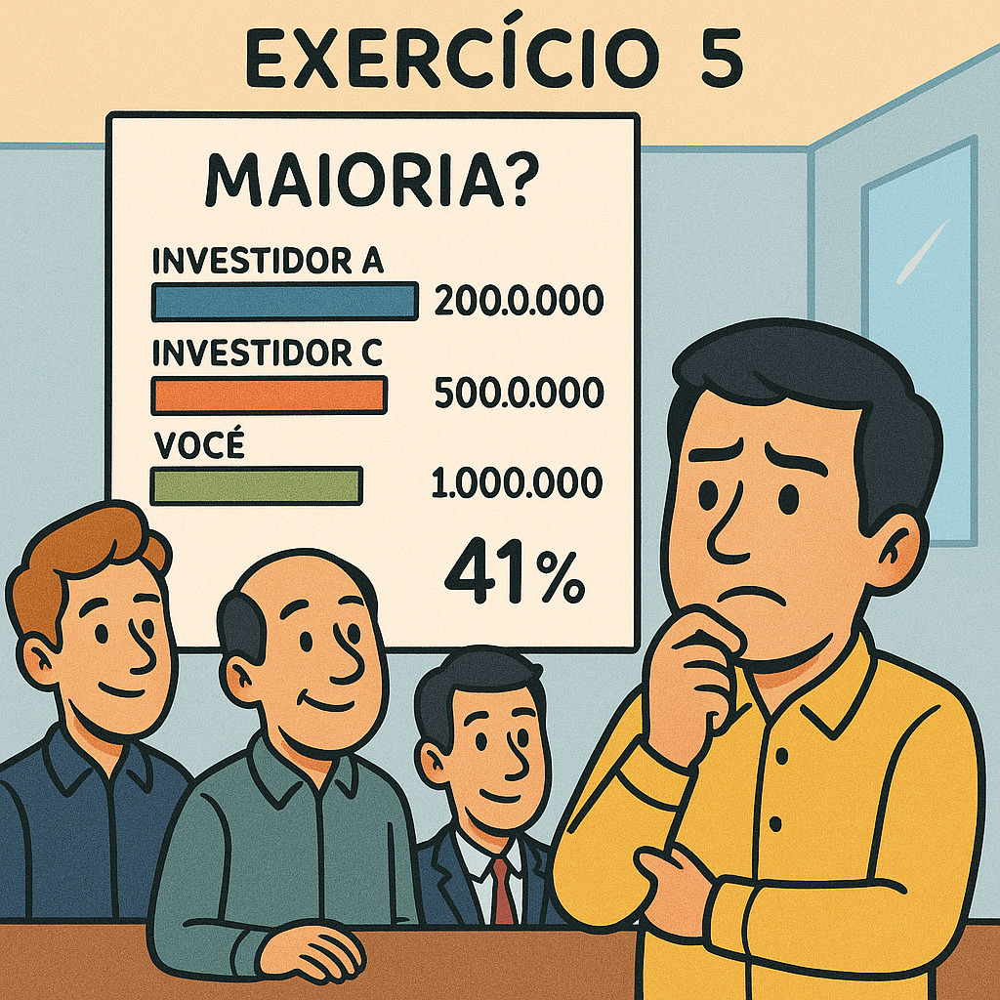

# Governança Corporativa - Assembléia dos Proprietários

#### 19/08/2025 - Campus Marquês {.unnumbered}

#### 20/08/2025 - Campus Chácara {.unnumbered}

### **Exercício 3:** Aporte Growth Capital (Série B)

{width="404"}

+------------------------------------------------------------------------------------------------------------------------------------------------------------------------------------------------------------------------------------------------------------------------------------------------------------------------------------------------------------------+
| Exercício 3 - "Tech-Solve" cresceu e agora tem um valuation de R\$ 50.000.000, com um total de 1.700.000 cotas. Você, como fundador, tem 1.000.000 cotas. Um novo investidor de Growth Capital quer injetar R\$ 15.000.000. Qual o percentual de diluição que você sofrerá após este novo aporte, assumindo que você ceda cotas suficientes para o investimento? |
+------------------------------------------------------------------------------------------------------------------------------------------------------------------------------------------------------------------------------------------------------------------------------------------------------------------------------------------------------------------+
| a)  23,08%                                                                                                                                                                                                                                                                                                                                                       |
+------------------------------------------------------------------------------------------------------------------------------------------------------------------------------------------------------------------------------------------------------------------------------------------------------------------------------------------------------------------+
| b)  18,75%                                                                                                                                                                                                                                                                                                                                                       |
+------------------------------------------------------------------------------------------------------------------------------------------------------------------------------------------------------------------------------------------------------------------------------------------------------------------------------------------------------------------+
| c)  20,00%                                                                                                                                                                                                                                                                                                                                                       |
+------------------------------------------------------------------------------------------------------------------------------------------------------------------------------------------------------------------------------------------------------------------------------------------------------------------------------------------------------------------+
| d)  25,00%                                                                                                                                                                                                                                                                                                                                                       |
+------------------------------------------------------------------------------------------------------------------------------------------------------------------------------------------------------------------------------------------------------------------------------------------------------------------------------------------------------------------+

### Exercício 4: Cenário de Múltiplos Investidores

{width="687"}

+-------------------------------------------------------------------------------------------------------------------------------------------------------------------------------------------------------------------------------------------------------------------------------------------------------------------------------------------------------------------------+
| Exercício 4 - "Tech-Solve" agora tem 1.000.000 de cotas originais, um investidor A com 200.000 cotas e um investidor B com 500.000 cotas. Sua participação é de 1.000.000 de cotas. A empresa está avaliada em R\$ 20.000.000. Um novo investidor quer comprar 10% da empresa. Quantas cotas ele deve receber, e qual será sua nova participação percentual na empresa? |
+-------------------------------------------------------------------------------------------------------------------------------------------------------------------------------------------------------------------------------------------------------------------------------------------------------------------------------------------------------------------------+
| a)  150.000 cotas; 8,8%                                                                                                                                                                                                                                                                                                                                                 |
+-------------------------------------------------------------------------------------------------------------------------------------------------------------------------------------------------------------------------------------------------------------------------------------------------------------------------------------------------------------------------+
| b)  200.000 cotas; 10,0%                                                                                                                                                                                                                                                                                                                                                |
+-------------------------------------------------------------------------------------------------------------------------------------------------------------------------------------------------------------------------------------------------------------------------------------------------------------------------------------------------------------------------+
| c)  190.000 cotas; 9,5%                                                                                                                                                                                                                                                                                                                                                 |
+-------------------------------------------------------------------------------------------------------------------------------------------------------------------------------------------------------------------------------------------------------------------------------------------------------------------------------------------------------------------------+
| d)  170.000 cotas; 8,5%                                                                                                                                                                                                                                                                                                                                                 |
+-------------------------------------------------------------------------------------------------------------------------------------------------------------------------------------------------------------------------------------------------------------------------------------------------------------------------------------------------------------------------+

### Exercício 5: Protegendo a Maioria

{width="667"}

+----------------------------------------------------------------------------------------------------------------------------------------------------------------------------------------------------------------------------------------------------------------------------------------------------------------------------------------------------------------------------------------------+
| Exercício 5 - Considere que, após todos os aportes (do Exercício 1 ao 4), você ainda deseja manter o controle majoritário da sua startup. O investidor A tem 200.000 cotas e o investidor B tem 500.000 cotas. No último aporte, o investidor C recebeu 190.000 cotas. Você começou com 1.000.000 de cotas. Qual a sua participação percentual atual na empresa, e você ainda tem a maioria? |
+----------------------------------------------------------------------------------------------------------------------------------------------------------------------------------------------------------------------------------------------------------------------------------------------------------------------------------------------------------------------------------------------+
| a)  50,0% - Não tem a maioria                                                                                                                                                                                                                                                                                                                                                                |
+----------------------------------------------------------------------------------------------------------------------------------------------------------------------------------------------------------------------------------------------------------------------------------------------------------------------------------------------------------------------------------------------+
| b)  51,5% - Tem a maioria                                                                                                                                                                                                                                                                                                                                                                    |
+----------------------------------------------------------------------------------------------------------------------------------------------------------------------------------------------------------------------------------------------------------------------------------------------------------------------------------------------------------------------------------------------+
| c)  48,0% - Não tem a maioria                                                                                                                                                                                                                                                                                                                                                                |
+----------------------------------------------------------------------------------------------------------------------------------------------------------------------------------------------------------------------------------------------------------------------------------------------------------------------------------------------------------------------------------------------+
| d)  49,5% - Não tem a maioria                                                                                                                                                                                                                                                                                                                                                                |
+----------------------------------------------------------------------------------------------------------------------------------------------------------------------------------------------------------------------------------------------------------------------------------------------------------------------------------------------------------------------------------------------+

## Respostas dos exercícios

|           |          |
|-----------|----------|
| Exercício | Resposta |
| 1 Modelo  | N/A      |
| 2         | e        |
| 3         | a        |
| 4         | c        |
| 5         | b        |
