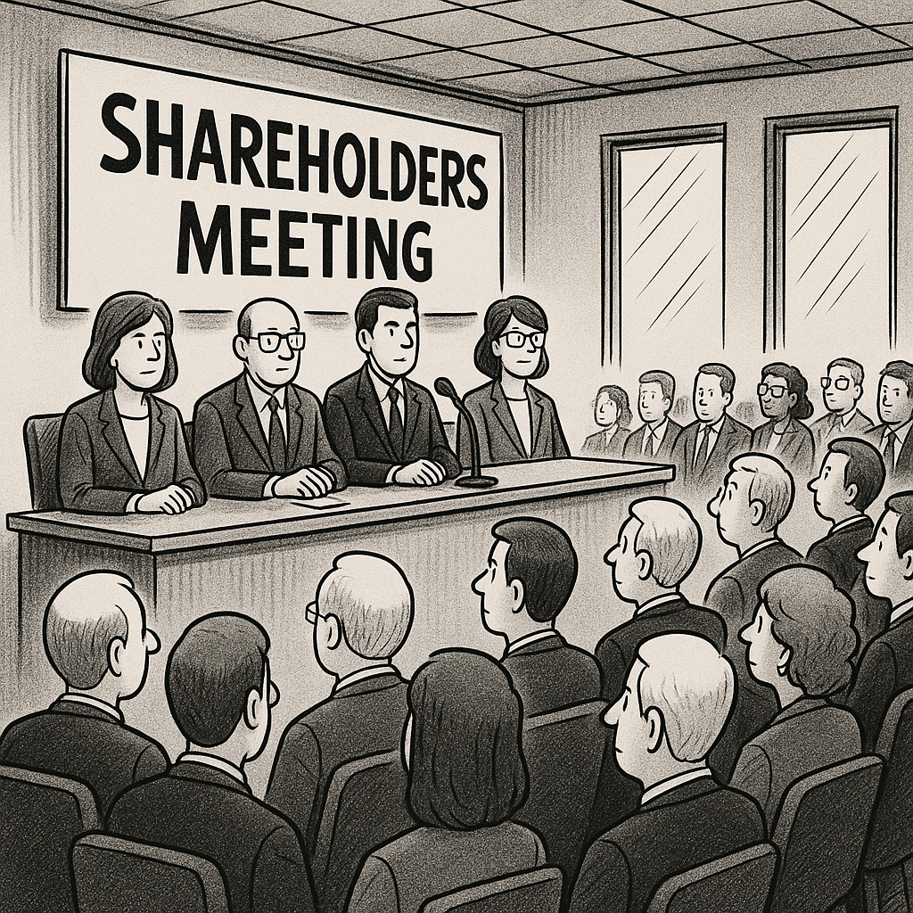

# Governança Corporativa - Assembléia dos Proprietários

#### 19/08/2025 - Campus Marquês {.unnumbered}

#### 20/08/2025 - Campus Chácara {.unnumbered}

### Livro "Governança Corporativa"

#### capítulo "A Assembleia Geral no processo de governança", pág 267

## **A Assembleia Geral**

{width="515"}

É definida como a **reunião de acionistas ou cotistas**.

É considerada o **órgão soberano da organização**.

## **Principais Competências da Assembleia Geral**

As competências destacadas da Assembleia Geral incluem:

-   **Aumentar ou reduzir o capital social** e **reformar o estatuto/contrato social**.

-   **Eleger ou destituir**, a qualquer tempo, **conselheiros de administração e fiscais**.

-   Tomar, anualmente, as **contas dos administradores** e deliberar sobre as **demonstrações financeiras**.

-   Deliberar sobre **transformação, fusão, incorporação, cisão, dissolução e liquidação da sociedade**.

-   Deliberar sobre a **avaliação de bens** que venham a integralizar o capital social.

-   **Aprovar a remuneração dos administradores**.

## **Frequência e Modalidade das Assembleias**

A Assembleia Geral pode ser de dois tipos, elecandos abaixo:

### **Assembleia Geral Ordinária (AGO)** 

Ocorre uma vez por ano com o objetivo de **aprovar as contas do exercício e o planejamento do ano seguinte**.

### **Assembleia Geral Extraordinária (AGE)** 

Pode ocorrer a qualquer momento, **sendo convocada por administradores ou acionistas/cotistas**, de acordo com as regras previstas no estatuto social.

## Participação Patromonial na empresa (Equity)
