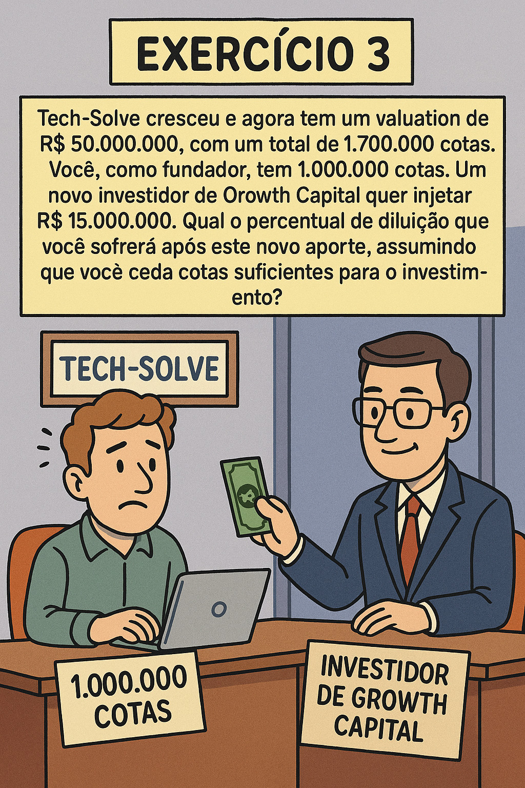
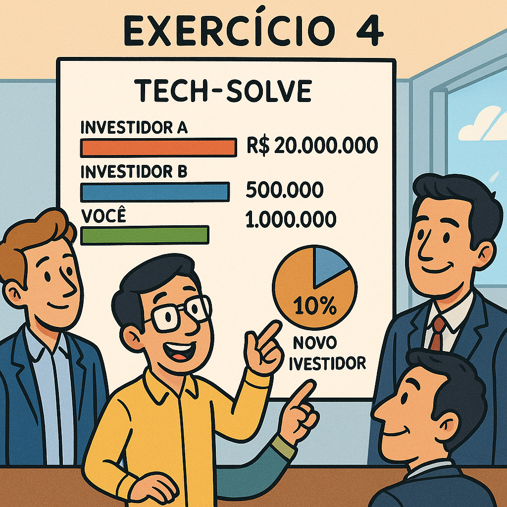
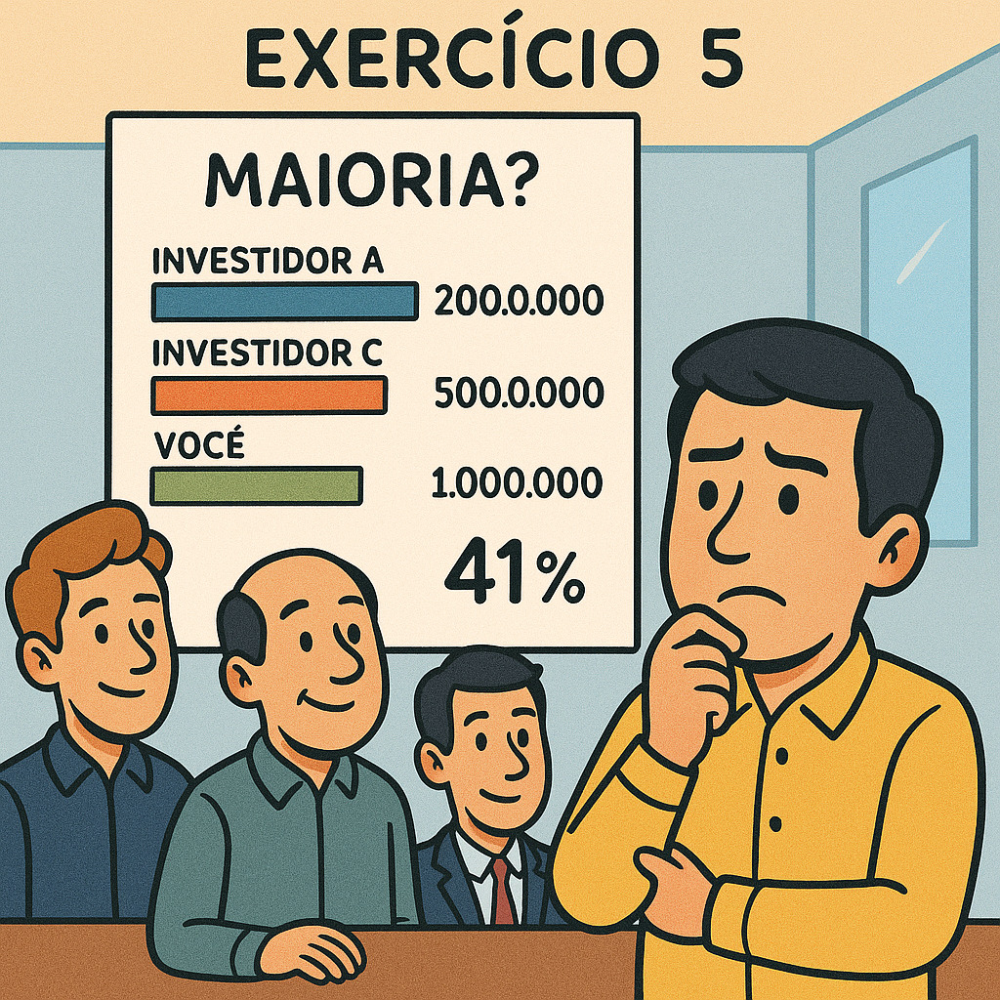

# Governança Corporativa - Assembléia dos Proprietários

#### 19/08/2025 - Campus Marquês {.unnumbered}

#### 20/08/2025 - Campus Chácara {.unnumbered}

### Livro "Governança Corporativa"

#### capítulo "A Assembleia Geral no processo de governança", pág 267

## **A Assembleia Geral**

{width="515"}

É definida como a **reunião de acionistas ou cotistas**.

É considerada o **órgão soberano da organização**.

## **Principais Competências da Assembleia Geral**

As competências destacadas da Assembleia Geral incluem:

-   **Aumentar ou reduzir o capital social** e **reformar o estatuto/contrato social**.

-   **Eleger ou destituir**, a qualquer tempo, **conselheiros de administração e fiscais**.

-   Tomar, anualmente, as **contas dos administradores** e deliberar sobre as **demonstrações financeiras**.

-   Deliberar sobre **transformação, fusão, incorporação, cisão, dissolução e liquidação da sociedade**.

-   Deliberar sobre a **avaliação de bens** que venham a integralizar o capital social.

-   **Aprovar a remuneração dos administradores**.

## **Frequência e Modalidade das Assembleias**

A Assembleia Geral pode ser de dois tipos, elecandos abaixo:

### **Assembleia Geral Ordinária (AGO)**

Ocorre uma vez por ano com o objetivo de **aprovar as contas do exercício e o planejamento do ano seguinte**.

### **Assembleia Geral Extraordinária (AGE)**

Pode ocorrer a qualquer momento, **sendo convocada por administradores ou acionistas/cotistas**, de acordo com as regras previstas no estatuto social.

------------------------------------------------------------------------

## Participação Patromonial na empresa (Equity)

{width="222"}

#### Como calcular EQUITY após uma rodada de investimentos

Como um acionista pode calcular sua participação na empresa após uma rodada de investimentos ?

Basicamente, podemos fazer-lo aplicado a fórmula:

#### Participação percentual do sócio pós-seção de participação ao investidor

$$
Porcentagem\_Participacao\_Sócio\_Pós\_Investimento = \frac{Porcentagem\_Participacao\_Pré\_Investimento}{(1 - Participacao\_Percentual\_Investidor)}
$$

#### Participação percentual do investidor pós-investimento monetário

$$
Participação\_Percentual\_\_Investidor = (\frac{ Dinheiro\_Investido}{ CapitalSocial\_Pós\_Investimento}) * 100%
$$

## Equity - caso FACEBOOK

<https://www.youtube.com/watch?v=YR4eE9TVq44&t=194s>

{width="676"}

+-------------------------------------------------------------------------------+------------------------------------------------------------------+
| {width="330" height="413"} | {width="380"} |
+-------------------------------------------------------------------------------+------------------------------------------------------------------+

+-------------------+------------------------------+-----------------------+------------------------------------------------------------------------------------------------------------------------------------------------------------------------------------------------------------------------+
| Data (Estim)      | Evento Chave                 | Equity Saverin(Estim) | Contexto e Ação                                                                                                                                                                                                        |
+===================+==============================+=======================+========================================================================================================================================================================================================================+
| Fevereiro de 2004 | Fundação do Facebook         | 30% a 34%             | **Eduardo Saverin** investe **US\$ 15 mil** para ajudar a fundar a empresa. **Sua participação é a maior entre os sócios**, atrás apenas de **Mark Zuckerberg**.                                                       |
+-------------------+------------------------------+-----------------------+------------------------------------------------------------------------------------------------------------------------------------------------------------------------------------------------------------------------+
| Metade de 2004    | Mudança para Palo Alto       | \< 30%                | Desentendimentos entre Zuckerberg e Saverin. Zuckerberg começa a buscar novos investidores e a estruturar a empresa legalmente para uma nova rodada de investimento.                                                   |
+-------------------+------------------------------+-----------------------+------------------------------------------------------------------------------------------------------------------------------------------------------------------------------------------------------------------------+
| Junho de 2004     | Aporte de Peter Thiel        | \~20% a 25%           | **Peter Thiel** e **Reid Hoffman** (investidores-anjo) injetam **US\$ 500 mil** no Facebook. Esta é a primeira rodada de investimento que causa a diluição da participação dos fundadores.                             |
+-------------------+------------------------------+-----------------------+------------------------------------------------------------------------------------------------------------------------------------------------------------------------------------------------------------------------+
| Final de 2004     | Reestruturação e Exclusão    | \< 10%                | **Zuckerberg** cria uma **nova entidade legal** ("Thefacebook, Inc."), emite novas ações e, de forma controversa, **dilui a participação de Saverin** a uma porcentagem mínima **sem seu consentimento**.              |
+-------------------+------------------------------+-----------------------+------------------------------------------------------------------------------------------------------------------------------------------------------------------------------------------------------------------------+
| Maio de 2005      | Rodada de Série A            | \~10%                 | A **Accel Partners** e o co-fundador da PayPal investem **US\$ 12,7 milhões** na empresa. **Ações adicionais são emitidas**, **diluindo ainda mais todos os fundadores**, incluindo **Saverin**.                       |
+-------------------+------------------------------+-----------------------+------------------------------------------------------------------------------------------------------------------------------------------------------------------------------------------------------------------------+
| Setembro de 2005  | Processo Judicial de Saverin | \~10%                 | **Saverin** processa **Zuckerberg** e o Facebook, alegando que **foi diluído de forma ilegal** e **quebra de contrato**.                                                                                               |
+-------------------+------------------------------+-----------------------+------------------------------------------------------------------------------------------------------------------------------------------------------------------------------------------------------------------------+
| 2006              | Rodada de Série B            | \< 10%                | **Accel Partners**, **Greylock Partners** e outros **investem US\$ 27,5 milhões**. A diluição continua.                                                                                                                |
+-------------------+------------------------------+-----------------------+------------------------------------------------------------------------------------------------------------------------------------------------------------------------------------------------------------------------+
| 2007              | Rodada da Microsoft          | \< 5%                 | **A Microsoft investe US\$ 240 milhões**, avaliando o **Facebook em US\$ 15 bilhões**. A **emissão de novas ações dilui drasticamente a participação de todos os sócios**.                                             |
+-------------------+------------------------------+-----------------------+------------------------------------------------------------------------------------------------------------------------------------------------------------------------------------------------------------------------+
| 2008              | Acordo com Saverin           | \~4%                  | Saverin e Zuckerberg chegam a um acordo extrajudicial. Os termos exatos não são revelados, mas é noticiado que Saverin recebe uma quantia em dinheiro, suas ações são restauradas, e ele é readmitido como cofundador. |
+-------------------+------------------------------+-----------------------+------------------------------------------------------------------------------------------------------------------------------------------------------------------------------------------------------------------------+
| Maio de 2012      | IPO do Facebook              | \~2%                  | No momento da **Oferta Pública Inicial (IPO)**, a participação de Saverin é amplamente divulgada como **estando em torno de 2%**. O **valor de sua fatia é estimado em cerca de US\$ 4 bilhões**.                      |
+-------------------+------------------------------+-----------------------+------------------------------------------------------------------------------------------------------------------------------------------------------------------------------------------------------------------------+
|                   |                              |                       |                                                                                                                                                                                                                        |
+-------------------+------------------------------+-----------------------+------------------------------------------------------------------------------------------------------------------------------------------------------------------------------------------------------------------------+

------------------------------------------------------------------------

## Exemplo

------------------------------------------------------------------------

## Exercício Resolvido 1

(Etapa 2 de Investimento: tipo Seed Capital -\> Investidor "Anjo")

{width="1026"}

+---------------------------------------------------------------------------------------------------------------------------------------------------------------------------------------------------------------------------------------------------------------------------------------------------------------------------------------------------------------------------------------------------------------------------------------------------------------------------------------------------------------------+
| EXEMPLO 1 - Você é o único fundador da startup "**Tech-Solve**" e possui 1.000.000 (um mihão) de cotas da empresa, que representam 100% do **EQUITY**. Um investidor anjo (seed capital) se interessa em investir. O valuation (valor da empresa antes do investimento) é de **R\$ 5.000.000,00** . O investidor quer injetar um capital de **R\$ 1.000.000** na empresa. Para **não perder a maioria**, qual o **número máximo de cotas** você pode ceder a ele, considerando que cada cota tem um valor unitário? |
+---------------------------------------------------------------------------------------------------------------------------------------------------------------------------------------------------------------------------------------------------------------------------------------------------------------------------------------------------------------------------------------------------------------------------------------------------------------------------------------------------------------------+
| a) 250.000 cotas                                                                                                                                                                                                                                                                                                                                                                                                                                                                                                    |
+---------------------------------------------------------------------------------------------------------------------------------------------------------------------------------------------------------------------------------------------------------------------------------------------------------------------------------------------------------------------------------------------------------------------------------------------------------------------------------------------------------------------+
| b) 200.000 cotas                                                                                                                                                                                                                                                                                                                                                                                                                                                                                                    |
+---------------------------------------------------------------------------------------------------------------------------------------------------------------------------------------------------------------------------------------------------------------------------------------------------------------------------------------------------------------------------------------------------------------------------------------------------------------------------------------------------------------------+
| c) 150.000 cotas                                                                                                                                                                                                                                                                                                                                                                                                                                                                                                    |
+---------------------------------------------------------------------------------------------------------------------------------------------------------------------------------------------------------------------------------------------------------------------------------------------------------------------------------------------------------------------------------------------------------------------------------------------------------------------------------------------------------------------+
| d) 100.000 cotas                                                                                                                                                                                                                                                                                                                                                                                                                                                                                                    |
+---------------------------------------------------------------------------------------------------------------------------------------------------------------------------------------------------------------------------------------------------------------------------------------------------------------------------------------------------------------------------------------------------------------------------------------------------------------------------------------------------------------------+

### Resolução:

O primeiro exemplo trata de um conceito fundamental para qualquer fundador de startup: a diluição do equity. O objetivo é calcular quantas cotas o **investidor anjo** deve receber para que ele injete **R\$ 1.000.000** na empresa.

Vamos resolver o exercício passo a passo:

**PASSO 1. Identifique o CAPITAL SOCIAL da empresa ANTES E APÓS a entrada do novo proprietário (ivestidor):**

+------------------------+------------------------+------------------------+
| CAPITAL SOCIAL ANTES   | INVESTIMENTO           | CAPITAL SOCIAL DEPOIS  |
+:======================:+:======================:+:======================:+
| ***R\$ 5.000.000,00*** | ***R\$ 1.000.000,00*** | ***R\$ 6.000.000,00*** |
+------------------------+------------------------+------------------------+

: CAPITAL SOCIAL DA EMPRESA

**PASSO 2. Calcular a participação do investidor (em percentual):**

-   A participação do investidor é a porcentagem que o valor do aporte representa no valor da empresa após o aporte.

$$
\text{Se }  \text{ R\$ 6.000.000,00} \rightarrow \text{ 100% } \newline
\quad \text{e} 
\newline
\newline 
\quad \text{ R\$ 5.000.000,00 } \rightarrow x 
\newline
\quad (\text{ Sagrada Regra de 3 }),
\newline
\newline
\qquad\frac{ R\$ 6.000.000,00 }{ R\$ 5.000.000,00}= 
\frac{ 100 \% }{x}\;\;\Rightarrow\;\; 
\newline
\newline
x=\frac{ [ (R\$ 5.000.000,00) * (100) ] }{ R\$ 6.000.000,00 }
\newline
x=\frac{ 5 }{6} * 100
\newline
x= (0,833333) * 100
\newline
x= 83,33\% \text{ Foi a percentagem de Capital Social restante ao dono original}
$$

$$
ParticipaçãoInvestidor = (\frac{ R$ 1.000.000}{ R$ 6.000.000}) * 100%
$$

$$
\text{Se }  \text{ R\$ 6.000.000,00} \rightarrow \text{ 100% } \newline
\quad \text{e} 
\newline
\newline 
\quad \text{ R\$ 1.000.000,00 } \rightarrow x 
\newline
\quad (\text{ Sagrada Regra de 3 }),
\newline
\newline
\qquad\frac{ R\$ 6.000.000,00 }{ R\$ 1.000.000,00}= 
\frac{ 100 \% }{x}\;\;\Rightarrow\;\; 
\newline
\newline
x=\frac{ [ (R\$ 1.000.000,00) * (100) ] }{ R\$ 6.000.000,00 }
\newline
x=\frac{ 1 }{6} * 100
\newline
x= (0,1666666) * 100
\newline
x= 16,67\% \text{ É percentagem de Capital Social restante ao Novo Sócio - Investidor}
$$

+---------------+----------------------------------------------+----------------------------------------------------+
| Sócios        | Posse do Capital Social                      | Posse do Capital Social                            |
|               |                                              |                                                    |
|               | Antes do Investidor ejetar dinheiro (aporte) | Depois do novo investidor ejetar dinheiro (aporte) |
+===============+==============================================+====================================================+
| Dono Original | **100%**                                     | **83,33 %** da participação                        |
+---------------+----------------------------------------------+----------------------------------------------------+
| Novo sócio    | **0%**                                       | **16,67 %** da participação                        |
+---------------+----------------------------------------------+----------------------------------------------------+

: Divisão de Percentual de Capital Social

**3. Calcular o total de cotas após o aporte:**

I.  Você, como fundador, tem 1.000.000 de cotas, que representam 100% do valor da empresa antes do aporte.

II. Para encontrar o número total de cotas após o aporte, podemos usar a seguinte fórmula:

    $$
    \text{Nova Quantidade de Quotas Totais após entrada de dinheiro} = \frac{ (Total\_Quotas\_Originais)}{(100\% - Participação\_Novo\_Investidor)}
    \newline
    \text{Total_Quotas_Originais} \Rightarrow 1.000.000 \text{  quotas }
    \newline
    \text{Participação Novo Investidor } \Rightarrow 16,67\%
    \newline
    \text{Nova Quantidade de Quotas Totais após entrada de dinheiro} = \frac{1.000.000}{ (100\% - 16,67\%}
    \newline
    \text{Nova Quantidade de Quotas Totais após entrada de dinheiro} = \frac{1.000.000}{ 1 - 0,1667}
    \newline
    \text{Nova Quantidade de Quotas Totais após entrada de dinheiro} = \frac{1.000.000}{ 0,83}
    \newline
    \text{Nova Quantidade de Quotas Totais após entrada de dinheiro} = \text{1.200.000 quotas}
    $$

III. Sua nova quantidade de quotas subiu de 1.000.0000 para **1.200.000 quotas**

**4. Calcular o número de cotas a serem cedidas ao investidor:**

I.  $$
    \text{Nova Quantidade de Quotas após entrada de dinheiro} = \text{1.200.000 quotas}
    \newline
    \text{Antigo Dono -  83,3% } \Rightarrow 1.000.000 \text{ continua com o mesmo número de quotas}
    \newline
    \text{Novo Dono -  Participação atual } \Rightarrow 16,67\%
    \newline
    \quad (\text{ Sagrada Regra de 3 }),
    \newline
    \newline
    \qquad\frac{ 1.200.000 }{ x }= 
    \frac{ 100 \% }{16,67\%}\;\;\Rightarrow\;\; 
    \newline
    \text{x} = \frac{(1.200.000) * (16,67) }{100}
    \newline
    \text{x} = \text{ 200.000 quotas}
    \newline
    \text{Novo Dono possui a seguinte quantidade de Quotas} = \text{ 200.000 quotas}
    $$

**Resposta correta:**

A alternativa **b) 200.000 cotas**.

Resumo:

-   **Valor do Aporte:** R\$ 1.000.000

-   **Valuation Pré-Aporte:** R\$ 5.000.000

-   **Cotas Originais do Fundador:** 1.000.000

1.  **Valuation Pós-Aporte** = R\$ 5.000.000 + R\$ 1.000.000 = **R\$ 6.000.000**

2.  **Participação do Investidor** = (R\$ 1.000.000 / R\$ 6.000.000) \* 100 = **16,67%**

3.  **Participação do Fundador Pós-Aporte** = 100% - 16,67% = **83,33%**

4.  **Total de Cotas Pós-Aporte** = 1.000.000 / 0,8333 = **1.200.000 cotas**

5.  **Cotas Cedidas ao Investidor** = 1.200.000 - 1.000.000 = **200.000 cotas**

Você pode continuar a praticar com os próximos exercícios se quiser! Eles vão aprofundar a sua compreensão sobre como a diluição e o controle de propriedade funcionam ao longo do tempo.

------------------------------------------------------------------------

## Exercícios

### **Exercício 2:**

### (Investimento do tipo Venture Capital -\> Investidor "profissional" )

{width="675"}

+---------------------------------------------------------------------------------------------------------------------------------------------------------------------------------------------------------------------------------------------------------------------------------------------------------------------------------------------------------------------------------------------------------------------+
| Exercício 2 - Após o aporte inicial, sua startup "Tech-Solve" tem agora 1.200.000 cotas e um Capital Social (valuation) de R\$ 10.000.000. Você ainda detém 1.000.000 de cotas. Um fundo de Venture Capital se propõe a investir R\$ 3.000.000. Para que você mantenha o controle majoritário da empresa (mais de 50% das cotas após o aporte), qual o número máximo de cotas que você pode ceder neste novo round? |
+---------------------------------------------------------------------------------------------------------------------------------------------------------------------------------------------------------------------------------------------------------------------------------------------------------------------------------------------------------------------------------------------------------------------+
| a) 500.000 cotas                                                                                                                                                                                                                                                                                                                                                                                                    |
+---------------------------------------------------------------------------------------------------------------------------------------------------------------------------------------------------------------------------------------------------------------------------------------------------------------------------------------------------------------------------------------------------------------------+
| b) 428.571 cotas                                                                                                                                                                                                                                                                                                                                                                                                    |
+---------------------------------------------------------------------------------------------------------------------------------------------------------------------------------------------------------------------------------------------------------------------------------------------------------------------------------------------------------------------------------------------------------------------+
| c) 300.000 cotas                                                                                                                                                                                                                                                                                                                                                                                                    |
+---------------------------------------------------------------------------------------------------------------------------------------------------------------------------------------------------------------------------------------------------------------------------------------------------------------------------------------------------------------------------------------------------------------------+
| d) 250.000 cotas                                                                                                                                                                                                                                                                                                                                                                                                    |
+---------------------------------------------------------------------------------------------------------------------------------------------------------------------------------------------------------------------------------------------------------------------------------------------------------------------------------------------------------------------------------------------------------------------+

### **Exercício 3:** Aporte Growth Capital (Série B)

{width="404"}

+------------------------------------------------------------------------------------------------------------------------------------------------------------------------------------------------------------------------------------------------------------------------------------------------------------------------------------------------------------------+
| Exercício 3 - "Tech-Solve" cresceu e agora tem um valuation de R\$ 50.000.000, com um total de 1.700.000 cotas. Você, como fundador, tem 1.000.000 cotas. Um novo investidor de Growth Capital quer injetar R\$ 15.000.000. Qual o percentual de diluição que você sofrerá após este novo aporte, assumindo que você ceda cotas suficientes para o investimento? |
+------------------------------------------------------------------------------------------------------------------------------------------------------------------------------------------------------------------------------------------------------------------------------------------------------------------------------------------------------------------+
| a) 23,08%                                                                                                                                                                                                                                                                                                                                                        |
+------------------------------------------------------------------------------------------------------------------------------------------------------------------------------------------------------------------------------------------------------------------------------------------------------------------------------------------------------------------+
| b) 18,75%                                                                                                                                                                                                                                                                                                                                                        |
+------------------------------------------------------------------------------------------------------------------------------------------------------------------------------------------------------------------------------------------------------------------------------------------------------------------------------------------------------------------+
| c) 20,00%                                                                                                                                                                                                                                                                                                                                                        |
+------------------------------------------------------------------------------------------------------------------------------------------------------------------------------------------------------------------------------------------------------------------------------------------------------------------------------------------------------------------+
| d) 25,00%                                                                                                                                                                                                                                                                                                                                                        |
+------------------------------------------------------------------------------------------------------------------------------------------------------------------------------------------------------------------------------------------------------------------------------------------------------------------------------------------------------------------+

### Exercício 4: Cenário de Múltiplos Investidores

{width="687"}

+-------------------------------------------------------------------------------------------------------------------------------------------------------------------------------------------------------------------------------------------------------------------------------------------------------------------------------------------------------------------------+
| Exercício 4 - "Tech-Solve" agora tem 1.000.000 de cotas originais, um investidor A com 200.000 cotas e um investidor B com 500.000 cotas. Sua participação é de 1.000.000 de cotas. A empresa está avaliada em R\$ 20.000.000. Um novo investidor quer comprar 10% da empresa. Quantas cotas ele deve receber, e qual será sua nova participação percentual na empresa? |
+-------------------------------------------------------------------------------------------------------------------------------------------------------------------------------------------------------------------------------------------------------------------------------------------------------------------------------------------------------------------------+
| a) 150.000 cotas; 8,8%                                                                                                                                                                                                                                                                                                                                                  |
+-------------------------------------------------------------------------------------------------------------------------------------------------------------------------------------------------------------------------------------------------------------------------------------------------------------------------------------------------------------------------+
| b) 200.000 cotas; 10,0%                                                                                                                                                                                                                                                                                                                                                 |
+-------------------------------------------------------------------------------------------------------------------------------------------------------------------------------------------------------------------------------------------------------------------------------------------------------------------------------------------------------------------------+
| c) 190.000 cotas; 9,5%                                                                                                                                                                                                                                                                                                                                                  |
+-------------------------------------------------------------------------------------------------------------------------------------------------------------------------------------------------------------------------------------------------------------------------------------------------------------------------------------------------------------------------+
| d) 170.000 cotas; 8,5%                                                                                                                                                                                                                                                                                                                                                  |
+-------------------------------------------------------------------------------------------------------------------------------------------------------------------------------------------------------------------------------------------------------------------------------------------------------------------------------------------------------------------------+

### Exercício 5: Protegendo a Maioria

{width="667"}

+----------------------------------------------------------------------------------------------------------------------------------------------------------------------------------------------------------------------------------------------------------------------------------------------------------------------------------------------------------------------------------------------+
| Exercício 5 - Considere que, após todos os aportes (do Exercício 1 ao 4), você ainda deseja manter o controle majoritário da sua startup. O investidor A tem 200.000 cotas e o investidor B tem 500.000 cotas. No último aporte, o investidor C recebeu 190.000 cotas. Você começou com 1.000.000 de cotas. Qual a sua participação percentual atual na empresa, e você ainda tem a maioria? |
+----------------------------------------------------------------------------------------------------------------------------------------------------------------------------------------------------------------------------------------------------------------------------------------------------------------------------------------------------------------------------------------------+
| a) 50,0% - Não tem a maioria                                                                                                                                                                                                                                                                                                                                                                 |
+----------------------------------------------------------------------------------------------------------------------------------------------------------------------------------------------------------------------------------------------------------------------------------------------------------------------------------------------------------------------------------------------+
| b) 51,5% - Tem a maioria                                                                                                                                                                                                                                                                                                                                                                     |
+----------------------------------------------------------------------------------------------------------------------------------------------------------------------------------------------------------------------------------------------------------------------------------------------------------------------------------------------------------------------------------------------+
| c) 48,0% - Não tem a maioria                                                                                                                                                                                                                                                                                                                                                                 |
+----------------------------------------------------------------------------------------------------------------------------------------------------------------------------------------------------------------------------------------------------------------------------------------------------------------------------------------------------------------------------------------------+
| d) 49,5% - Não tem a maioria                                                                                                                                                                                                                                                                                                                                                                 |
+----------------------------------------------------------------------------------------------------------------------------------------------------------------------------------------------------------------------------------------------------------------------------------------------------------------------------------------------------------------------------------------------+

## Respostas dos exercícios

|           |          |
|-----------|----------|
| Exercício | Resposta |
| 1 Modelo  | b        |
| 2         | c        |
| 3         | a        |
| 4         | c        |
| 5         | b        |

## Referências

ROSSETTI, José Paschoal; ANDRADE, Adriana. *Governança Corporativa: Fundamentos, Desenvolvimento e Tendências*. São Paulo: Atlas, 7. ed., 2014. p. s.p.
