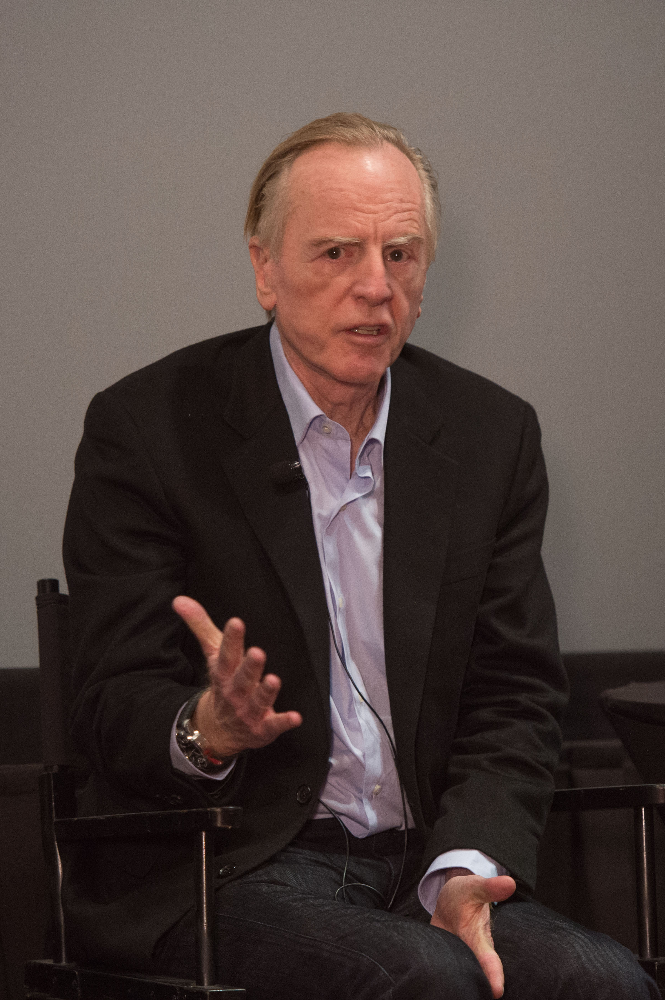

# Governança Corporativa - Conselhos da Empresa

#### 26/08/2025 - Campus Marquês {.unnumbered}

#### 27/08/2025 - Campus Chácara {.unnumbered}

## Fisiologia da Governança Corporativa –

### Conselho de Administração

[Ler livro "GOVERNANÇA CORPORATIVA no Brasil e no Mundo" -  - capítulo 4 - páginas 137 a 139 ](https://pdfcoffee.com/governana-corporativa-no-brasil-e-no-mundo-pdf-free.html)

> O **Conselho de Administração** é o órgão de orientação estratégica de uma empresa com governança corporativa.

------------------------------------------------------------------------

#### Competências do Conselho de Administração

-   Definição da estratégia da empresa\
-   Eleição e destituição do seu principal executivo\
-   Aprovação da escolha ou da dispensa dos demais executivos sob proposta do executivo principal (CEO)\
-   Acompanhamento da gestão\
-   Monitoramento dos riscos\
-   Indicação e substituição dos auditores independentes

------------------------------------------------------------------------

#### Boa Prática

Atualmente, é considerada uma boa prática a formação do Conselho de Administração com o maior número possível de **conselheiros independentes**.

------------------------------------------------------------------------

### Conselho Fiscal

[Ler livro "GOVERNANÇA CORPORATIVA no Brasil e no Mundo" -  - capítulo 4 - páginas 143 a 144 ](https://pdfcoffee.com/governana-corporativa-no-brasil-e-no-mundo-pdf-free.html)

{width="495"}

> O **Conselho Fiscal** é o órgão de fiscalização dos acionistas/cotistas.

#### Competências do Conselho Fiscal

-   é um órgão **não obrigatório**;
-   tem como objetivo **fiscalizar os atos da administração**, verificar o *compliance* e dar informações seguras aos sócios;
-   atua como um **controle independente** para os sócios; e
-   deve ser visto como um órgão que possui instrumentos que visam **agregar valor à sociedade**.

------------------------------------------------------------------------

### Conselho Consultivo

[Ler livro "GOVERNANÇA CORPORATIVA no Brasil e no Mundo" -  - capítulo 4 - páginas 141 ](https://pdfcoffee.com/governana-corporativa-no-brasil-e-no-mundo-pdf-free.html)

{width="797"}

-   Órgão **não deliberativo**, mas que dá suporte às decisões do Conselho de Administração.
-   Recomendado para empresas cujo Conselho de Administração seja formado por conselheiros **acionistas/cotistas** (portanto, não independentes) e que necessitem de **competências técnicas** para amparar as suas decisões.
-   Indicado também para empresas que estejam na **fase inicial de implantação** de uma arquitetura de governança corporativa.

------------------------------------------------------------------------

## ESTUDO DE CASO: SAÍDA DE STEEVE JOBS DA APPLE

+-------------------------------------------+---------------------------------------------------+---------------------------------------------------------------+
| Acionista-Fundador gestor (minoritário)   | CEO                                               | Acionista Majoritário                                         |
|                                           |                                                   |                                                               |
| Steeve Jobs                               | John Sculley                                      | Arthur Rock                                                   |
+===========================================+===================================================+===============================================================+
|  |  | {width="308"} |
+-------------------------------------------+---------------------------------------------------+---------------------------------------------------------------+

### Linha do Tempo: Steve Jobs e a Apple (1976–1997)

#### - 1976 – Steve Jobs e Steve Wozniak fundam a Apple Computer na garagem da família Jobs, em Cupertino.

#### - 1977 – Lançamento do Apple II, primeiro grande sucesso comercial.

#### - 1980 – A Apple abre seu capital na bolsa (IPO), valorizando fortemente a empresa.

#### - 1983 – Jobs convence John Sculley, então CEO da PepsiCo, a assumir como CEO da Apple com a famosa frase:

“Você quer vender água com açúcar pelo resto da sua vida ou quer mudar o mundo comigo?”

#### - 1984 – Lançamento do Macintosh, com a campanha icônica no Super Bowl.

#### - 1985 – Conflito entre Steve Jobs e John Sculley sobre o rumo da empresa.

Jobs perde apoio da diretoria, liderada por Arthur Rock (investidor e presidente do board).

Resultado: Steve Jobs é afastado da Apple.

#### - 1985–1996 – Período fora da Apple:

Jobs funda a NeXT Computer.

Adquire e transforma a Pixar Animation Studios, que em 1995 lança Toy Story, primeiro longa em animação digital.

#### - 1996 – A Apple compra a NeXT por US\$ 429 milhões para obter seu sistema operacional (base do futuro macOS).

#### - 1997 – Steve Jobs retorna à Apple como conselheiro e, pouco depois, CEO interino ("iCEO").

Início do processo de revitalização que levaria ao

#### - iMac (1998)

#### - iPod (2001)

#### - iPhone (2007)

#### - iPad (2010)

## Referências

ROSSETTI, José Paschoal; ANDRADE, Adriana. *Governança Corporativa: Fundamentos, Desenvolvimento e Tendências*. São Paulo: Atlas, 7. ed., 2014. p. s.p.

SILVEIRA, Alexandre Di Miceli da. *Governança Corporativa no Brasil e no Mundo: Teoria e Prática*. Rio de Janeiro: Elsevier, 2010.
