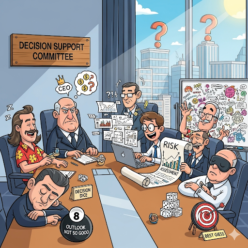

# Governança Corporativa - C Level e Diretoria Executiva

#### 02/09/2025 - Campus Marquês {.unnumbered}

#### 03/09/2025 - Campus Chácara {.unnumbered}

## Comitês de Suporte à Decisão e Cargos C-Level

## 1. O que são Comitês de Suporte à Decisão?

Os **comitês de suporte à decisão** são **órgãos técnicos** dentro de uma organização. Eles foram criados com um propósito muito claro: **apoiar tecnicamente as deliberações do Conselho de Administração e as posições do Conselho Consultivo**. Em essência, a função primordial desses comitês é **amparar as decisões e deliberações do conselho de administração**.

Segundo o Alexandre Di Miceli SILEVIRA (2010) "**comitês de assessoramento do conselho de administração**" (comitês de suporte a decisão)

> *" ... são uma solução proposta pelos códigos de governança para melhorar o funcionamento dos conselhos de administração. A ideia fundamental é que conselheiros mais especializados ou interessados em certas matérias tenham mais tempo para se aprofundar em temas específicos, a fim de propiciar uma melhor tomada de decisão pelos conselhos ... "*

Livro [Governança Corporativa no Brasil e no Mundo: Teoria e Prática - Alexandre Di Miceli da SILVEIRA](https://pdfcoffee.com/governana-corporativa-no-brasil-e-no-mundo-pdf-free.html)

capítulo 9 - "O conselho de administração como mecanismo fundamental de governança" - introduz os Comitês de Assessoramento (comitês de suporte a decisão ) págs 121, 263-265

Alexandre Di Miceli Silveira cita **3 Comitês de Suporte a Decisão** como os mais importantes:

**Comitê de Auditoria**: É considerado fundamental pelos principais códigos de governança. Suas atribuições incluem a interação com auditorias interna e externa, supervisão de decisões contábeis e de auditoria, participação na seleção do auditor independente, revisão da integridade das informações financeiras, avaliação da efetividade dos controles internos e gerenciamento de riscos, e revisão periódica da independência dos auditores;

**Comitê de Remuneração/Recursos Humanos**: Avalia a independência de consultorias de remuneração de executivos, e o sistema de remuneração dos executivos deve ser alinhado à criação de valor de longo prazo, considerando o controle de riscos;

**Comitê de Nomeação/Governança Corporativa**: Coordenar o processo de seleção e indicação do diretor-presidente e zelar pela adoção de boas práticas de governança

## 2. Características Principais

Esses comitês possuem algumas características distintivas:

-   **Natureza Técnica:** Como mencionado, são órgãos com foco técnico, fornecendo expertise e análises aprofundadas sobre temas específicos.
-   **Flexibilidade de Duração:** Podem ser **permanentes ou temporários**, adaptando-se às necessidades da organização. Um comitê permanente pode ser necessário para um tema de contínua relevância, enquanto um temporário pode ser formado para um projeto ou crise específica.
-   **Foco *Ad Hoc*:** Normalmente, são **"ad hoc"**, o que significa que **possuem foco em um determinado tema de análise**. Isso permite que a organização mobilize especialistas para se debruçar sobre questões específicas sem sobrecarregar o conselho principal.

## 3. Exemplos de Comitês de Suporte à Decisão

Para ilustrar a variedade de temas que esses comitês podem abordar, a fonte nos oferece alguns exemplos:

-   **Comitê de riscos e crises**: Focado na identificação, avaliação e mitigação de riscos, além de planejar respostas a situações de crise.
-   **Comitê de ética**: Encarregado de zelar pelos princípios éticos da organização, investigando e propondo soluções para dilemas morais.
-   **Comitê de estratégia**: Auxilia na formulação e revisão das estratégias da empresa, avaliando o ambiente de negócios e as oportunidades de crescimento.
-   **Comitê de novos negócios**: Dedicado à análise de novas oportunidades de mercado, aquisições ou parcerias estratégicas.

## Conclusão

Os Comitês de Suporte à Decisão são, portanto, ferramentas valiosas na governança corporativa. Eles agem como **olhos e ouvidos técnicos** do Conselho de Administração e do Conselho Consultivo, permitindo que a liderança tome decisões mais informadas e estratégicas, baseadas em análises detalhadas e especializadas. Sem esses comitês, a complexidade das decisões modernas poderia sobrecarregar os órgãos de governança, tornando o processo mais lento e menos eficaz. Eles são como **grupos de consultores internos especializados** que fornecem os dados e as análises necessárias para que os "capitães" da empresa (o Conselho) possam traçar o melhor rumo.

------------------------------------------------------------------------

## O que é C-Level?

-   “C” vem de **Chief** → significa **Chefe**
-   Refere-se aos cargos de **alta liderança executiva**
-   Responsáveis por **estratégia, decisões-chave e gestão global**
-   Exemplos: **CEO, CFO, COO, CMO**

| ASPECTO | Papel principal | Tomada de decisão | Relacionamento | Foco |
|---------------|---------------|---------------|---------------|---------------|
| **C-LEVEL** | Liderar a operação e garantir a execução da estratégia | Decisões operacionais e estratégicas de curto e médio prazo | Trabalha em sintonia com o Conselho, reportando resultados e desafios | Eficiência, inovação e crescimento da empresa |
| **CONSELHO** | Orientar a empresa e assegurar a visão de longo prazo | Decisões estratégicas e de governança, considerando a sustentabilidade do negócio | Atua como parceiro estratégico, oferecendo direcionamento | Proteção dos valores, interesses dos acionistas e continuidade do negócio |

------------------------------------------------------------------------

## Governança Corporativa e C-Level

-   O **Conselho de Administração** define diretrizes
-   O **C-Level executa e operacionaliza**
-   Impactos principais:
    -   Transparência
    -   Responsabilidade
    -   Criação de valor para stakeholders

------------------------------------------------------------------------

## CEO (Chief Executive Officer) - Diretor Executivo

-   Cargo mais alto da hierarquia executiva
-   Define **visão e estratégia**
-   Representa a empresa externamente
-   Supervisiona os demais executivos
-   Ex.: Satya Nadella (Microsoft), Tim Cook (Apple)

------------------------------------------------------------------------

## COO (Chief Operating Officer) - Diretor de Operações

-   Braço direito do CEO
-   Administra as **operações diárias**
-   Garante a execução da estratégia
-   Muitas vezes visto como **sucessor natural** do CEO

------------------------------------------------------------------------

## CFO (Chief Financial Officer) - Diretor Financeiro

-   Gestor das **finanças da empresa**
-   Responsável por:
    -   Planejamento e orçamento
    -   Controle de riscos
    -   Comunicação com investidores
-   Papel central na **sustentabilidade de longo prazo**

------------------------------------------------------------------------

## CMO (Chief Marketing Officer) - Diretor de Marketing

-   Foco em **crescimento e mercado**
-   Lidera:
    -   Branding e comunicação
    -   Estratégias de vendas e marketing digital
-   Responsável pela **imagem e percepção da marca**

## **CTO** (Chief Technology Officer) - Diretor de Tecnologia e inovação

-   **Liderança e Estratégia Tecnológica:** Define a visão e a estratégia tecnológica, alinhando-as com os objetivos de negócio da empresa para impulsionar a inovação e o crescimento;
-   **Desenvolvimento e Inovação:** É responsável pelo desenvolvimento de novos produtos e serviços, aplicando tecnologias de ponta para criar vantagens competitivas;
-   **"Ponte" entre Negócios e Tecnologia:** Atua como uma ponte entre a tecnologia e os objetivos estratégicos, traduzindo as necessidades do negócio em soluções tecnológicas eficazes

## **CIO** - Diretor de Infraestrutura de TI

-   responsável por toda a área de TI de uma empresa. Seu objetivo é garantir o acesso às melhores e mais atuais tecnologias para tornar os sistemas da empresa cada vez mais produtivos e eficientes.

-   Seu papel é fundamental em tempos de digitalização e automação de processos por meio da tecnologia. Cabe ao Diretor de TI traçar estratégias para recursos e aplicações tecnológicas a fim de alcançar os resultados e objetivos da empresa.

-   produtos e serviços de TI (hardwares e softwares);

-   processamento e armazenamento de dados;

-   desenvolvimento de políticas de uso de dados;

-   construção ou aquisição de sistemas de apoio ao negócio;

-   criação de métricas e apuração dos resultados de performance;

-   padronização e integração dos processos da organização, como a comunicação interna;

------------------------------------------------------------------------

## Outros Cargos C-Level

-   **CHRO** → Recursos Humanos e cultura
-   **CISO** → Segurança da Informação
-   **CDO** → Dados e transformação digital

------------------------------------------------------------------------

## C-Level em Ação

📌 Exemplo prático: queda de vendas

-   **CEO** → Redefine estratégia geral\
-   **CFO** → Analisa impacto financeiro\
-   **CMO** → Cria campanha para reconquistar clientes\
-   **COO** → Ajusta operações\
-   **CTO** → Sugere soluções digitais

------------------------------------------------------------------------

## Fechamento

-   C-Level = **núcleo estratégico da empresa**\
-   Cada cargo tem papel único\
-   O sucesso vem da **coordenação entre Conselho + Executivos**

------------------------------------------------------------------------

## Referências

ROSSETTI, José Paschoal; ANDRADE, Adriana. *Governança Corporativa: Fundamentos, Desenvolvimento e Tendências*. São Paulo: Atlas, 7. ed., 2014. p. s.p.

SILVEIRA, Alexandre Di Miceli da. *Governança Corporativa no Brasil e no Mundo: Teoria e Prática*. Rio de Janeiro: Elsevier, 2010.

ABDALA, Guilherme - <https://einstitute.com.br/artigos/como-equilibrar-a-relacao-entre-o-c-level-e-o-conselho-em-empresas-familiares>
