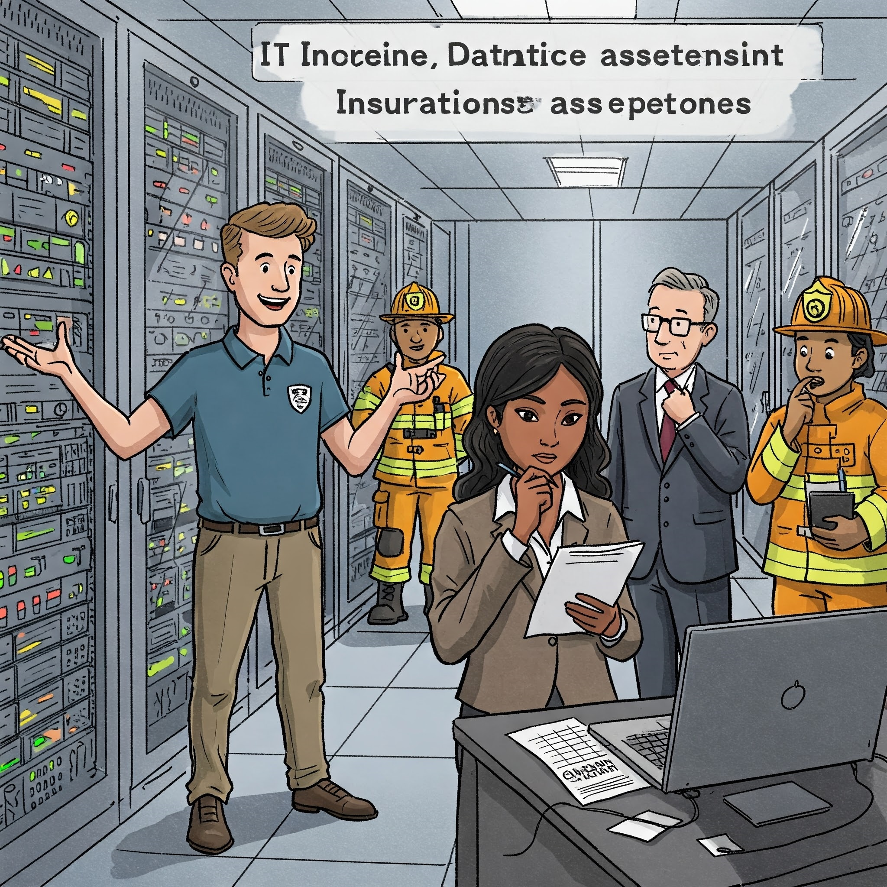

# Governança da Informação - Diretoria de Informática

#### 09/09/2025 - Campus Marquês {.unnumbered}

#### 10/09/2025 - Campus Chácara {.unnumbered}

## Diretoria de Informática - Gestão e Governança

### 

+--------------------------+------------------------+-------------------------------------------------------------------------+
| Posição                  | Objetivo de implantar  | Como implantar?                                                         |
|                          |                        |                                                                         |
|                          | Governança Corporativa |                                                                         |
+==========================+:======================:+=========================================================================+
| Conselho Adiministrativo | SEPARAR                | Implantando a estrutura piramidal hierarquica de Governança Corporativa |
|                          |                        |                                                                         |
|                          | PROPRIEDADE            |                                                                         |
|                          |                        |                                                                         |
|                          | GESTÃO                 |                                                                         |
+--------------------------+------------------------+-------------------------------------------------------------------------+
| Diretoria de TIC         | SEPARAR                | Implantando ITIL para Gestão                                            |
|                          |                        |                                                                         |
|                          | PROPRIEDADE            | Implantando COBIT (Geovernança)                                         |
|                          |                        |                                                                         |
|                          | GESTÃO                 |                                                                         |
+--------------------------+------------------------+-------------------------------------------------------------------------+

-   ITIL \`**Information Technology Infrastructure Library**\`

-   COBIT \`**Control Objectives for Information and Related Technologies**\`

+-----------------+------------+------------------------------------------+
| **BOA PRÁTICA** | **Donos**  | **Componentes**                          |
+-----------------+------------+------------------------------------------+
| ITIL            | AXELOS     | -   10 SERVIÇOS                          |
+-----------------+------------+------------------------------------------+
| COBIT           | ISACA      | -   5 PRINCÍPIOS                         |
|                 |            |                                          |
|                 |            | -   7 HABILITADORES                      |
+-----------------+------------+------------------------------------------+

### Gestão de Infra-Estrutura de um departamento de TIC

Para dar uma noção sobre melhores práticas de gestão de processos de TIC, utilizaremos o framework ITIL em sua versão 2 (2001), uma vez que o mesmo possui apenas 10 processos de Gestão de TIC divididos em dois grupos chamdos disciplinas ITIL.

##### Processos ITIL Versão 2 (2001)

+-----------------------------------------+--------------------------------------------+
| Grupo de Processos (Disciplina ITIL v2) | Processos                                  |
+:=======================================:+:==========================================:+
| **"GRUPO" SUPORTE A SERVIÇO**           | 01- Gestão de Incidentes                   |
|                                         |                                            |
|                                         | 02- Gestão de Problemas                    |
|                                         |                                            |
|                                         | 03- Gestão de Mudanças                     |
|                                         |                                            |
|                                         | 04- Gestão de Liberação                    |
|                                         |                                            |
|                                         | 05- Gestão Configuração                    |
+-----------------------------------------+--------------------------------------------+
| **"GRUPO" ENTREGA DE SERVIÇO**          | 06- Gestão de Nível de Serviço             |
|                                         |                                            |
|                                         | 07- Gestão de Disponibilidade              |
|                                         |                                            |
|                                         | 08- Gestão de Capacidade                   |
|                                         |                                            |
|                                         | 09- Gestão de Continuidade de Serviços TIC |
|                                         |                                            |
|                                         | 10- Gestão Financeira para Serviços de TIC |
+-----------------------------------------+--------------------------------------------+

##### Processos do grupo SUPORTE A SERVIÇOS DE TIC

O ITIL descreve melhores práticas para gestão de serviços de TIC. A Disciplina (agrupamento) de Suporte ao Serviço e a Disciplina (agrupamento) de Fornecimento de serviço combinadas oferecem o recurso de **Gerenciamento de Serviço de TIC** a uma organização. Inter-relacionamentos complexos entre todas as dez disciplinas do Gerenciamento de Serviços interagem para garantir que a infraestrutura de TI forneça um alto nível de serviço aos negócios.

###### 01- Gestão de Incidentes

O processo "**Service Desk e Gerenciamento de Incidentes**" visa restaurar os Serviços de TI para seus Níveis de Serviço definidos o mais rápido possível O processo também é responsável por receber e processar Solicitações de Serviço, por auxiliar os usuários e por coordenar a Resolução de Incidentes com Grupos de Suporte Especializados. Ao longo do processo, os usuários são informados em intervalos regulares sobre o status de seus incidentes.

###### 02- Gestão de Problemas

O objetivo do **Processo de Gerenciamento de Problemas** é resolver a causa raiz dos Incidentes e evitar a recorrência de Incidentes relacionados a esses erros. Ele fornece Gerenciamento de Incidentes com Correções Temporárias (Soluções) e Soluções Permanentes para Erros Conhecidos. O Gerenciamento Proativo de Problemas identifica e resolve Problemas antes que os Incidentes ocorram, por exemplo, analisando tendências no Uso de Serviços de TI ou investigando Incidentes históricos.

###### 03- Gestão de Mudanças

No **Processo de Gerenciamento de Mudanças**, todas as alterações na infraestrutura de TI e seus componentes (Itens de Configuração) são autorizadas e documentadas, a fim de garantir que os efeitos de interrupção na operação em execução sejam reduzidos ao mínimo. As etapas de implementação são planejadas e comunicadas, a fim de reconhecer possíveis efeitos colaterais o mais cedo possível. O Gerente de Mudanças e (para Mudanças de maior alcance) o Conselho Consultivo de Mudanças (CAB) são responsáveis por isso. Existe um procedimento específico para emergências, lidando com Mudanças Urgentes.

###### 04- Gestão de Liberação

O **Processo de Liberação de Mudanças** é responsável pela implementação de mudanças aprovadas na Infraestrutura de TI, para que estas sejam realizadas de forma eficaz, segura e verificável. As tarefas deste processo incluem planejamento, monitoramento e implementação dos respectivos *Rollouts* ou *Rollins* em coordenação com o Gerenciamento de Mudanças anteriormente citada.

###### 05- Gestão Configuração

As informações sobre Infraestrutura e Serviços necessárias para o Gerenciamento de Serviços de TI são disponibilizadas pelo Gerenciamento de Configuração. As alterações são documentadas e o status atualizado das informações é verificado regularmente. Com isso, informações atualizadas e históricas sobre os Itens de Configuração (CIs) estão continuamente disponíveis no Banco de Dados de Gerenciamento de Configuração (CMDB).

##### Processos do grupo ENTREGA DE SERVIÇOS DE TIC

###### 06- Gestão de Nível de Serviço

{width="385"}

O Gerenciamento de Nível de Serviço tem as tarefas de manter o Catálogo de Serviços da Organização de TI e alcançar acordos vinculativos para Desempenho de Serviços internos e externos. Na interface com o cliente, os Contratos de Nível de Serviço são acordados. O Gerente de Nível de Serviço é responsável pelo monitoramento dos parâmetros de qualidade acordados e, quando necessário, recorre a contramedidas. A prestação adequada de Serviços de TI internos é assegurada através de Acordos de Nível Operacional e Contratos de Apoio (OLAs/UCs).

###### 07- Gestão de Disponibilidade

O Gerenciamento de Disponibilidade permite que as Organizações de TI sustentem a disponibilidade da infraestrutura de TI para atender aos Níveis de Serviço acordados definidos nos SLAs. Ele monitora constantemente os níveis de disponibilidade alcançados e, quando necessário, realiza medidas corretivas.

###### 08- Gestão de Capacidade

O Gerenciamento de Capacidade suporta a provisão ideal e econômica de Serviços de TI, ajudando as Organizações de TI a combinar seus Recursos de TI (Software, Hardware, Recursos Humanos) com as necessidades de negócios. O processo envolve estimativas de demanda futura, que são a base para o planejamento de necessidades futuras de capacidade, resultando no Plano de Capacidade.

###### 09- Gestão de Continuidade de Serviços TIC

O Gerenciamento de Continuidade de Serviço de TI define e planeja todas as medidas e processos para eventos imprevistos de desastre. A análise regular de vulnerabilidades, ameaças e riscos representa uma base para precauções adequadas.

###### 10- Gestão Financeira para Serviços de TI

O Gerenciamento Financeiro para Serviços de TI garante o uso mais econômico dos recursos financeiros de TI e cobra dos clientes pela prestação de Serviços de TI. Durante este período, deve ser alcançada uma relação equilibrada entre qualidade e custos, tendo simultaneamente em conta os requisitos do cliente. A realização do planeamento orçamental regular e o apuramento dos meios financeiros aprovados é também uma das tarefas da Gestão Financeira.

## Principais Certificações de TIC para analistas de infraestrutura iniciando na área em 2025:

+--------------------------------+----------------------------------------------------------------------------------------------------------------------------------------------------------------+------------------------------------------------------------------------------------------------------------------------------------------------------------------+-----------------------------------------------------------------------------------------------------------------------------------------------------------------------------+
| Característica                 | ITIL® 4 Foundation                                                                                                                                             | COBIT® 2019 Foundation                                                                                                                                           | Cisco Certified Network Associate (CCNA)                                                                                                                                    |
+================================+================================================================================================================================================================+==================================================================================================================================================================+=============================================================================================================================================================================+
| Organização                    | PeopleCert (em nome da AXELOS)                                                                                                                                 | ISACA®                                                                                                                                                           | Cisco Systems, Inc.                                                                                                                                                         |
+--------------------------------+----------------------------------------------------------------------------------------------------------------------------------------------------------------+------------------------------------------------------------------------------------------------------------------------------------------------------------------+-----------------------------------------------------------------------------------------------------------------------------------------------------------------------------+
| Área Principal                 | Gerenciamento de Serviços de TI (ITSM)                                                                                                                         | Governança e Gestão de TI (EGIT)                                                                                                                                 | Redes de Computadores                                                                                                                                                       |
+--------------------------------+----------------------------------------------------------------------------------------------------------------------------------------------------------------+------------------------------------------------------------------------------------------------------------------------------------------------------------------+-----------------------------------------------------------------------------------------------------------------------------------------------------------------------------+
| Foco                           | Melhores práticas para entregar e suportar serviços de TIC de forma eficaz e eficiente. Foco no valor para o negócio.                                          | Framework para alinhar a TIC com os objetivos de negócio, gerenciando riscos e recursos de forma otimizada.                                                      | Instalação, configuração, operação e troubleshooting de redes (switches e roteadores). Fundamentos de segurança e automação de redes.                                       |
+--------------------------------+----------------------------------------------------------------------------------------------------------------------------------------------------------------+------------------------------------------------------------------------------------------------------------------------------------------------------------------+-----------------------------------------------------------------------------------------------------------------------------------------------------------------------------+
| Público-Alvo                   | Profissionais de TI em geral (suporte, operações, desenvolvimento, gestão), gerentes de projeto, analistas de negócio.                                         | Auditores de TI, gerentes de TI, profissionais de risco, conformidade (compliance) e segurança da informação, consultores.                                       | Técnicos de rede, administradores de rede, engenheiros de rede juniores, técnicos de suporte com foco em infraestrutura.                                                    |
+--------------------------------+----------------------------------------------------------------------------------------------------------------------------------------------------------------+------------------------------------------------------------------------------------------------------------------------------------------------------------------+-----------------------------------------------------------------------------------------------------------------------------------------------------------------------------+
| Nível                          | Fundamental / Iniciante                                                                                                                                        | Fundamental / Iniciante                                                                                                                                          | Associado / Iniciante-Intermediário (bastante técnico)                                                                                                                      |
+--------------------------------+----------------------------------------------------------------------------------------------------------------------------------------------------------------+------------------------------------------------------------------------------------------------------------------------------------------------------------------+-----------------------------------------------------------------------------------------------------------------------------------------------------------------------------+
| Principais Conceitos Abordados | Sistema de Valor de Serviço (SVS), 4 Dimensões do Gerenciamento de Serviços, Princípios Orientadores, Cadeia de Valor de Serviço, Práticas ITIL (visão geral). | Princípios do Sistema de Governança, Princípios do Framework de Governança, Domínios (APO, BAI, DSS, MEA), Objetivos de Governança e Gestão, Fatores de Desenho. | Modelo OSI e TCP/IP, Endereçamento IP (IPv4/IPv6), Sub-redes, Switching (VLANs, STP), Roteamento (OSPF), WLANs, NAT, DHCP, DNS, Fundamentos de Segurança, Automação básica. |
+--------------------------------+----------------------------------------------------------------------------------------------------------------------------------------------------------------+------------------------------------------------------------------------------------------------------------------------------------------------------------------+-----------------------------------------------------------------------------------------------------------------------------------------------------------------------------+
| Benefício para Iniciantes      | Fornece linguagem comum e compreensão dos processos de entrega de serviços, útil em quase qualquer função de TI. Ajuda a entender como a TI agrega valor.      | Oferece visão sobre como a TI se encaixa na estratégia e nos controles do negócio. Valioso para quem se interessa por auditoria, segurança ou gestão.            | Desenvolve habilidades práticas e conhecimento técnico profundo em redes, essencial para funções de infraestrutura. Altamente reconhecida no mercado de redes.              |
+--------------------------------+----------------------------------------------------------------------------------------------------------------------------------------------------------------+------------------------------------------------------------------------------------------------------------------------------------------------------------------+-----------------------------------------------------------------------------------------------------------------------------------------------------------------------------+
| Versão Atual (Maio 2025)       | ITIL 4                                                                                                                                                         | COBIT 2019                                                                                                                                                       | CCNA (Exam 200-301 é o atual, mas o nome da certificação é CCNA)                                                                                                            |
+--------------------------------+----------------------------------------------------------------------------------------------------------------------------------------------------------------+------------------------------------------------------------------------------------------------------------------------------------------------------------------+-----------------------------------------------------------------------------------------------------------------------------------------------------------------------------+

## Exercícios de Fixação

### Testes de múltipla escolha

+------------------------------------------------------------------------------------------------------------------------------------------------------------+
| **TESTE 01**                                                                                                                                               |
+:===========================================================================================================================================================+
| O que serve como base para todos os sistemas de informação em uma empresa, fornecendo o fundamento sobre o qual as operações de TIC podem ser construídas? |
+------------------------------------------------------------------------------------------------------------------------------------------------------------+
| A)  Aplicações de software                                                                                                                                 |
+------------------------------------------------------------------------------------------------------------------------------------------------------------+
| B)  Tecnologia de gestão de dados                                                                                                                          |
+------------------------------------------------------------------------------------------------------------------------------------------------------------+
| C)  Infraestrutura de Tecnologia da Informação e Comunicação (TIC)                                                                                         |
+------------------------------------------------------------------------------------------------------------------------------------------------------------+
| D)  Processos de negócio                                                                                                                                   |
+------------------------------------------------------------------------------------------------------------------------------------------------------------+
| E)  Interfaces de usuário                                                                                                                                  |
+------------------------------------------------------------------------------------------------------------------------------------------------------------+

+----------------------------------------------------------------------------------------------------------------------------------------------------------------------+
| **TESTE 02**                                                                                                                                                         |
+:=====================================================================================================================================================================+
| De acordo com as fontes que referenciam o livro de Laudon, qual das seguintes alternativas é considerada um dos cinco elementos principais da infraestrutura de TI ? |
+----------------------------------------------------------------------------------------------------------------------------------------------------------------------+
| A)  Relacionamento com clientes                                                                                                                                      |
+----------------------------------------------------------------------------------------------------------------------------------------------------------------------+
| B)  Estratégias de marketing                                                                                                                                         |
+----------------------------------------------------------------------------------------------------------------------------------------------------------------------+
| C)  Cultura organizacional                                                                                                                                           |
+----------------------------------------------------------------------------------------------------------------------------------------------------------------------+
| D)  Serviços de tecnologia                                                                                                                                           |
+----------------------------------------------------------------------------------------------------------------------------------------------------------------------+
| E)  Relatórios financeiros                                                                                                                                           |
+----------------------------------------------------------------------------------------------------------------------------------------------------------------------+

+--------------------------------------------------------------------------------------------------------------+
| **TESTE 03**                                                                                                 |
+:=============================================================================================================+
| Dentro da Gestão do Departamento de TIC, o Processo de Gestão de Liberação é responsável por qual atividade? |
+--------------------------------------------------------------------------------------------------------------+
| A)  Planejar futuras necessidades de capacidade                                                              |
+--------------------------------------------------------------------------------------------------------------+
| B)  Sustentar a disponibilidade da infraestrutura                                                            |
+--------------------------------------------------------------------------------------------------------------+
| C)  Implementar mudanças aprovadas na infraestrutura de TI de forma eficaz, segura e verificável.            |
+--------------------------------------------------------------------------------------------------------------+
| D)  Organizar os dados da empresa                                                                            |
+--------------------------------------------------------------------------------------------------------------+
| E)  Desenvolver aplicações de software                                                                       |
+--------------------------------------------------------------------------------------------------------------+

+------------------------------------------------------------------------------------------------------------------------------------------------------------------------+
| **TESTE 04**                                                                                                                                                           |
+:=======================================================================================================================================================================+
| O processo que permite às Organizações de TI sustentar a disponibilidade da infraestrutura de TI para atender aos Níveis de Serviço acordados (SLAs) é conhecido como: |
+------------------------------------------------------------------------------------------------------------------------------------------------------------------------+
| A)  Gestão de Capacidade                                                                                                                                               |
+------------------------------------------------------------------------------------------------------------------------------------------------------------------------+
| B)  Gestão de Configuração                                                                                                                                             |
+------------------------------------------------------------------------------------------------------------------------------------------------------------------------+
| C)  Gestão de Problemas                                                                                                                                                |
+------------------------------------------------------------------------------------------------------------------------------------------------------------------------+
| D)  Gestão de Incidentes                                                                                                                                               |
+------------------------------------------------------------------------------------------------------------------------------------------------------------------------+
| E)  Gestão de Disponibilidade                                                                                                                                          |
+------------------------------------------------------------------------------------------------------------------------------------------------------------------------+

+-------------------------------------------------------------------------------------------------------------------------------------------------------------------------------------------------------------+
| **TESTE 05**                                                                                                                                                                                                |
+:============================================================================================================================================================================================================+
| Qual processo suporta a provisão ideal e econômica de Serviços de TI, ajudando as Organizações de TI a combinar seus Recursos de TI (Software, Hardware, Recursos Humanos) com as necessidades de negócios? |
+-------------------------------------------------------------------------------------------------------------------------------------------------------------------------------------------------------------+
| A)  Gestão de Liberação                                                                                                                                                                                     |
+-------------------------------------------------------------------------------------------------------------------------------------------------------------------------------------------------------------+
| B)  Gestão de Nível de Serviço                                                                                                                                                                              |
+-------------------------------------------------------------------------------------------------------------------------------------------------------------------------------------------------------------+
| C)  Gestão Financeira                                                                                                                                                                                       |
+-------------------------------------------------------------------------------------------------------------------------------------------------------------------------------------------------------------+
| D)  Gestão de Capacidade                                                                                                                                                                                    |
+-------------------------------------------------------------------------------------------------------------------------------------------------------------------------------------------------------------+
| E)  Gestão de Continuidade de Negócio                                                                                                                                                                       |
+-------------------------------------------------------------------------------------------------------------------------------------------------------------------------------------------------------------+

+--------------------------------------------------------------------------------------------------------------------------------------------------------------------------------------------------------------------------------------------------------------------------------------------------------------------------------------------------------------------------------------------------------------------------+
| **TESTE 06**                                                                                                                                                                                                                                                                                                                                                                                                             |
+:=========================================================================================================================================================================================================================================================================================================================================================================================================================+
| A Biblioteca ITIL em sua Versão 2 (2001) propõe na totalidade os seguintes processos de gestão de TIC para as organizações:                                                                                                                                                                                                                                                                                              |
+--------------------------------------------------------------------------------------------------------------------------------------------------------------------------------------------------------------------------------------------------------------------------------------------------------------------------------------------------------------------------------------------------------------------------+
| A)  05 processos conhecidos como grupo de processos de suporte a serviço: Gestão de Incidentes, Gestão de Problemas, Gestão de Mudanças, Gestão de Liberação e Gestão Configuração.                                                                                                                                                                                                                                      |
+--------------------------------------------------------------------------------------------------------------------------------------------------------------------------------------------------------------------------------------------------------------------------------------------------------------------------------------------------------------------------------------------------------------------------+
| B)  05 processos conhecidos como grupo de processos de entrega de serviço: Gestão de Incidentes, Gestão de Problemas, Gestão de Mudanças, Gestão de Liberação e Gestão Configuração.                                                                                                                                                                                                                                     |
+--------------------------------------------------------------------------------------------------------------------------------------------------------------------------------------------------------------------------------------------------------------------------------------------------------------------------------------------------------------------------------------------------------------------------+
| C)  10 processos conhecidos como grupo de processos de suporte a serviço: Gestão de Incidentes, Gestão de Problemas, Gestão de Mudanças, Gestão de Liberação, Gestão Configuração, Gestão de Nível de Serviço, Gestão de Disponibilidade, Gestão de Capacidade, Gestão de Continuidade de Serviços TIC e Gestão Financeira para Serviços de TIC                                                                          |
+--------------------------------------------------------------------------------------------------------------------------------------------------------------------------------------------------------------------------------------------------------------------------------------------------------------------------------------------------------------------------------------------------------------------------+
| D)  05 processos conhecidos como grupo de processos de suporte a serviço: Gestão de Incidentes, Gestão de Problemas, Gestão de Mudanças, Gestão de Liberação, Gestão Configuração; e 05 processos conhecidos como grupo de processos de entrega de serviço: Gestão de Nível de Serviço, Gestão de Disponibilidade, Gestão de Capacidade, Gestão de Continuidade de Serviços TIC e Gestão Financeira para Serviços de TIC |
+--------------------------------------------------------------------------------------------------------------------------------------------------------------------------------------------------------------------------------------------------------------------------------------------------------------------------------------------------------------------------------------------------------------------------+
| E)  Nenhuma das anteriores.                                                                                                                                                                                                                                                                                                                                                                                              |
+--------------------------------------------------------------------------------------------------------------------------------------------------------------------------------------------------------------------------------------------------------------------------------------------------------------------------------------------------------------------------------------------------------------------------+

+-----------------------------------------------------------------------------------------------------------------------------------------------------------------------------------------------------------------------+
| **TESTE 07**                                                                                                                                                                                                          |
+:======================================================================================================================================================================================================================+
| De acordo com as fontes, a distinção entre Governança de TIC e Gestão de TIC, baseada no COBIT 5, é que:                                                                                                              |
+-----------------------------------------------------------------------------------------------------------------------------------------------------------------------------------------------------------------------+
| A)  Governança assegura que a TI apoie eficazmente os objetivos e estratégias da organização, gerencie riscos e otimize recursos, enquanto Gestão é responsável pela execução da orientação definida pela Governança. |
+-----------------------------------------------------------------------------------------------------------------------------------------------------------------------------------------------------------------------+
| B)  Governança é responsável pela execução da orientação, enquanto Gestão assegura que a TI apoie objetivos e estratégias organizacionais.                                                                            |
+-----------------------------------------------------------------------------------------------------------------------------------------------------------------------------------------------------------------------+
| C)  Governança foca nas operações diárias, enquanto Gestão foca no alinhamento estratégico.                                                                                                                           |
+-----------------------------------------------------------------------------------------------------------------------------------------------------------------------------------------------------------------------+
| D)  Governança lida com detalhes técnicos, enquanto Gestão lida com suporte ao usuário.                                                                                                                               |
+-----------------------------------------------------------------------------------------------------------------------------------------------------------------------------------------------------------------------+
| E)  Governança é apenas para grandes empresas, enquanto Gestão é para empresas menores.                                                                                                                               |
+-----------------------------------------------------------------------------------------------------------------------------------------------------------------------------------------------------------------------+

+-----------------------------------------------------------------------------------------------------------------------+
| **TESTE 08**                                                                                                          |
+=======================================================================================================================+
| A tecnologia de rede e telecomunicações, como um componente da infraestrutura de TI, é primariamente responsável por: |
+-----------------------------------------------------------------------------------------------------------------------+
| A)  Organizar e processar os dados da organização.                                                                    |
+-----------------------------------------------------------------------------------------------------------------------+
| B)  Administrar os recursos e atividades do computador.                                                               |
+-----------------------------------------------------------------------------------------------------------------------+
| C)  Gerenciar as instalações físicas de TI.                                                                           |
+-----------------------------------------------------------------------------------------------------------------------+
| D)  Desenvolver novas aplicações de software.                                                                         |
+-----------------------------------------------------------------------------------------------------------------------+
| E)  Fornecer a conectividade necessária para interligar computadores e outros dispositivos.                           |
+-----------------------------------------------------------------------------------------------------------------------+

+----------------------------------------------------------------------------------------------------------------------------------------------------------------+
| **TESTE 09**                                                                                                                                                   |
+================================================================================================================================================================+
| Qual das seguintes alternativas melhor descreve o propósito geral da Infraestrutura de TI no contexto empresarial, conforme abordado nas fontes?               |
+----------------------------------------------------------------------------------------------------------------------------------------------------------------+
| A)  Gerar relatórios detalhados para a gerência sênior.                                                                                                        |
+----------------------------------------------------------------------------------------------------------------------------------------------------------------+
| B)  Prover a base de hardware, software, gestão de dados, redes e serviços necessária para que os sistemas de informação suportem as operações da organização. |
+----------------------------------------------------------------------------------------------------------------------------------------------------------------+
| C)  Gerenciar exclusivamente os relacionamentos com fornecedores externos.                                                                                     |
+----------------------------------------------------------------------------------------------------------------------------------------------------------------+
| D)  Focar-se unicamente no desenvolvimento de novas tecnologias inovadoras.                                                                                    |
+----------------------------------------------------------------------------------------------------------------------------------------------------------------+
| E)  Reduzir o número de funcionários necessários de TI.                                                                                                        |
+----------------------------------------------------------------------------------------------------------------------------------------------------------------+

+----------------------------------------------------------------------------------------------------------------+
| **TESTE 10**                                                                                                   |
+================================================================================================================+
| Qual componente da infraestrutura de TI envolve o software para organizar e processar os dados da organização? |
+----------------------------------------------------------------------------------------------------------------+
| A)  Hardware                                                                                                   |
+----------------------------------------------------------------------------------------------------------------+
| B)  Software                                                                                                   |
+----------------------------------------------------------------------------------------------------------------+
| C)  Tecnologia de rede e telecomunicações                                                                      |
+----------------------------------------------------------------------------------------------------------------+
| D)  Tecnologia de gestão de dados                                                                              |
+----------------------------------------------------------------------------------------------------------------+
| E)  Serviços de tecnologia                                                                                     |
+----------------------------------------------------------------------------------------------------------------+

### Resposta dos testes de multipla escolha

+---------------+------------------+
| Alternativa   | Resposta correta |
+:=============:+:================:+
| **01**        | C                |
+---------------+------------------+
| **02**        | D                |
+---------------+------------------+
| **03**        | C                |
+---------------+------------------+
| **04**        | E                |
+---------------+------------------+
| **05**        | D                |
+---------------+------------------+
| **06**        | D                |
+---------------+------------------+
| **07**        | A                |
+---------------+------------------+
| **08**        | E                |
+---------------+------------------+
| **09**        | B                |
+---------------+------------------+
| **10**        | D                |
+---------------+------------------+

## Referências

ROSSETTI, José Paschoal; ANDRADE, Adriana. *Governança Corporativa: Fundamentos, Desenvolvimento e Tendências*. São Paulo: Atlas, 7. ed., 2014. p. s.p.
