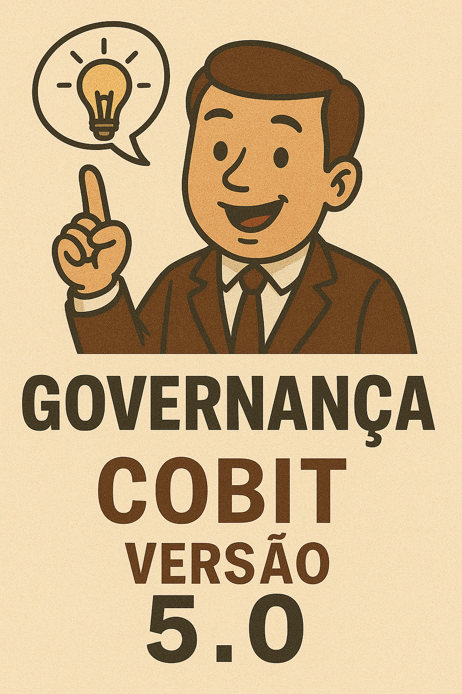
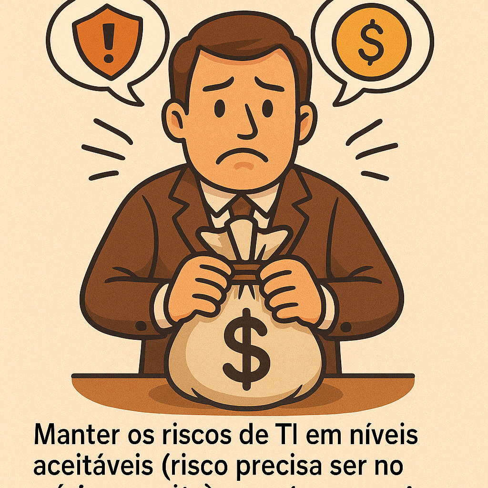
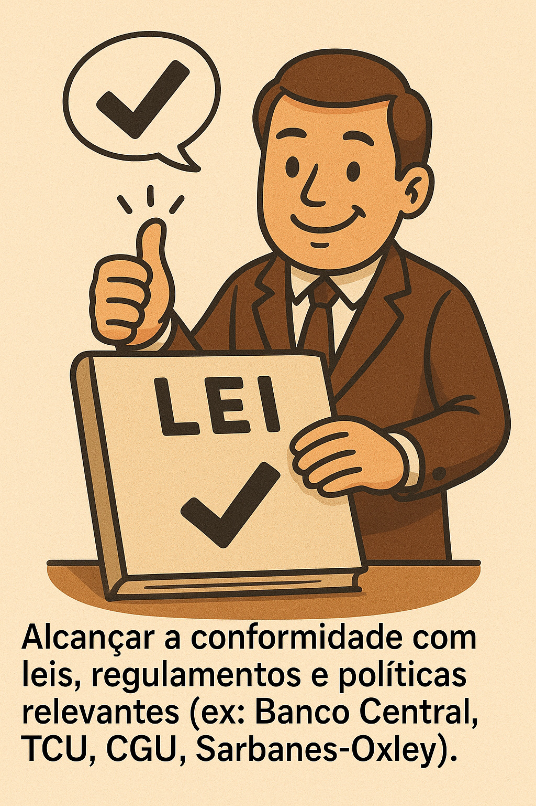
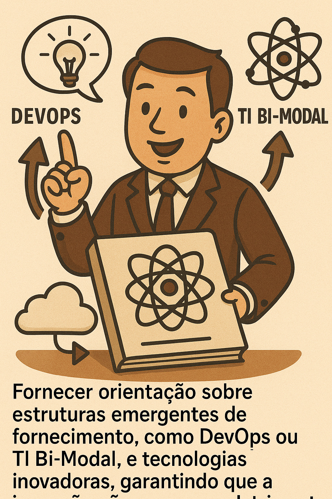

# Governança da Informação - Modelo COBIT 5.0

#### 23/09/2025 - Campus Marquês {.unnumbered}

#### 24/09/2025 - Campus Chácara {.unnumbered}

# Visão Geral do COBIT 5

{width="449"}

## Agenda

-   Porque o COBIT versão 5 ?
-   Quais os benefícios da versão COBIT 5 ?
-   A **arquitetura de produto** e o **formato** do COBIT 5.
-   O que é a gestão global ou **gestão holística** da TI no COBIT 5 ?
-   Como o COBIT 5 "conversa" com outros *frameworks* e padrões de mercado.

## Porque o COBIT versão 5 ?

O COBIT 5 é um modelo de negócio, desenvolvido pela ISACA, voltado para a **Governança Corporativa em TIC**.

### O que é ISACA ?

{width="651"}

O COBIT 5 foi desenvolvido pela ISACA (Information Systems Audit and Control Association):

-   É uma **associação global sem fins lucrativos** (embora as publicações sejam pagas).
-   Foi fundada em **1969**.
-   Conta com aproximadamente 140.000 profissionais afiliados em mais de 180 países e tem mais de 200 capítulos em todo o mundo (incluindo Brasil).
-   Oferece certificações mundialmente respeitadas, como CISA, CISM, CGEIT e CRISK.

### O Acrônimo e a Evolução

Originalmente, o COBIT era um acrônimo para **Control Objective for Information and related Technology** (Objetivos de Controle para a Informação e sua Tecnologia Relacionada). Atualmente, COBIT é apenas uma marca que identifica o *framework* da ISACA.

**Trajetória de Evolução**:

{width="251"}

| Versão | Ano | Foco Principal |
|:---|:---|:---|
| **COBIT 1** | 1996 | Auditoria (COBIT 1 era como um "Excelzinho" de controles). |
| **COBIT 2** | 1998 | Controle. |
| **COBIT 3** | 2000 | Gerenciamento (passou a ter processos). |
| **COBIT 4.0/4.1** | 2005/2007 | Governança de TI (adicionando segurança, controle de investimento, risco de TI). |
| **COBIT 5** | 2012 | Governança da TI Corporativa (integração de práticas, princípios e habilitadores). |

## Quais as razões para se criar a versão COBIT 5 ?

Também chamados de motivadores, temos basicamente 2 razões

### Razões (motivadores) da ISACA (Diretriz do Conselho Executivo)

A ISACA atualizou a base de conhecimento do COBIT e ao mesmo tempo criou as novas certificações, gerando receita para essa associação global. Isso também implicou em:

1.  Prover uma estrutura de governança e gestão **renovada e autoritária**. (quase ditatorial)
2.  **Integrar** todas as principais estruturas e orientações da ISACA, que antes eram publicações isoladas. Exemplos de estruturas integradas: **Val IT** (para controle de investimentos em TI), **Risk IT** (para gerenciamento de riscos de TI), e **ITAF** (para *assurance*).
3.  **Alinhar** o COBIT com outros *frameworks* e normas de mercado.

### Razões (motivadores) de Negócio

O COBIT 5 foi desenvolvido para cobrir as responsabilidades da empresa em relação à TI, que se tornou **pervasiva** (incrustrada em todas as operações de negócio).

Os principais motivadores relacionados às necessidades das organizações incluem a pressão constante para:

| Motivador | Detalhe | Imagem |
|:---|:---|:--:|
| **Cobrir de Ponta a Ponta** | Cobrir responsabilidades do negócio e TI de ponta a ponta, entendendo que a **TI é responsabilidade de todos na empresa**. |  |
| **Criação de Valor** | Assegurar a criação de mais valor e o aumento do retorno da governança sobre a TI corporativa. |  |
| **Satisfação e Relacionamento** | Obter a satisfação dos usuários de negócio e **melhorar a relação entre negócios e TI**, que é uma relação viva e complexa. |  |
| **Controle de Risco e Custos** | **Manter os riscos de TI em níveis aceitáveis** (risco precisa ser no mínimo aceito) e conter os custos. |  |
| **Conformidade** | Alcançar a **conformidade com leis, regulamentos e políticas** relevantes (ex: Banco Central, TCU, CGU, Sarbanes-Oxley). |  |
| **Novas Estruturas e Tecnologias** | Fornecer orientação sobre estruturas emergentes de fornecimento, como **DevOps** ou **TI Bi-Modal**, e tecnologias inovadoras, garantindo que a inovação não ocorra em detrimento do controle. |  |

## Escopo, Informação e Benefícios

### O Escopo do COBIT 5

O COBIT 5 é aplicável à governança e gerenciamento da informação em **qualquer que seja o meio utilizado** e **de ponta a ponta na organização**.

-   **Abrangência Holística:** O COBIT 5 é completo e abrangente (holístico).
-   **Adaptabilidade:** O COBIT 5 deve ser adaptado ao ambiente, tamanho, cultura e características de negócio da empresa (ex: bancos, hospitais, setor público).
-   **Público-alvo:** Ele é relevante para Gerentes de Negócio, Diretores, Auditores, Consultores, e Profissionais de TI/Segurança da Informação.

### O Papel da Informação

A informação é considerada a **moeda do mercado no século 21**, valendo muitas vezes mais do que o dinheiro.

O COBIT 5 define um **ciclo de vida para a informação**, que inclui as fases de: 1. **Idealização/Criação** 2. **Uso** 3. **Manutenção** 4. **Divulgação/Proteção** 5. **Descarte/Destruição**

O *framework* define requisitos de qualidade para que a informação possa subsidiar decisões executivas de qualidade.

### Benefícios Corporativos

Ao utilizar o COBIT 5, a organização obtém benefícios como:

-   **Geração de Valor:** Gerar valor para o negócio a partir dos investimentos em TI, alcançando metas estratégicas (o COBIT olha todo o ciclo de investimentos, integrando o Val IT).
-   **Excelência Operacional:** Alcançar uma operação estável, consistente e robusta.
-   **Gestão de Risco:** Manter os riscos de TI sob controle, em níveis aceitáveis.
-   **Otimização de Recursos:** Otimizar recursos (incluindo custos, pessoas, infraestrutura) através do uso eficiente.

## Arquitetura e Formato do COBIT 5

O COBIT 5 é baseado em **cinco valores fundamentais (princípios)** e **sete elementos fundamentais (habilitadores)**.

O *framework* é fornecido através de uma **Família de Produtos** (ou publicações):

1.  **COBIT 5 Framework:** O guia principal. Está disponível para download gratuito no site da ISACA (www.isaca.org).
2.  **Guias de Habilitadores:** Explicam em detalhe os sete habilitadores. Exemplos incluem:
    -   *COBIT 5 Habilitando Processos*.
    -   *COBIT 5 Habilitando Informação*.
3.  **Guias Profissionais:** Endereçados a públicos específicos ou áreas temáticas:
    -   *COBIT 5 Implementação*.
    -   *COBIT 5 para Risco*.
    -   *COBIT 5 para Segurança da Informação*.
    -   *COBIT 5 para Garantia (Assurance)* (verificações de conformidade).

## COBIT 5 e Outros Frameworks e Normas

O COBIT 5 atua como um **guarda-chuva** para outros *frameworks* e normas. Eles não são excludentes, mas sim **complementares**.

A relação entre modelos pode ser vista em camadas:

| Nível | Modelos | Função |
|:---|:---|:---|
| **Governança Corporativa** | **COSO**, **Balanced Scorecard (BSC)** | Modelos de alto nível que olham a empresa inteira. O COBIT **particulariza** o COSO para a TI. |
| **Governança de TI** | **COBIT 5** | Define **o quê** precisa ser feito em termos de governança e gestão de TI. Ele estabelece os requisitos de controle. |
| **Padrões e Boas Práticas (O *Como*)** | **ITIL, PMBOK, PRINCE2, TOGAF, CMMI** | *Frameworks* que definem **como** os requisitos de controle do COBIT podem ser atendidos. Por exemplo, a ITIL detalha o gerenciamento de serviços (incidente, mudança). |
| **Normas (ISO)** | **ISO 38500** (Governança de TI), **ISO 27001** (Segurança), **ISO 20000** (Gerenciamento de Serviços) | As ISOs garantem mais consistência, pois são sistemas de gestão que a empresa **escolhe** implementar (sendo rigorosas). |

------------------------------------------------------------------------

## Referências

rmarkdown::render("03-2025-08-19_20\_.Rmd", output_dir="docs", output_file ="temporario.html" , output_format = "html_document") ; utils::browseURL("docs/temporario.html")
