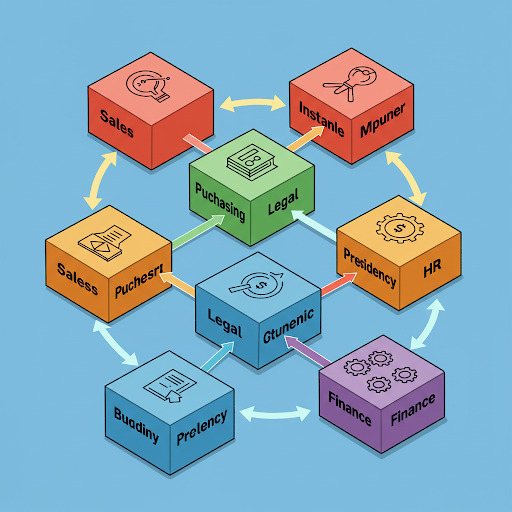

# Governança da Informação - COBIT 5.0 - Os 5 Princípios

#### 30/09/2025 - Campus Marquês {.unnumbered}

#### 01/10/2025 - Campus Chácara {.unnumbered}

## Os 5 Princípios do COBIT

O conceito de Princípio COBIT se traduz em uma Filosofia e objetivos na a TI se baseia e aplica em toda Empresa. Por se tratar de uma Filosofia e não de um conjunto de processos engessados, COBIT pode ser implantado desde a empresa mais complexa até a mais simples.

Os 5 princípios tornam o COBIT um MODELO CLARO, INTEGRADO e COMPARTILHADO: Diretores, Presidente, RH conseguem todos devem falar a mesma lingua quando o assunto é o papel da TI na organização. Entedner qual é o papel da TI, seus **riscos**, **custos** e **valor gerado**.

O modelo COBIT 5 é baseado em cinco princípios básicos para a governança e gestão de TI da organização. Estes princípios são:

### 1º Princípio: Atender às Necessidades das Partes Interessadas

{width="320"}

As organizações existem para criar valor para suas Partes interessadas, mantendo o equilíbrio entre a realização de benefícios e a otimização do risco e uso dos recursos. O COBIT 5 fornece todos os processos necessários e demais habilitadores para apoiar a criação de valor para a organização com o uso de TI. Cada organização pode personalizar o COBIT 5 de acordo com seu contexto específico por meio da cascata de objetivos, traduzindo objetivos corporativos de alto nível em objetivos de TI específicos e gerenciáveis, que são então mapeados em práticas e processos específicos.

### 2º Princípio: Cobrir a Organização de Ponta a Ponta

O COBIT 5 integra a governança corporativa de TI à governança corporativa:

|  |  |
|--------------------------|----------------------------------------------|
| Processos de Negócio x Processos de TIC | Cobre todas as funções e processos corporativos, considerando a tecnologia da informação e tecnologias relacionadas como ativos que devem ser tratados como qualquer outro ativo por todos na organização |
| Alinamento de Gestores e Fornecedores | Considera todos os habilitadores de governança e gestão de TI aplicáveis em toda a organização, de ponta a ponta, incluindo tudo e todos - interna e externamente - que forem considerados relevantes para a governança e gestão das informações e de TI da organização |

### 3º Princípio: Aplicar Um Modelo Único Integrado

{width="430"}

Existem muitas normas e boas práticas relacionadas a TI, cada qual fornecendo orientações para um conjunto específico de atividades de TI. O COBIT 5 se alinha a outros padrões e modelos importantes em um alto nível e, portanto, pode servir como um modelo unificado para a governança e gestão de TI da organização.

### 4º Princípio: Permitir uma Abordagem Holística

Uma governança e gestão eficiente e eficaz de TI da organização requer uma abordagem holística, levando em conta seus diversos componentes interligados. O COBIT 5 define um conjunto de sete categorias de habilitadores para apoiar a implementação de um sistema abrangente de gestão e governança de TI da organização.

| Item | Habilitador                            |
|------|----------------------------------------|
| 01   | Princípios, Políticas e Modelos        |
| 02   | Processos                              |
| 03   | Estruturas Organizacionais             |
| 04   | Cultura, Ética e Comportamento         |
| 05   | Informação                             |
| 06   | Serviços, Infraestrutura e Aplicativos |
| 07   | Pessoas, Habilidades e Competências    |

### 5º Princípio: Distinguir a Governança da Gestão

{width="285"}

O modelo do COBIT 5 faz uma clara distinção entre governança e gestão. Essas duas disciplinas compreendem diferentes tipos de atividades, exigem modelos organizacionais diferenciados e servem a propósitos diferentes. A governança garante que as necessidades, condições e opções das Partes Interessadas sejam avaliadas a fim de determinar objetivos corporativos acordados e equilibrados; definindo a direção através de priorizações e tomadas de decisão; e monitorando o desempenho e a conformidade com a direção e os objetivos estabelecidos.

### 5º A "Gestão" mencionada no 5o princípio:

A gestão irá implantar os 37 processos COBIT. São atividades e práticas para se executar no dia-a-dia.

Estes processos estão agrupados nos seguintes domínios:

| Grupo | Significado                          |
|-------|--------------------------------------|
| EDM   | \- Avaliar, Dirigir  e Monitorar     |
| APO   | \- Alinhar, Planejar e Organizar     |
| BAI   | \- Construir, Adquirir e Implementar |
| DSS   | \- Entregar, Servir e Suportar       |
| MEA   | \- Monitorar, Avaliar e Analisar     |

## Exercícios de Fixação

### Testes de múltipla escolha

| **TESTE 01** |
|------------------------------------------------------------------------|
| De acordo com a distinção feita pelo COBIT 5, qual das alternativas abaixo descreve corretamente as responsabilidades principais da Governança de TIC? |
| A) Uso ponderado de recursos (pessoas, processos, práticas, etc.) para atingir determinados objetivos relacionados à tecnologia da informação. |
| B) Alinhamento das atividades de planejamento, desenvolvimento, organização e controle operacional com a orientação definida e a geração de relatórios sobre essas atividades. |
| C) Garantir que as necessidades, condições e opções das Partes Interessadas sejam avaliadas, definindo a direção através de priorizações e tomadas de decisão, e monitorando o desempenho e a conformidade com a direção e os objetivos estabelecidos. |
| D) Execução da orientação definida pelo órgão de governança, aplicando os recursos disponíveis de TIC de forma inteligente. |
| E) Controle operacional dos serviços de TI, sejam internos ou externos, e garantia de que a estratégia de negócios seja suportada de maneira controlada. |

| **TESTE 02** |
|------------------------------------------------------------------------|
| Um dos principais objetivos do COBIT é oferecer um framework abrangente que auxilia as organizações a otimizar o valor gerado pela TI. Conforme as fontes, quais são outros objetivos principais do COBIT? |
| A) Descrever melhores práticas para gerenciamento de serviços de TI, focando na manutenção e operação da Infraestrutura de TI e no gerenciamento de incidentes e problemas,. |
| B) Permitir que a TI seja governada e gerenciada de forma holística para toda a organização e criar uma linguagem comum entre TI e negócios para a governança e gestão de TI corporativa. |
| C) Fornecer gerenciamento da TI com maior controle sobre os Ativos de TI (IC’s) da organização e criar e manter uma Base de Dados do Gerenciamento da Configuração (BDGC). |
| D) Definir critérios claros e mensuráveis para o sucesso, permitindo que as equipes trabalhem para atingir metas específicas enquanto medem continuamente seu progresso. |
| E) Identificar pontos fracos e desencadeadores para criar um desejo de mudança nos níveis de gestão executiva, definindo o escopo da implementação. |

| **TESTE 03** |
|------------------------------------------------------------------------|
| O COBIT 5 é baseado em cinco princípios básicos para a governança e gestão de TI. O Quarto Princípio é "Permitir uma Abordagem Holística",. De acordo com as fontes, o que este princípio envolve? |
| A) Integrar a governança corporativa de TI à governança corporativa, cobrindo todas as funções e processos corporativos, e considerando a TI como ativo a ser tratado por todos na organização. |
| B) Assegurar que as necessidades, condições e opções das Partes Interessadas sejam avaliadas a fim de determinar objetivos corporativos acordados e equilibrados. |
| C) Levar em conta diversos componentes interligados (habilitadores) para uma governança e gestão eficiente e eficaz de TI da organização, definindo sete categorias de habilitadores. |
| D) Alinhar-se a outros padrões e modelos importantes em um alto nível, servindo como um modelo unificado para a governança e gestão de TI da organização. |
| E) Fazer uma clara distinção entre governança e gestão, compreendendo diferentes tipos de atividades, modelos organizacionais diferenciados e propósitos diferentes. |

| **TESTE 04** |
|------------------------------------------------------------------------|
| Conforme descrito nas fontes, qual é um dos propósitos fundamentais dos indicadores-chave de desempenho (KPIs) eficazes? |
| A) Servir como métricas quantitativas para relatórios diários de status de projetos. |
| B) Permitir que as pessoas tomem decisões precisas e rápidas. |
| C) Determinar quão bem os processos e atualizações são realizados em um período de tempo mais curto para ajustes imediatos. |
| D) Substituir a necessidade de um Banco de Dados de Gerenciamento da Configuração (CMDB) para controle de ativos de TI. |
| E) Focar exclusivamente em indicadores de atraso para determinar o desempenho dos processos em um período mais longo. |

| **TESTE 05** |
|------------------------------------------------------------------------|
| As fontes mencionam a organização de métricas em duas categorias de indicadores-chave de desempenho. Quais são essas categorias e suas características principais? |
| A) Indicadores Internos e Externos: Medem o desempenho dentro da organização e em relação ao mercado. |
| B) Indicadores de Curto Prazo e Longo Prazo: Medem resultados imediatos e resultados acumulados ao longo do tempo. |
| C) Indicadores Financeiros e Não Financeiros: Medem o impacto na receita/custos e em outros aspectos como satisfação do cliente ou produtividade. |
| D) Indicadores Principais (de Avanço) e Indicadores Secundários (de Atraso): Os de avanço indicam a necessidade de ajustar a estratégia, enquanto os de atraso determinam o desempenho em um período mais longo. |
| E) Indicadores SMART e Não SMART: Indicadores que são específicos, mensuráveis, acionáveis, pertinentes e tempestivos versus aqueles que não são. |

| **TESTE 06** |
|------------------------------------------------------------------------|
| O princípio do COBIT 5 "Permitir uma Abordagem Holística", define um conjunto de sete categorias de habilitadores,, para apoiar a implementação de um sistema abrangente de governança e gestão de TI,. Qual das alternativas abaixo apresenta uma dessas categorias de habilitadores? |
| A) Serviços, Infraestrutura e Aplicativos. |
| B) Domínio Avaliar, Dirigir e Monitorar (EDM). |
| C) Gerenciamento de Incidentes. |
| D) Gerenciamento da Continuidade de Serviços TIC. |
| E) Modelo de Capacidade de Processo. |

### Resposta dos testes de multipla escolha

| Alternativa | Resposta correta |
|:-----------:|:----------------:|
|   **01**    |        C         |
|   **02**    |        B         |
|   **03**    |        C         |
|   **04**    |        B         |
|   **05**    |        D         |
|   **06**    |        A         |

## Referências

[1] ISACA. ***COBIT 5: A Business Framework for the Governance and Management of Enterprise IT**.* Rolling Meadows (IL): ISACA; 2012. ISBN 978-1-60420-237-3

[2] ISACA. ***COBIT 5: Enabling Processes**.* Rolling Meadows (IL): ISACA; 2012. ISBN 978-1-60420-241-0

[3] ISACA. ***COBIT 5: Enabling Information**.* Rolling Meadows (IL): ISACA; 2013. ISBN 978-1-60420-242-7

[4] ISACA. ***COBIT 5 Implementation**.* Rolling Meadows (IL): ISACA; 2012. ISBN 978-1-60420-240-3

[5] ISACA. ***COBIT 5 For Information Security**.* Rolling Meadows (IL): ISACA; 2012. ISBN 978-1-60420-254-0

[6] ISACA. ***COBIT 5 For Assurance**.* Rolling Meadows (IL): ISACA; 2012. ISBN 978-1-60420-339-4

[7] ISACA. ***COBIT 5 For Risk**.* Rolling Meadows (IL): ISACA; 2012. ISBN 978-1-60420-457-5
