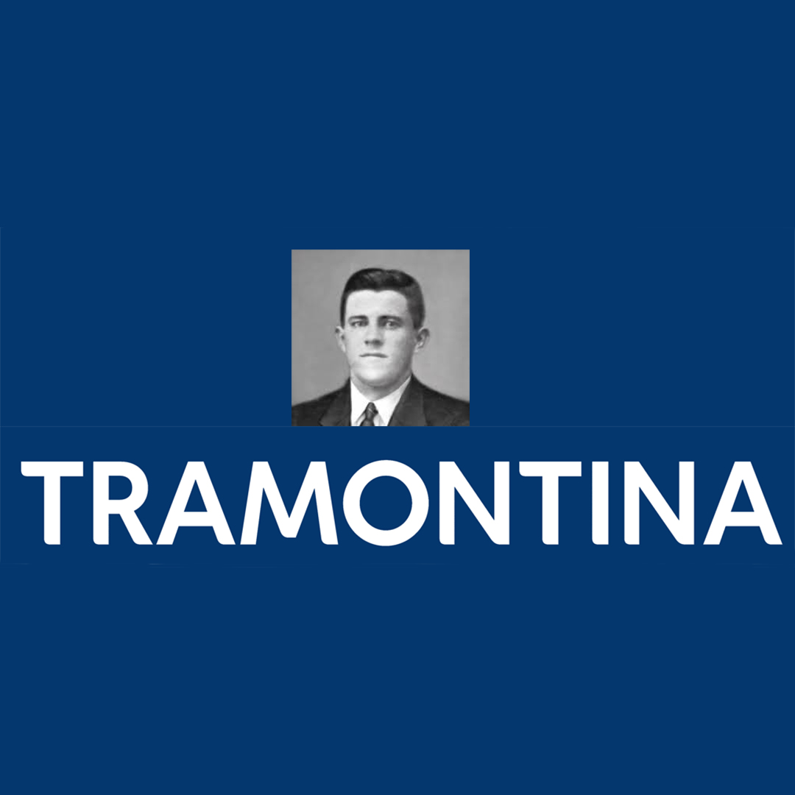
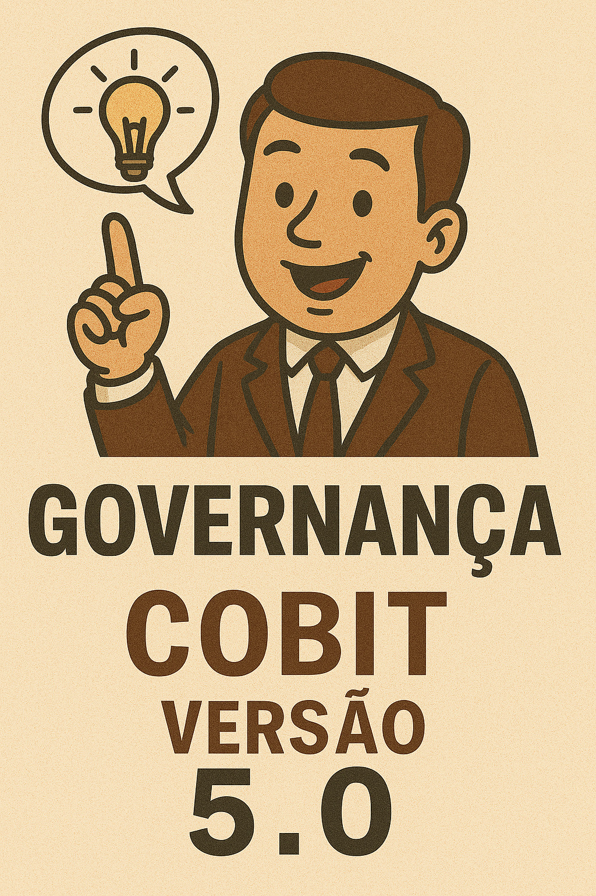
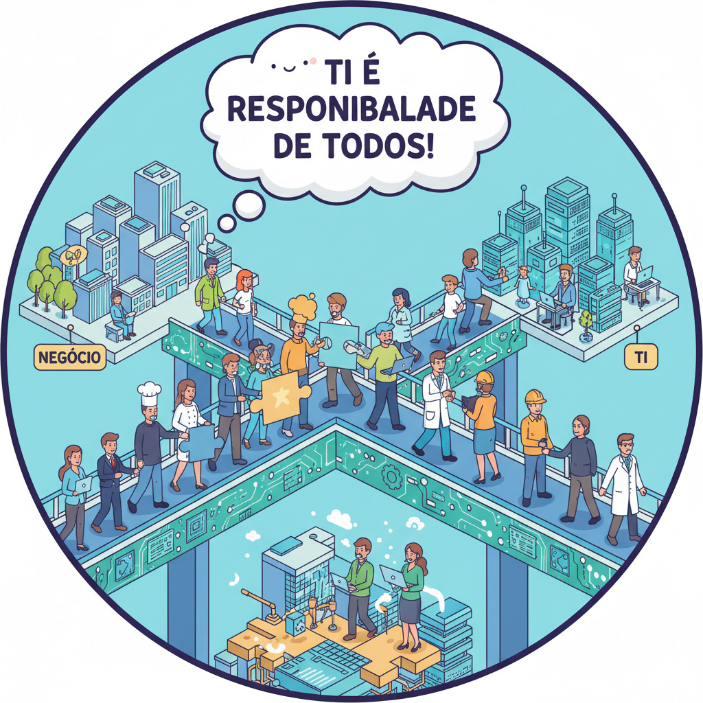
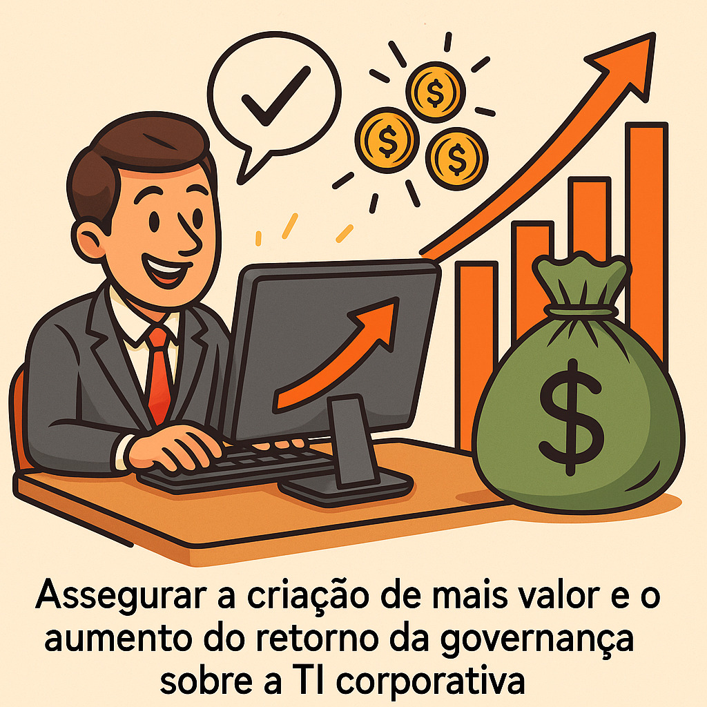
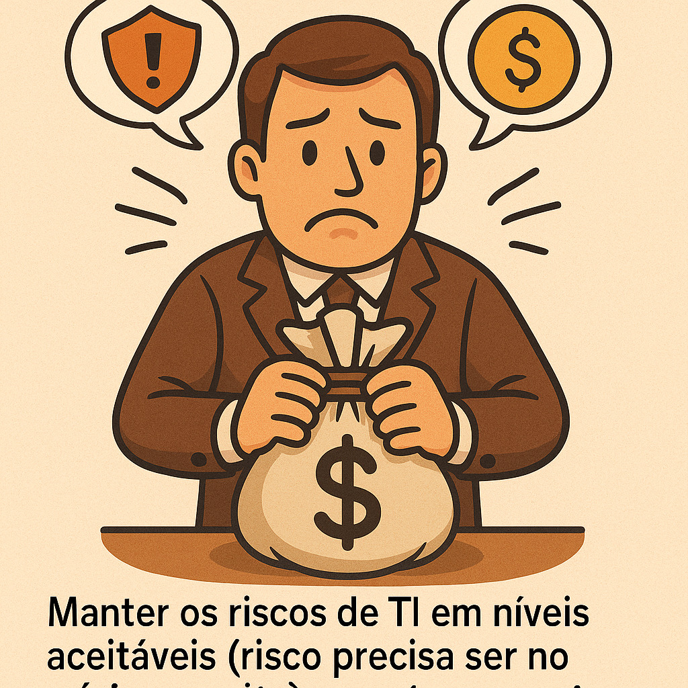
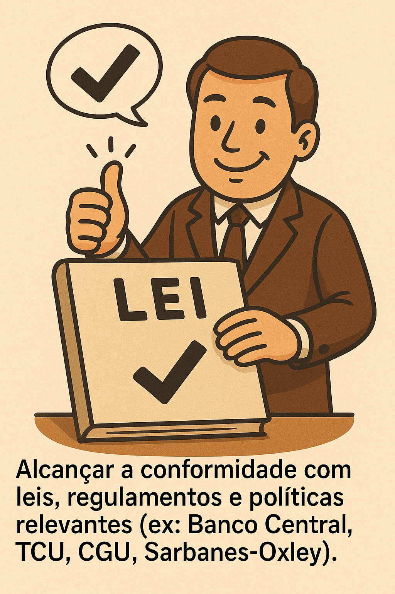
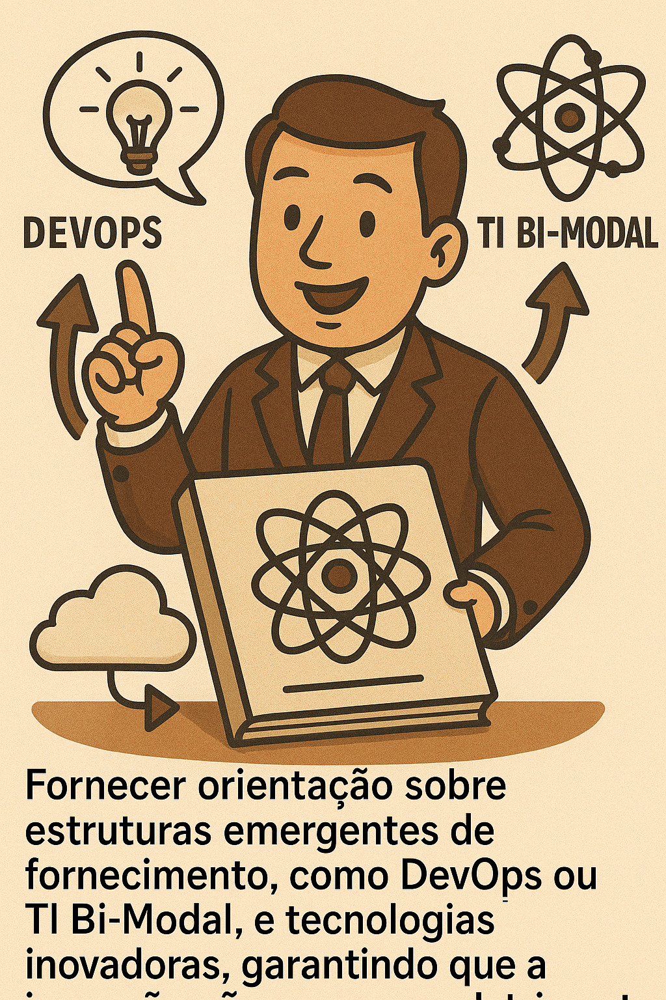

# Sobre estas anotações {.unnumbered}

—————————————————————————————————————————————

Estas anotações são apenas lembretes das aulas expostas em sala, durante a disciplina de Governança da Informação.

## ACESSO AO GITBOOK CELULAR

—————————————————————————————————————————————

#### <https://miguel7penteado.github.io/2025-2sem-GTI-Governanca>


## Leitores de formato de arquivo EPUB para SmartPhone

—————————————————————————————————————————————

### ANDROID

#### **Moon+ Reader**

{width="340"}

## Livros Texto da Disciplina

—————————————————————————————————————————————

### "Governança Corporativa" dos autores "**José Paschoal Rossetti e Adriana Andrade**"


+----------------------------------+------------------------------------------------------------------------------------------------------------------------------------------------------------------------------------+
| **Autor(es)**                    | [**José Paschoal Rossetti**](https://www.fdc.org.br/sobreafdc/professores/rossetti) **e [Adriana Andrade](https://tradeconbusiness.com.br/nossa-equipe/adriana-de-andrade-sole/)** |
+----------------------------------+------------------------------------------------------------------------------------------------------------------------------------------------------------------------------------+
| **Editora**                      | Atlas                                                                                                                                                                              |
+----------------------------------+------------------------------------------------------------------------------------------------------------------------------------------------------------------------------------+
| **Idioma**                       | Português                                                                                                                                                                          |
+----------------------------------+------------------------------------------------------------------------------------------------------------------------------------------------------------------------------------+
| **ISBN**                         | 9788522493050                                                                                                                                                                      |
+----------------------------------+------------------------------------------------------------------------------------------------------------------------------------------------------------------------------------+
| **Formato**                      | Capa dura                                                                                                                                                                          |
+----------------------------------+------------------------------------------------------------------------------------------------------------------------------------------------------------------------------------+
| **Páginas**                      | 608                                                                                                                                                                                |
+----------------------------------+------------------------------------------------------------------------------------------------------------------------------------------------------------------------------------+
| **Código Biblioteca**            |                                                                                                                                                                                    |
+----------------------------------+------------------------------------------------------------------------------------------------------------------------------------------------------------------------------------+

### "Implantando a Governança de TI (4ª edição): Da estratégia à gestão de processos e serviços" dos autores "Aguinaldo Aragon Fernandes e Vladimir Ferraz de Abreu"


+-----------------------+-----------------------------------------------------------------------------------------------------------------------------------------------------------------+
| **Autor(es)**         | #### [Aguinaldo Aragon Fernandes](https://br.linkedin.com/in/aguinaldo-aragon-fernandes) e [Vladimir Ferraz de Abreu](https://br.linkedin.com/in/vladimirabreu) |
+-----------------------+-----------------------------------------------------------------------------------------------------------------------------------------------------------------+
| **Editora**           | BRASPORT                                                                                                                                                        |
+-----------------------+-----------------------------------------------------------------------------------------------------------------------------------------------------------------+
| **Idioma**            | Português                                                                                                                                                       |
+-----------------------+-----------------------------------------------------------------------------------------------------------------------------------------------------------------+
| **ISBN-13**           | 978-8574528441                                                                                                                                                  |
+-----------------------+-----------------------------------------------------------------------------------------------------------------------------------------------------------------+
| **Formato**           | Eletrônico                                                                                                                                                      |
+-----------------------+-----------------------------------------------------------------------------------------------------------------------------------------------------------------+
| **Páginas**           | 1198                                                                                                                                                            |
+-----------------------+-----------------------------------------------------------------------------------------------------------------------------------------------------------------+
| **Código Biblioteca** |                                                                                                                                                                 |
+-----------------------+-----------------------------------------------------------------------------------------------------------------------------------------------------------------+

## Calendário das aulas

—————————————————————————————————————————————

##### AGOSTO DE 2025

| Data       | Dia da Semana | Aulas          | Conteúdo |
|------------|---------------|----------------|----------|
| 06/08/2025 | Quarta-Feira  | Aula Inaugural |          |
| 13/08/2025 | Quarta-Feira  | Aula 2         |          |
| 20/08/2025 | Quarta-Feira  | Aula 3         |          |
| 27/08/2025 | Quarta-Feira  | Aula 4         |          |

##### SETEMBRO DE 2025

| Data       | Dia da Semana | Aulas  | Conteúdo |
|------------|---------------|--------|----------|
| 03/09/2025 | Quarta-Feira  | Aula 5 |          |
| 10/09/2025 | Quarta-Feira  | Aula 6 |          |
| 17/09/2025 | Quarta-Feira  | NP1    | PROVA    |
| 24/09/2025 | Quarta-Feira  | Aula 7 |          |

##### OUTUBRO DE 2025

| Data       | Dia da Semana | Aulas   | Conteúdo |
|------------|---------------|---------|----------|
| 01/10/2025 | Quarta-Feira  | Aula 8  |          |
| 08/10/2025 | Quarta-Feira  | Aula 9  |          |
| 15/10/2025 | Quarta-Feira  | Aula 10 |          |
| 22/10/2025 | Quarta-Feira  | Aula 11 |          |
| 29/10/2025 | Quarta-Feira  | Aula 12 |          |

##### NOVEMBRO DE 2025

| Data       | Dia da Semana | Aulas | Conteúdo |
|------------|---------------|-------|----------|
| 05/11/2025 | Quarta-Feira  | NP2   | PROVA    |
| 12/11/2025 | Quarta-Feira  |       | N/A      |
| 19/11/2025 | Quarta-Feira  | SUB   | PROVA    |
| 26/11/2025 | Quarta-Feira  |       | N/A      |

##### DEZEMBRO DE 2025

| Data       | Dia da Semana | Aulas | Conteúdo |
|------------|---------------|-------|----------|
| 03/12/2025 | Quarta-Feira  |       | N/A      |
| 10/12/2025 | Quarta-Feira  | EXAME | PROVA    |
| 17/12/2025 | Quarta-Feira  |       | N/A      |
| 24/12/2025 | Quarta-Feira  |       | NATAL    |
| 31/12/2025 | Quarta-Feira  |       | Confrat  |

## Alunos 2025 - 2o Semestre

—————————————————————————————————————————————

### Campus Chácara Santo Antônio

#### Turma TI3P40

| Matrícula |        Nome do aluno         |
|:---------:|:----------------------------:|
|  R191BJ3  |   ANDRESSA MARIA DA SILVA    |
|  R194GF6  | JOÃO VICTOR DE JESUS ANDRADE |
|  R1704D1  |  PALOMA FERNANDES D GERALDO  |
|  G7946I4  |    VINICIUS ALMEIDA SILVA    |

#### Turma TI4P40

| Matrícula |         Nome do aluno          |
|:---------:|:------------------------------:|
|  G958DB5  |    AGATHA CALUCIO SANTIAGO     |
|  G03IJD7  |   ALESSANDRA ALMEIDA RIBEIRO   |
|  G993FJ5  |  ANNA BEATRIZ TEIXEIRA SILVA   |
|  G9699B3  | CAMILA VICTORIA DE SOUZA SANTO |
|  G9787H7  |  LEONARDO GONCALVES R FONSECA  |
|  G978JB0  |   LIRIEL CHAIANE M OLIVEIRA    |
|  R0958I0  |      RENAN HENRIQUE SILVA      |
|  G94GFD1  |     VANESSA ALMEIDA SANTOS     |
|  G833EG6  | WESLEY PEREIRA DOS S DE SOUSA  |

### Campus Marquês de São Vicente

#### Turma TI3P13

| Matrícula |   Nome do aluno    |
|:---------:|:------------------:|
|  F35GAE8  | LUCAS SOUZA XAVIER |

#### Turma TI4P13

| Matrícula |         Nome do aluno         |
|:---------:|:-----------------------------:|
|  F358542  |    ANA JULIA DE O BARBOSA     |
|  R0416B5  |    CAUA MARTINS SILVESTRE     |
|  F359549  |       ERICA CALO SANTOS       |
|  R063HI0  |    FERNANDO ROCHA QUINHOLI    |
|  F359573  |  GABRIEL HENRIQUE M TEIXEIRA  |
|  R057BD6  |  GUILHERME JACOB M DE MACEDO  |
|  G960CJ8  | GUILHERME RENATO R DE QUEIROZ |
|  G978099  | ISABELA SASS MARTINS DE SOUZA |
|  F3591B9  |    JOAO VITOR SILVA SOUZA     |
|  G907582  |    KAROLINE VIEIRA ARAGAO     |


```{r imprimir-01, eval=FALSE, include=FALSE}
rmarkdown::render("03-2025-08-19_20_.Rmd", output_dir="docs", output_file ="temporario.html" , output_format = "html_document") ; utils::browseURL("docs/temporario.html")
```


<!--chapter:end:index.Rmd-->

# Aula Inaugural

#### 05/08/2025 - Campus Marquês {.unnumbered}

#### 06/08/2025 - Campus Chácara {.unnumbered}

#### Professor Miguél Suares {.unnumbered}

## Disciplina: **Governança da Informação**

-   Curso: Gestão em Tecnologia da Informação (GTI)\
-   Período: **Noturno**\
-   Turma: **4º semestre de 2025**
-   Campus: **Chácara Santo Antônio**
-   Campus: **Chácara Marquês de São Vicente**

> “*Reunir-se é um começo; manter-se unido é progresso; trabalhar em conjunto é sucesso.*” — Henry Ford

{width="350"}

------------------------------------------------------------------------

## 👨‍🏫 Sobre o Professor

-   Nome: Prof. Miguél Suares

-   Formação: Mestre em Engenharia da Computação e Energia da Agricultura

-   Experiência: +13 anos trabalhando e lidando com compliance de TIC no setor público

-   Contato: [miguel.penteado\@docente.unip.br](mailto:miguel.penteado@docente.unip.br)

------------------------------------------------------------------------

## 🎯 Objetivos da Disciplina

-   Começar compreendendo os fundamentos de Govarenança Corporativa

-   Compreender modelos de governança de cada área chave da empresa

-   Governança de TIC - Conhecer o COBIT 5.0 - certificação e Prova

-   Governança de TIC - Conhecer o COBIT 5.0 - Princípios e Habilitadores

-   Governança de TIC - Conhecer o COBIT 2019 - mudanças em relação a versão 5.0
    

------------------------------------------------------------------------

## 📅 Calendário da Disciplina - Campus Marquês de São Vicente

| Data       | Aula    | Tema                                       |
|------------|---------|--------------------------------------------|
| 05/08/2025 | Aula 1  | Aula Inaugural                             |
| 12/08/2025 | Aula 2  | O topo da Pirâmide                         |
| 19/08/2025 | Aula 3  | Assembléia dos Proprietários               |
| 26/08/2025 | Aula 4  | Conselhos da Empresa                       |
| 02/09/2025 | Aula 5  | C Level e Diretorias                       |
| 09/09/2025 | Aula 6  | Diretoria de Informática                   |
| 16/09/2025 | **NP1** | **Prova**                                  |
| 23/09/2025 | Aula 7  | Modelo COBIT 5.0                           |
| 30/09/2025 | Aula 8  | COBIT 5.0 - Os 5 Princípios                |
| 07/10/2025 | Aula 9  | COBIT 5.0 - Os 7 Habilitadores             |
| 14/10/2025 | Aula 10 | COBIT 5.0 - Implantação                    |
| 21/10/2025 | Aula 11 | COBIT 2019 - O que mudou em relação ao 5.0 |
| 28/10/2025 | Aula 12 | Revisão                                    |
| 04/11/2025 | **NP2** | **Prova**                                  |

------------------------------------------------------------------------

## 📅 Calendário da Disciplina - Campus Chácara Santo Antônio

| Data       | Aula    | Tema                                       |
|------------|---------|--------------------------------------------|
| 06/08/2025 | Aula 1  | Aula Inaugural                             |
| 13/08/2025 | Aula 2  | O topo da Pirâmide                         |
| 20/08/2025 | Aula 3  | Assembléia dos Proprietários               |
| 27/08/2025 | Aula 4  | Conselhos da Empresa                       |
| 03/09/2025 | Aula 5  | C Level e Diretorias                       |
| 10/09/2025 | Aula 6  | Diretoria de Informática                   |
| 17/09/2025 | **NP1** | **Prova**                                  |
| 24/09/2025 | Aula 7  | Modelo COBIT 5.0                           |
| 01/10/2025 | Aula 8  | COBIT 5.0 - Os 5 Princípios                |
| 08/10/2025 | Aula 9  | COBIT 5.0 - Os 7 Habilitadores             |
| 15/10/2025 | Aula 10 | COBIT 5.0 - Implantação                    |
| 22/10/2025 | Aula 11 | COBIT 2019 - O que mudou em relação ao 5.0 |
| 29/10/2025 | Aula 12 | Revisão                                    |
| 05/11/2025 | **NP2** | **Prova**                                  |

------------------------------------------------------------------------

## 📚 Ementa Resumida

-   Conhecer a Governança na Empresa

-   Conhecer a Governança de T.I.

-   Conhecer o Modelo COBIT 5.0

-   Vislumbrar o modelo COBIT 2019

    

------------------------------------------------------------------------

## 📝 Avaliação

-   **Provas (NP1 + NP2)**
-   **Prova Substitutiva**
-   **Exame**

------------------------------------------------------------------------

## 🛠️ Ferramentas da Disciplina

-   Livro texto:

-   Questionários

-   Vídeos Youtube

------------------------------------------------------------------------

## 📌 Expectativas e Regras

-   Pontualidade e entrega de atividades no prazo
-   Trabalhos devem ser originais (sem plágio)
-   Participação ativa nas discussões e práticas
-   Uso responsável das ferramentas
-   Respeito e colaboração entre colegas

------------------------------------------------------------------------

## 💡 Dicas para Mandar Bem

-   Faça os exercícios logo após a aula
-   Participe das práticas com base real

------------------------------------------------------------------------

## 🙌 Encerramento

## Estamos prontos?

📧 Dúvidas? Estou à disposição\
📊 Vamos construir conhecimento juntos!

> Próxima aula: **Governança da Informação** – 11/08/2025

<!--chapter:end:01-2025-08-05_06-aula-inaugural.Rmd-->

# Governança Corporativa - O topo da Pirâmide

#### 12/08/2025 - Campus Marquês {.unnumbered}

#### 13/08/2025 - Campus Chácara {.unnumbered}

------------------------------------------------------------------------

## O que é Governança Corporativa

Governança corporativa lida com o **processo decisório na alta gestão** e com os **relacionamentos** entre os principais personagens das organizações empresariais, notadamente **executivos**, **conselheiros** e **acionistas/cotistas**.

No livro "Governança Corporativa", os autores **José Paschoal Rossetti e Adriana Andrade** dão a seguinte definição para Governaça Corporativa:

> ***Um sistema pelo qual as sociedades empresárias são dirigidas e monitoradas, envolvendo os relacionamentos entre sócios/cotistas, conselho de administração, diretoria, auditoria independente e conselho fiscal*****. -** (Rossetti e Andrade - 2014*)*

Instituto Brasileiro de Governança Corporativa , **IBGC,** define governança corporativa como

> “***Sistema no qual as empresas são dirigidas, monitoradas e incentivadas envolvendo os relacionamentos entre sócios, conselho de administração, diretoria, órgãos de fiscalização e controle e demais partes interessadas***”. (IBGC, 2015)

No livro "Governança Corporativa no Brasil e no Mundo: Teoria e Prática", o autor **Alexandre Di Miceli da Silveira** fornece a seguinte definição para Governança Corporativa:

> ***"O conjunto de mecanismos que visam a fazer com que as decisões corporativas sejam sempre tomadas com a finalidade de maximizar a perspectiva de geração de valor de longo prazo para o negócio"*** (Di Miceli, Alexandre - 2021)

## Quais motivos criam a necessidade de Governança Corporativa ?

Os mecanismos de governança devem estar presentes em qualquer companhia em função da existência de três potenciais problemas na cúpula das empresas: conflito de interesses, limitações técnicas individuais e vieses cognitivos.

+---------------------------------+
| Os "3 Problemas" da alta cúpula |
+=================================+
| -   Conflito de Interesses      |
+---------------------------------+
| -   Limitações Técnicas         |
+---------------------------------+
| -   Viés Cognitivo              |
+---------------------------------+

: Mas nem todas as empresas vão apresentar necessidade imediata de implantação de uma estrutura de Governança Corporativa. Existem cenários uma característica torna a necessidade da implantação imediata.

Mas qual seria(m) essa(s) característica(s) ?

-   Quantidade de funcionários da empresa ?
-   Tamanho da corporação ?
-   Ramo de atividade da empresa ?
-   Faturamento mensal/anual da empresa ?

+----------------------------------------------------------+-----------------------------------------+-------------------------------------------------+
| CACAU SHOW                                               | WEG                                     | TRAMONTINA                                      |
+:========================================================:+:=======================================:+:===============================================:+
| MENOS DE 10 SÓCIOS                                       | 3 SÓCIOS FUNDADORES                     | 1 CASAL FUNDADOR - MARIDO SÓCIO ADMINISTRADOR   |
+----------------------------------------------------------+-----------------------------------------+-------------------------------------------------+
| EMPRESA FAMILIAR                                         | EMPRESA LIVRE INICIATIVA                | EMPRESA FAMILIAR                                |
+----------------------------------------------------------+-----------------------------------------+-------------------------------------------------+
| CAPITAL FECHADO - 2025                                   | CAPITAL ABERTO DESDE ANOS 1970          | CAPITAL FECHADO                                 |
+----------------------------------------------------------+-----------------------------------------+-------------------------------------------------+
|  |  |  |
+----------------------------------------------------------+-----------------------------------------+-------------------------------------------------+

------------------------------------------------------------------------

## O principal fator é o número efetivo ou potencial de sócios

-   **Efetivo:** NÚMERO DE SÓCIOS

|                                                              |
|:------------------------------------------------------------:|
|                        **PETROBRÁS**                         |
|            MUITOS, MUITOS SÓCIOS - CAPITAL ABERTO            |
|               EMPRESA SOCIEDADE ANÔNIMA (S/A)                |
| GOVERNO FEDERAL É O MAIOR ACIONISTA ( MAIS DE 50% DAS AÇÕES) |
|                 |

------------------------------------------------------------------------

## O principal fator é o número efetivo ou potencial de sócios

-   **Potencial:** futuro número de sócios !

    +-------------------------------------+--------------------------------------------------------------------+
    | POTENCIAL CASO DE AUMENTO DE SÓCIOS |                                                                    |
    +:===================================:+:==================================================================:+
    | **FUSÕES**                          | {width="237"} |
    +-------------------------------------+--------------------------------------------------------------------+
    | **AQUISIÇÕES**                      |                                                                    |
    +-------------------------------------+--------------------------------------------------------------------+
    | **INCORPORAÇÕES**                   |                                                                    |
    +-------------------------------------+--------------------------------------------------------------------+
    | **SUCESSÃO FAMILIAR**               | {width="188"} |
    +-------------------------------------+--------------------------------------------------------------------+

------------------------------------------------------------------------

## Casos que normalmente demandam arquitetura de governança corporativa

-   Sucessão familiar que amplie significativamente o número de sócios\
    *(filhos – 1ª geração –, netos – 2ª geração – etc.)*

    {width="547"}

-   Fusão ou incorporação que amplie o número de acionistas ou cotistas

-   Sociedade que já nasça com grande número de acionistas ou cotistas

------------------------------------------------------------------------

## Arquitetura de Governança

-   Topo - Assembléia de Acionistas/Cotistas

-   2o Degrau - Conselhos (Administrativo, Fiscal e Consultivo)

-   3o Degrau - CEO

-   4o Degrau - Diretorias


------------------------------------------------------------------------

## ARQUÉTIPOS DA GOVERNANÇA CORPORATIVA

-   **SEPARAÇÃO DE PROPRIEDADE E GESTÃO**

-   Anglo-Saxão

-   Alemão

-   Francês

-   Japonês

-   Latino-Americano

------------------------------------------------------------------------

#### Modelo Anglo-Saxão de Governança Corporativa

{width="143"}

### Características definidoras

**Financiamento predominante** - Fonte principal: mercado de capitais - Ações (equity) como base da capitalização - Fundos de pensão com grande parte do patrimônio em ações - Orientação para o mercado

**Propriedade e controle acionário** - Estrutura patrimonial pulverizada - Raros acionistas com mais de 10% do capital nas maiores empresas

**Propriedade e gestão** - Dissociação entre propriedade e gestão

**Conflitos de agência** - Principal conflito: acionistas x gestores - Altos custos de agência

**Proteção legal a minoritários** - Forte, por leis e regulação do mercado

------------------------------------------------------------------------

#### Modelo Alemão de Governança Corporativa

{width="225"}

### Características definidoras

**Financiamento predominante** - Crédito bancário de longo prazo como principal fonte - Relação duradoura com bancos, reduzindo assimetria de informação

**Propriedade e controle acionário** - Estrutura patrimonial concentrada - Bancos e grandes acionistas controlam boa parte do capital

**Propriedade e gestão** - Bancos com grande poder, monitorando interesses dos credores

**Conflitos de agência** - Principal risco: expropriação de minoritários - Conflitos caros são raros

**Proteção legal a minoritários** - Não é prioridade; tendência de fortalecer o mercado de ações

------------------------------------------------------------------------

#### Modelo Japonês de Governança Corporativa

{width="205"}

### Características definidoras

**Financiamento predominante** - Bancos financiam via dívida de longo prazo - Relação duradoura entre bancos e empresas

**Propriedade e controle acionário** - Concentração peculiar: keiretsu com posse cruzada de ações

**Propriedade e gestão** - Sobreposição; predominância do consenso

**Conflitos de agência** - Custos e conflitos insignificantes

**Proteção legal a minoritários** - Sustentação de relações de longo prazo - Gestão voltada a múltiplos interesses

------------------------------------------------------------------------

#### Modelo Francês de Governança Corporativa

{width="198"}

### Características definidoras

**Financiamento predominante** - Indefinido, mas alavancagem relevante - Forte presença de empresas familiares fechadas

**Propriedade e controle acionário** - Controle concentrado

**Propriedade e gestão** - Sobreposição; gestão fechada - Conselhos com função mais consultiva

**Conflitos de agência** - Baixos conflitos devido à concentração - Risco de expropriação de minoritários

**Proteção legal a minoritários** - Fraca, com baixo enforcement - Mercados de capitais pouco desenvolvidos

------------------------------------------------------------------------

#### Modelo Latino-Americano de Governança Corporativa

{width="306"}

### Características definidoras

**Financiamento predominante** - Predomínio da dívida - Mercados de capitais pouco expressivos

**Propriedade e controle acionário** - Propriedade concentrada - Maior participação estrangeira nos últimos anos

**Propriedade e gestão** - Exercida pelos majoritários

**Conflitos de agência** - Entre acionistas majoritários e minoritários

**Proteção legal a minoritários** - Predominantemente fraca - Alta proporção de ações sem voto


## Referências

ROSSETTI, José Paschoal; ANDRADE, Adriana. *Governança Corporativa: Fundamentos, Desenvolvimento e Tendências*. São Paulo: Atlas, 7. ed., 2014. p. s.p.

SILVEIRA, Alexandre Di Miceli da. *Governança Corporativa no Brasil e no Mundo: Teoria e Prática*. Rio de Janeiro: Elsevier, 2010.

<!--chapter:end:02-2025-08-12_13-aula.Rmd-->

## Exercícios da aula

### Testes sobre Modelos de Governança Corporativa

------------------------------------------------------------------------

Livro [Governança Corporativa no Brasil e no Mundo: Teoria e Prática - Alexandre Di Miceli da SILVEIRA](https://pdfcoffee.com/governana-corporativa-no-brasil-e-no-mundo-pdf-free.html)

Exercícios referentes ao capítulo 1 - Introdução à Governança Corporativa - pág 3 a 6 - Exercícios referentes ao capítulo 2 - Capítulo 2 – Estrutura de Governança Corporativa - pág 37 a 40 -

+-----------------------------------------------------------------------------------------------------------------------------------------------------------------------+
| Questão 1:                                                                                                                                                            |
+=======================================================================================================================================================================+
| **Qual dos seguintes modelos de governança corporativa tem como principal fonte de financiamento o mercado de capitais, com as ações sendo a base da capitalização?** |
+-----------------------------------------------------------------------------------------------------------------------------------------------------------------------+
| a)  Reduzir custos operacionais internos.                                                                                                                             |
+-----------------------------------------------------------------------------------------------------------------------------------------------------------------------+
| b)  Aumentar o valor da sociedade, facilitar acesso ao capital e garantir perenidade. \|                                                                              |
+-----------------------------------------------------------------------------------------------------------------------------------------------------------------------+
| c)  Eliminar a necessidade de auditoria independente.                                                                                                                 |
+-----------------------------------------------------------------------------------------------------------------------------------------------------------------------+
| d)  Diminuir a participação dos acionistas minoritários.                                                                                                              |
+-----------------------------------------------------------------------------------------------------------------------------------------------------------------------+
| e)  Facilitar apenas a sucessão familiar.                                                                                                                             |
+-----------------------------------------------------------------------------------------------------------------------------------------------------------------------+

------------------------------------------------------------------------

| **Questão 2**                                               |
|-------------------------------------------------------------|
| **A implantação de governança corporativa não depende de:** |
| a) Tamanho da empresa.                                      |
| b) Número efetivo ou potencial de sócios.                   |
| c) Fusões ou incorporações.                                 |
| d) Sucessão familiar.                                       |
| e) Aumento de acionistas minoritários.                      |

------------------------------------------------------------------------

+-------------------------------------------------------------------------------------------------------+
| **Questão 3**                                                                                         |
+=======================================================================================================+
| **Qual é o principal fator para decidir quando implantar uma arquitetura de governança corporativa?** |
+-------------------------------------------------------------------------------------------------------+
| a)  Lucro líquido.                                                                                    |
+-------------------------------------------------------------------------------------------------------+
| b)  Valor de mercado da empresa.                                                                      |
+-------------------------------------------------------------------------------------------------------+
| c)  Número efetivo ou potencial de sócios.                                                            |
+-------------------------------------------------------------------------------------------------------+
| d)  Estrutura de capital de giro.                                                                     |
+-------------------------------------------------------------------------------------------------------+
| e)  Taxa de juros do mercado.                                                                         |
+-------------------------------------------------------------------------------------------------------+

------------------------------------------------------------------------

+-------------------------------------------------------------------------------------+
| **Questão 4**                                                                       |
+=====================================================================================+
| **A sucessão familiar que amplia o número de sócios é um caso típico que demanda:** |
+-------------------------------------------------------------------------------------+
| a)  Expansão internacional.                                                         |
+-------------------------------------------------------------------------------------+
| b)  Arquitetura de governança corporativa.                                          |
+-------------------------------------------------------------------------------------+
| c)  Troca de CEO.                                                                   |
+-------------------------------------------------------------------------------------+
| d)  Criação de novas subsidiárias.                                                  |
+-------------------------------------------------------------------------------------+
| e)  Aumento do capital social.                                                      |
+-------------------------------------------------------------------------------------+

------------------------------------------------------------------------

Livro [Governança Corporativa no Brasil e no Mundo: Teoria e Prática - Alexandre Di Miceli da SILVEIRA](https://pdfcoffee.com/governana-corporativa-no-brasil-e-no-mundo-pdf-free.html)

Exercícios referentes ao Capítulo 3 – Modelos de Governança Corporativa no Mundo - pág 71 a 85 - - Modelo Anglo-Saxão - pág 71 - 74 - Modelo Alemão - pág 74 - 77 - Modelo Japonês - pág 77 - 80 - Modelo Francês - pág 80 - 82 - Modelo Latino-Americano - pág 82 - 85

------------------------------------------------------------------------

+----------------------------------------------------------------------------------+
| **Questão 5**                                                                    |
+==================================================================================+
| **No modelo anglo-saxão, a principal fonte de financiamento das corporações é:** |
+----------------------------------------------------------------------------------+
| a)  Crédito bancário de longo prazo.                                             |
+----------------------------------------------------------------------------------+
| b)  Mercado de capitais.                                                         |
+----------------------------------------------------------------------------------+
| c)  Recursos familiares.                                                         |
+----------------------------------------------------------------------------------+
| d)  Capital estatal.                                                             |
+----------------------------------------------------------------------------------+
| e)  Dívida de fornecedores.                                                      |
+----------------------------------------------------------------------------------+
| e)  Aumento do capital social.                                                   |
+----------------------------------------------------------------------------------+

------------------------------------------------------------------------

+----------------------------------------------------------------------+
| **Questão 6**                                                        |
+======================================================================+
| **No modelo alemão, o papel dos bancos é:**                          |
+----------------------------------------------------------------------+
| a)  Inexistente, pois prevalece a pulverização acionária.            |
+----------------------------------------------------------------------+
| b)  Secundário em relação aos fundos de pensão.                      |
+----------------------------------------------------------------------+
| c)  Central, como principais financiadores e monitores das empresas. |
+----------------------------------------------------------------------+
| d)  Consultivo, apenas assessorando conselhos.                       |
+----------------------------------------------------------------------+
| e)  Exclusivamente regulatório.                                      |
+----------------------------------------------------------------------+
|                                                                      |
+----------------------------------------------------------------------+

------------------------------------------------------------------------

+------------------------------------------------------------------------+
| **Questão 7**                                                          |
+========================================================================+
| **No modelo japonês, a estrutura de propriedade é caracterizada por:** |
+------------------------------------------------------------------------+
| a)  Total pulverização acionária.                                      |
+------------------------------------------------------------------------+
| b)  Forte controle estatal.                                            |
+------------------------------------------------------------------------+
| c)  Grupos keiretsu com posse cruzada de ações.                        |
+------------------------------------------------------------------------+
| d)  Predomínio de fundos de pensão.                                    |
+------------------------------------------------------------------------+
| e)  Participação estrangeira majoritária.                              |
+------------------------------------------------------------------------+
|                                                                        |
+------------------------------------------------------------------------+

------------------------------------------------------------------------

+---------------------------------------------------------------------------+
| **QUESTÃO 8**                                                             |
+===========================================================================+
| **No modelo francês, o conflito de agência é reduzido porque:**           |
+---------------------------------------------------------------------------+
| a)  A gestão é totalmente terceirizada.                                   |
+---------------------------------------------------------------------------+
| b)  Há forte proteção aos minoritários.                                   |
+---------------------------------------------------------------------------+
| c)  A concentração patrimonial gera sobreposição de propriedade e gestão. |
+---------------------------------------------------------------------------+
| d)  A legislação é baseada no modelo anglo-saxão.                         |
+---------------------------------------------------------------------------+
| e)  O mercado de capitais é muito desenvolvido.                           |
+---------------------------------------------------------------------------+
|                                                                           |
+---------------------------------------------------------------------------+

------------------------------------------------------------------------

+--------------------------------------------------------------------------------------+
| **Questão 9**                                                                        |
+======================================================================================+
| **No modelo latino-americano (brasileiro), qual é o principal conflito de agência?** |
+--------------------------------------------------------------------------------------+
| a)  Entre acionistas e gestores.                                                     |
+--------------------------------------------------------------------------------------+
| b)  Entre bancos e credores.                                                         |
+--------------------------------------------------------------------------------------+
| c)  Entre acionistas majoritários e minoritários.                                    |
+--------------------------------------------------------------------------------------+
| d)  Entre conselhos e diretoria executiva.                                           |
+--------------------------------------------------------------------------------------+
| e)  Entre empresas familiares e fundos de pensão.                                    |
+--------------------------------------------------------------------------------------+

------------------------------------------------------------------------

| **QUESTÃO 10**                                                   |
|------------------------------------------------------------------|
| **Em relação à proteção legal dos acionistas minoritários:**     |
| a) É forte e predominante no modelo latino-americano.            |
| b) É pouco relevante no modelo japonês.                          |
| c) É expressiva e garantida por regulação no modelo anglo-saxão. |
| d) É garantida pela concentração patrimonial no modelo francês.  |
| e) É inexistente no modelo alemão.                               |

------------------------------------------------------------------------

## Respostas dos exercícios

+---------+--------------------------------------------------------------------------------------+
| Questão | Alternativa Correta                                                                  |
+=========+======================================================================================+
| **1**   | b)  Aumentar o valor da sociedade, facilitar acesso ao capital e garantir perenidade |
+---------+--------------------------------------------------------------------------------------+
| **2**   | a)  Tamanho da empresa                                                               |
+---------+--------------------------------------------------------------------------------------+
| **3**   | c)  Número efetivo ou potencial de sócios                                            |
+---------+--------------------------------------------------------------------------------------+
| **4**   | b)  Arquitetura de governança corporativa                                            |
+---------+--------------------------------------------------------------------------------------+
| **5**   | b)  Mercado de capitais                                                              |
+---------+--------------------------------------------------------------------------------------+
| **6**   | c)  Central, como principais financiadores e monitores das empresas                  |
+---------+--------------------------------------------------------------------------------------+
| **7**   | c)  Grupos keiretsu com posse cruzada de ações                                       |
+---------+--------------------------------------------------------------------------------------+
| **8**   | c)  A concentração patrimonial gera sobreposição de propriedade e gestão             |
+---------+--------------------------------------------------------------------------------------+
| **9**   | c)  Entre acionistas majoritários e minoritários                                     |
+---------+--------------------------------------------------------------------------------------+
| **10**  | c)  É expressiva e garantida por regulação no modelo anglo-saxão                     |
+---------+--------------------------------------------------------------------------------------+

## Quizz Online

### Código Mentis 3742 6405

[{width="682"}](https://www.menti.com/al4av68ojfs4)

<!--chapter:end:02-2025-08-12_13-exercicio.Rmd-->

# Governança Corporativa - Assembléia dos Proprietários

#### 19/08/2025 - Campus Marquês {.unnumbered}

#### 20/08/2025 - Campus Chácara {.unnumbered}

### Livro "Governança Corporativa"

#### capítulo "A Assembleia Geral no processo de governança", pág 267

## **A Assembleia Geral**

{width="513"}

{width="515"}

É definida como a **reunião de acionistas ou cotistas**.

É considerada o **órgão soberano da organização**.

## **Principais Competências da Assembleia Geral**

As competências destacadas da Assembleia Geral incluem:

-   **Aumentar ou reduzir o capital social** e **reformar o estatuto/contrato social**.

-   **Eleger ou destituir**, a qualquer tempo, **conselheiros de administração e fiscais**.

-   Tomar, anualmente, as **contas dos administradores** e deliberar sobre as **demonstrações financeiras**.

-   Deliberar sobre **transformação, fusão, incorporação, cisão, dissolução e liquidação da sociedade**.

-   Deliberar sobre a **avaliação de bens** que venham a integralizar o capital social.

-   **Aprovar a remuneração dos administradores**.

## **Frequência e Modalidade das Assembleias**

A Assembleia Geral pode ser de dois tipos, elecandos abaixo:

### **Assembleia Geral Ordinária (AGO)**

Ocorre uma vez por ano com o objetivo de **aprovar as contas do exercício e o planejamento do ano seguinte**.

### **Assembleia Geral Extraordinária (AGE)**

Pode ocorrer a qualquer momento, **sendo convocada por administradores ou acionistas/cotistas**, de acordo com as regras previstas no estatuto social.

------------------------------------------------------------------------

## Participação Patromonial na empresa (Equity)

{width="222"}

#### Como calcular EQUITY após uma rodada de investimentos

Como um acionista pode calcular sua participação na empresa após uma rodada de investimentos ?

Basicamente, podemos fazer-lo aplicado a fórmula:

#### Participação percentual do sócio pós-seção de participação ao investidor

$$
Porcentagem\_Participacao\_Sócio\_Pós\_Investimento = \frac{Porcentagem\_Participacao\_Pré\_Investimento}{(1 - Participacao\_Percentual\_Investidor)}
$$

#### Participação percentual do investidor pós-investimento monetário

$$
Participação\_Percentual\_\_Investidor = (\frac{ Dinheiro\_Investido}{ CapitalSocial\_Pós\_Investimento}) * 100%
$$

## Equity - caso FACEBOOK

<https://www.youtube.com/watch?v=YR4eE9TVq44&t=194s>

{width="676"}

+-------------------------------------------------------------------------------+------------------------------------------------------------------+
| {width="330" height="413"} | {width="380"} |
+-------------------------------------------------------------------------------+------------------------------------------------------------------+

+-------------------+------------------------------+-----------------------+------------------------------------------------------------------------------------------------------------------------------------------------------------------------------------------------------------------------+
| Data (Estim)      | Evento Chave                 | Equity Saverin(Estim) | Contexto e Ação                                                                                                                                                                                                        |
+===================+==============================+=======================+========================================================================================================================================================================================================================+
| Fevereiro de 2004 | Fundação do Facebook         | 30% a 34%             | **Eduardo Saverin** investe **US\$ 15 mil** para ajudar a fundar a empresa. **Sua participação é a maior entre os sócios**, atrás apenas de **Mark Zuckerberg**.                                                       |
+-------------------+------------------------------+-----------------------+------------------------------------------------------------------------------------------------------------------------------------------------------------------------------------------------------------------------+
| Metade de 2004    | Mudança para Palo Alto       | \< 30%                | Desentendimentos entre Zuckerberg e Saverin. Zuckerberg começa a buscar novos investidores e a estruturar a empresa legalmente para uma nova rodada de investimento.                                                   |
+-------------------+------------------------------+-----------------------+------------------------------------------------------------------------------------------------------------------------------------------------------------------------------------------------------------------------+
| Junho de 2004     | Aporte de Peter Thiel        | \~20% a 25%           | **Peter Thiel** e **Reid Hoffman** (investidores-anjo) injetam **US\$ 500 mil** no Facebook. Esta é a primeira rodada de investimento que causa a diluição da participação dos fundadores.                             |
+-------------------+------------------------------+-----------------------+------------------------------------------------------------------------------------------------------------------------------------------------------------------------------------------------------------------------+
| Final de 2004     | Reestruturação e Exclusão    | \< 10%                | **Zuckerberg** cria uma **nova entidade legal** ("Thefacebook, Inc."), emite novas ações e, de forma controversa, **dilui a participação de Saverin** a uma porcentagem mínima **sem seu consentimento**.              |
+-------------------+------------------------------+-----------------------+------------------------------------------------------------------------------------------------------------------------------------------------------------------------------------------------------------------------+
| Maio de 2005      | Rodada de Série A            | \~10%                 | A **Accel Partners** e o co-fundador da PayPal investem **US\$ 12,7 milhões** na empresa. **Ações adicionais são emitidas**, **diluindo ainda mais todos os fundadores**, incluindo **Saverin**.                       |
+-------------------+------------------------------+-----------------------+------------------------------------------------------------------------------------------------------------------------------------------------------------------------------------------------------------------------+
| Setembro de 2005  | Processo Judicial de Saverin | \~10%                 | **Saverin** processa **Zuckerberg** e o Facebook, alegando que **foi diluído de forma ilegal** e **quebra de contrato**.                                                                                               |
+-------------------+------------------------------+-----------------------+------------------------------------------------------------------------------------------------------------------------------------------------------------------------------------------------------------------------+
| 2006              | Rodada de Série B            | \< 10%                | **Accel Partners**, **Greylock Partners** e outros **investem US\$ 27,5 milhões**. A diluição continua.                                                                                                                |
+-------------------+------------------------------+-----------------------+------------------------------------------------------------------------------------------------------------------------------------------------------------------------------------------------------------------------+
| 2007              | Rodada da Microsoft          | \< 5%                 | **A Microsoft investe US\$ 240 milhões**, avaliando o **Facebook em US\$ 15 bilhões**. A **emissão de novas ações dilui drasticamente a participação de todos os sócios**.                                             |
+-------------------+------------------------------+-----------------------+------------------------------------------------------------------------------------------------------------------------------------------------------------------------------------------------------------------------+
| 2008              | Acordo com Saverin           | \~4%                  | Saverin e Zuckerberg chegam a um acordo extrajudicial. Os termos exatos não são revelados, mas é noticiado que Saverin recebe uma quantia em dinheiro, suas ações são restauradas, e ele é readmitido como cofundador. |
+-------------------+------------------------------+-----------------------+------------------------------------------------------------------------------------------------------------------------------------------------------------------------------------------------------------------------+
| Maio de 2012      | IPO do Facebook              | \~2%                  | No momento da **Oferta Pública Inicial (IPO)**, a participação de Saverin é amplamente divulgada como **estando em torno de 2%**. O **valor de sua fatia é estimado em cerca de US\$ 4 bilhões**.                      |
+-------------------+------------------------------+-----------------------+------------------------------------------------------------------------------------------------------------------------------------------------------------------------------------------------------------------------+
|                   |                              |                       |                                                                                                                                                                                                                        |
+-------------------+------------------------------+-----------------------+------------------------------------------------------------------------------------------------------------------------------------------------------------------------------------------------------------------------+

------------------------------------------------------------------------

## Exemplo

------------------------------------------------------------------------

## Exercício Resolvido 1

(Etapa 2 de Investimento: tipo Seed Capital -\> Investidor "Anjo")

{width="684"}

+-------------------------------------------------------------------------------------------------------------------------------------------------------------------------------------------------------------------------------------------------------------------------------------------------------------------------------------------------------------------------------------+
| EXEMPLO 1 - Você é o único fundador da startup "**Tech-Solve**" e possui 1.000.000 (um mihão) de cotas da empresa, que representam 100% do **EQUITY**. Um investidor anjo (seed capital) se interessa em investir. O valuation (valor da empresa antes do investimento) é de **R\$ 5.000.000,00** . O investidor quer injetar um capital de **R\$ 1.000.000** na empresa. Descubra: |
|                                                                                                                                                                                                                                                                                                                                                                                     |
| I)  Com quantas cotas o fundador original ficou após o aporte (investimento) de R\$ 1.000.000,00 (um milhão de reiais) ?                                                                                                                                                                                                                                                            |
|                                                                                                                                                                                                                                                                                                                                                                                     |
| II) Qual a participação no Capital Social da empresa de cada sócio após o investimento ?                                                                                                                                                                                                                                                                                            |
|                                                                                                                                                                                                                                                                                                                                                                                     |
| III) Quantas cotas receberá o investidor ( então novo sócio da **Tech-Solve**) após o seu investimento ?                                                                                                                                                                                                                                                                            |
|                                                                                                                                                                                                                                                                                                                                                                                     |
| IV) Qual o valor máximo que um investidor poderia aportar (colocar na empresa), sem que o dono original perca a majoridade ?                                                                                                                                                                                                                                                        |
|                                                                                                                                                                                                                                                                                                                                                                                     |
| Para **não perder a maioria**, qual o **número máximo de cotas** você pode ceder a ele, considerando que cada cota tem um valor unitário?                                                                                                                                                                                                                                           |
+-------------------------------------------------------------------------------------------------------------------------------------------------------------------------------------------------------------------------------------------------------------------------------------------------------------------------------------------------------------------------------------+

### Resolução do Exercício I:

#### Item I - Com quantas cotas o fundador original ficou após o aporte (investimento) de R\$ 1.000.000,00 (um milhão de reiais) ?

+-------------------+-----------------+------------------------+---------------------------------------+
| Sócio em Análise  | COTAS ANTES     | INVESTIMENTO           | COTAS DEPOIS                          |
+===================+:===============:+:======================:+:=====================================:+
| Sócio original    | ***1.000.000*** | N/A                    | ***1.000.000***                       |
|                   |                 |                        |                                       |
| (Sócio-Fundador)  |                 |                        |                                       |
+-------------------+-----------------+------------------------+---------------------------------------+
| Sócio atual       | **0**           | ***R\$ 1.000.000,00*** | (ainda não sabemos) - calcular depois |
|                   |                 |                        |                                       |
| (Investidor-Anjo) |                 |                        |                                       |
+-------------------+-----------------+------------------------+---------------------------------------+

#### RESPOSTA ITEM I : "O antigo dono continuar com 1.000.000 (um milhão) de cotas".

------------------------------------------------------------------------

#### Item II - Qual a participação no Capital Social da empresa de cada sócio após o investimento ?

A participação do investidor é a porcentagem que o valor do aporte representa no valor da empresa após o aporte.

+-------------------+------------------------+------------------------+------------------------+
| Sócio em Análise  | CAPITAL SOCIAL ANTES   | INVESTIMENTO           | CAPITAL SOCIAL DEPOIS  |
+===================+:======================:+:======================:+:======================:+
| Sócio original    | ***R\$ 5.000.000,00*** | N/A                    | ***R\$ 5.000.000,00*** |
|                   |                        |                        |                        |
| (Sócio-Fundador)  |                        |                        |                        |
+-------------------+------------------------+------------------------+------------------------+
| Sócio atual       | **R\$ 0,00**           | ***R\$ 1.000.000,00*** | ***R\$ 1.000.000,00*** |
|                   |                        |                        |                        |
| (Investidor-Anjo) |                        |                        |                        |
+-------------------+------------------------+------------------------+------------------------+

: CAPITAL SOCIAL DA EMPRESA Total após o investimento: ***R\$ 6.000.000,00.***

$$
\textbf{INICIALMENTE} \\
\text{ } \\
\text{ Capital Social total ORIGINAL (todo patrimônio do único dono original) } \\ 
R\$ 5.000.000,00 \quad \rightarrow  100\%
\text{ } \\
\text{ } \\
\textbf{AGORA - APÓS ENTRADA DO NOVO SÓCIO} \\
\text{ } \\
\text{Capital Social total FINAL (após o investimento de 1 milhão) } \\ 
R\$ 6.000.000,00  \quad \rightarrow  100\%
$$

6 milhões é o dinheiro dos dois sócios somados. Destes R\$ 6 milhões totais, a parte do sócio original continua sendo R\$ 5 milhões.

Assim podemos usar a regra de 3

$$
\frac{R\$ 6.000.000,00}{R\$ 5.000.000,00} = \frac{100\%}{x}
$$

Resolvendo:

$$
\textbf{Calculando a fatia de participação do dono original.} \\
\text{ } \\
x = \frac{(R\$ 5.000.000,00) \times 100}{R\$ 6.000.000,00} \\
x = (\frac{5}{6}) \times 100 \\
x \quad = \quad (0,8333 \times 100) \quad = \quad 83,33\%  \\
\textbf{Portanto, 83,33\% é agora participação de capital social restante ao dono original.} \\
\text{ } \\
ParticipaçãoInvestidor = (\frac{ R\$ 1.000.000}{ R\$ 6.000.000}) * 100\% 
$$

$$
\text{-----------------------------------------} \\
\text{ CAPITAL SOCIAL DA EMPRESA INICIALMENTE  } \\
\text{-----------------------------------------} \\
\text{ } \\
\text{Capital Social total ORIGINAL todo patrimônio do unico dono original } \rightarrow \text{ R \$ 5.000.000,00 } \rightarrow \text{ 100\% } \\
\text{ } \\
\text{-------------------------------------------------------} \\
\text{ CAPITAL SOCIAL DA EMPRESA  APÓS ENTRADA DO NOVO SÓCIO } \\
\text{-------------------------------------------------------} \\
\text{ } \\
\text{Capital Social total FINAL (após o investimento de 1 MILHÃO ) } \rightarrow \text{ R\$ 6.000.000,00} \rightarrow \text{ 100\% } \\
\text{ } \\
\text{6 milhões é o dinheiro dos DOIS SÓCIOS SOMADOS} \\
\text{ } \\
\text{ } \\
\text{----------------------------------------------------------------} \\
\text{ PARTICIPAÇÃO DO ANTIGO SÓCIO NO NOVO CAPITAL SOCIAL DA EMPRESA } \\
\text{----------------------------------------------------------------} \\
\text{ } \\
\text{ aplicamos Regra de 3 } \\
\text{ } \\
\text{----------------} \\
\qquad\frac{ R\$ 6.000.000,00 }{ R\$ 5.000.000,00}= \frac{ 100 \% }{x} \qquad \Rightarrow \qquad
x=\frac{ [ (R\$ 5.000.000,00) * (100) ] }{ R\$ 6.000.000,00 } \\
\text{ } \\
x=\frac{ 5 }{6} * 100 \\
\text{ } \\
x= (0,833333) * 100 \\
\text{ } \\
x= 83,33\% \\
\text{ O antigo dono, agora um sócio-fundador, possui } \quad \textbf{83,33\%} \quad \text{de participação na empresa} \\
\text{ } \\
\text{----------------------------------------------------------------------------------------------} \\
\text{ PARTICIPAÇÃO DO NOVO SÓCIO (o que entrou como investidior) NO NOVO CAPITAL SOCIAL DA EMPRESA } \\
\text{----------------------------------------------------------------------------------------------} \\
\text{ } \\
\text{ aplicando novamente Regra de 3 } \\
\text{ } \\
\text{----------------} \\
\qquad\frac{ R\$ 6.000.000,00 }{ R\$ 1.000.000,00}= \frac{ 100 \% }{x} \qquad \Rightarrow \qquad
x=\frac{ [ (R\$ 1.000.000,00) * (100) ] }{ R\$ 6.000.000,00 } \\
\text{ } \\
x=\frac{ 1 }{6} * 100 \\
\text{ } \\
x= (0,16666666666) * 100 \\
\text{ } \\
x= 16,6666\% \\
\text{ O novo sócio, agora um sócio-investidor, possui } \quad \textbf{16,66\%} \quad \text{de participação na empresa} \\
\text{ } \\
$$

+---------------+----------------------------------------------+----------------------------------------------------+
| Sócios        | Posse do Capital Social                      | Posse do Capital Social                            |
|               |                                              |                                                    |
|               | Antes do Investidor ejetar dinheiro (aporte) | Depois do novo investidor ejetar dinheiro (aporte) |
+===============+==============================================+====================================================+
| Dono Original | **100%**                                     | **83,33 %** da participação                        |
+---------------+----------------------------------------------+----------------------------------------------------+
| Novo sócio    | **0%**                                       | **16,67 %** da participação                        |
+---------------+----------------------------------------------+----------------------------------------------------+

: Divisão de Percentual de Capital Social

#### RESPOSTA ITEM II : "O primeiro sócio ficou com 83,33% de participação e o novo sócio (investidor) ficou com 16,66% de participação".

------------------------------------------------------------------------

#### Item III - Quantas cotas receberá o investidor ( então novo sócio da **Tech-Solve**) após o seu investimento ?

$$
\text{ } \\
\text{ TOTAL\_COTAS\_APOS\_INVESTIMENTO } = \frac{ ( TOTAL\_COTAS\_ORIGINAIS )}{(100\% - PARTICIPACAO\_NOVO\_INVESTIDOR\%)}
\text{ } \\
\text{TOTAL\_COTAS\_ORIGINAIS} \Rightarrow \quad \textbf{1.000.000} \quad  \text{ (um milhão de cotas) }
\text{ } \\
\text{PARTICIPACAO\_NOVO\_INVESTIDOR } \quad \Rightarrow \quad \textbf{16,67\%}
\text{ } \\
\text{TOTAL\_COTAS\_APOS\_INVESTIMENTO} = \frac{1.000.000}{ (100\% - 16,67\%}
\text{ } \\
\text{TOTAL\_COTAS\_APOS\_INVESTIMENTO} = \frac{1.000.000}{ 1 - 0,1667}
\text{ } \\
\text{TOTAL\_COTAS\_APOS\_INVESTIMENTO} = \frac{1.000.000}{ 0,83}
\text{ } \\
\text{TOTAL\_COTAS\_APOS\_INVESTIMENTO} = \text{1.200.000 quotas}
\text{ } \\
\text{ Sabendo que a quantidade de cotas totais é de 1.200.000 (um milhão e duzentas cotas) e } \\
\text{ } \\
\text{ a participação do novo investidor é de 16,66\% } \\
\text{ } \\
\text{ vamos usar a REGRA DE 3 para descobrir a quantidade cotas dele } \\
\text{ } \\
\qquad\frac{ 1.200.000 }{ x}= \frac{ 100 \% }{16,6666\%} \qquad \Rightarrow \qquad
\frac{ [ ( x ) \times (100) ] }{ [ (16,6666 \%) \times (1.200.000) ] } \\
100*x = (16,6666 ) \times (1.200.000) \\
100*x = (16,6666 ) \times (1.200.000) \\
\text{ } \\
x=\frac{ [(1.200.000) \times (16,6666)] }{100}  \\
\text{ } \\
x= \frac{19.999.999,92}{100} \\
x= 199.999,99 \\
\text{ arredonda para} \quad \text{ x= 200.000 cotas } \\
\text{ } \\
x= 200.000
\text{ O novo sócio, agora um sócio-investidor, possui } \quad \textbf{ 200.000 } \quad \text{cotas da empresa} \\
\text{ } 
$$

#### RESPOSTA ITEM III : "O novo sócio (investidor) recebeu 200.000 (duzentas mil) cotas da empresa."

------------------------------------------------------------------------

#### Item IV - Qual o valor máximo que um investidor poderia aportar (colocar na empresa), sem que o dono original perca a majoridade ?

$$
\text{ O INVESTIDOR ORIGINAL SÓ PERDE A MAJORIDADE SE FICAR COM MENOS DE 51\% DO CAPITAL SOCIAL} \\
\text{ } \\
\text{ COMO VIMOS NO EXERCÍCIO, ELE POSSUI 5 MILHÕES DE PARTICIPAÇÃO NO CAPITAL SOCIAL } \\
\text{ } \\
\text{ APÓS O NOVO SÓCIO TER INVESTIDO 1 MILHÃO, A EMPRESA PASSOU A TER 6 MILHÕES DE CAPITAL SOCIAL } \\
\text{ } \\
\text{ SENDO QUE DESTES 6 MILHÕES, 5 MILHÕES SÃO DO ANTIGO DONO (5 MILHÕES REPRESENTAM 83,33\% DO VALOR TOTAL) } \\
\text{ } \\
\text{ A PERGUNTA AGORA SERIA: "QUAL VALOR TOTAL ONDE 5 MILHÕES REPRESENTAM 51\% DELE") } \\
\text{ } \\
\text{ VAMOS UTILIZAR NOVAMENTE A REGRA DE 3} \\
\text{ } \\
\qquad\frac{ x }{ 5.000.000 }= \frac{ 100 \% }{51 \%} \qquad \Rightarrow \qquad
\frac{ [ ( x ) \times (51) ] }{ [ ( 5.000.000 ) \times (100) ] } \\
51*x = (5.000.000 ) \times (100) \\
51*x = (500.000.000) \\
\text{ } \\
x=\frac{ 500.000.000 }{51}  \\
\text{ } \\
x= 9.803.921,5687 \\
\text{ R\$ 9.803.921,5687 é o valor total de dinheiro em caixa onde R\$ 5.000.000,00 representam 51% deste valor } \\
\text{ } \\
\text{ Assim, sabendo que já tinhamos R\$ 5.000.000,00 em caixa, se o investidor investisse mais 4.803.921,5687 } \\
\text{ o total em caixa chegava a R\$ 9.803.921,5687 DE CAPITAL SOCIAL , quantidade máxima de capital social total para que os 5 milhões do antigo dono } \\
\text{ representassem 51\% da participação na sociedade. } \\
\text{ Um investidor pode investir no máximo } \textbf{R\$ 4.803.921,56 } \text{ para que o antigo dono ainda seja mandatário na empresa } \\
\text{ } \\
$$

#### RESPOSTA ITEM IV : "o novo sócio poderia investir no máximo R\$ 4.803.921,56" para que o antigo sócio ainda continuasse mandatário da empresa.

------------------------------------------------------------------------

Você pode continuar a praticar com os próximos exercícios se quiser! Eles vão aprofundar a sua compreensão sobre como a diluição e o controle de propriedade funcionam ao longo do tempo.

------------------------------------------------------------------------

## Exercícios

### **Exercício 2:**

### (Investimento do tipo Venture Capital -\> Investidor "profissional" )

{width="675"}

+-----------------------------------------------------------------------------------------------------------------------------------------------------------------------------------------------------------------------------------------------------------------------------------------------------------------------------------------------------------------------------------------------------------------------------+
| Exercício 2 - Após o aporte inicial, sua startup "Tech-Solve" tem agora 1.200.000 cotas e um Capital Social (valuation) de R\$ 10.000.000. Você ainda detém 1.000.000 de cotas. Um fundo de Venture Capital se propõe a investir R\$ 3.000.000. Para que você mantenha o controle majoritário da empresa (mais de 51% ou mais das cotas após o aporte), qual o número máximo de cotas que você pode ceder neste novo round? |
+-----------------------------------------------------------------------------------------------------------------------------------------------------------------------------------------------------------------------------------------------------------------------------------------------------------------------------------------------------------------------------------------------------------------------------+
| a)  500.000 cotas                                                                                                                                                                                                                                                                                                                                                                                                           |
+-----------------------------------------------------------------------------------------------------------------------------------------------------------------------------------------------------------------------------------------------------------------------------------------------------------------------------------------------------------------------------------------------------------------------------+
| b)  428.571 cotas                                                                                                                                                                                                                                                                                                                                                                                                           |
+-----------------------------------------------------------------------------------------------------------------------------------------------------------------------------------------------------------------------------------------------------------------------------------------------------------------------------------------------------------------------------------------------------------------------------+
| c)  300.000 cotas                                                                                                                                                                                                                                                                                                                                                                                                           |
+-----------------------------------------------------------------------------------------------------------------------------------------------------------------------------------------------------------------------------------------------------------------------------------------------------------------------------------------------------------------------------------------------------------------------------+
| d)  250.000 cotas                                                                                                                                                                                                                                                                                                                                                                                                           |
+-----------------------------------------------------------------------------------------------------------------------------------------------------------------------------------------------------------------------------------------------------------------------------------------------------------------------------------------------------------------------------------------------------------------------------+
| e)  760.784 cotas                                                                                                                                                                                                                                                                                                                                                                                                           |
+-----------------------------------------------------------------------------------------------------------------------------------------------------------------------------------------------------------------------------------------------------------------------------------------------------------------------------------------------------------------------------------------------------------------------------+

### Resolução do Exercício II:

A empresa valorizou gerando valor por faturamento. Antes, eu e meu sócio-investidor tinhamos em caixa R\$ 6 milhões de CAPITAL SOCIAL.

Agora, após faturamento de produção e crescimento orgânico, o CAPITAL SOCIAL da empresa aumentou de R\$ 6 milhões para R\$ 10 milhões.

De toda forma, segundo o enunciado do exercício, eu continuo tendo 1.000.000 de cotas (83,333% de participação no CAPITAL SOCIAL), enquanto que o outro sócio (sócio-investidor do exercício anterior) continua tendo 200.000 cotas (que representam os mesmos 16,67% do capital social).

Como o CAPITAL SOCIAL aumentou de R\$ 6 milhões (total do exercício anterior) para R\$ 10 milhões agora, preciso saber quanto destes R\$ 10 mihões são a minha parte ( "em reais" ) e quanto é a parte do meu sócio investidor atualmente.

$$
\begin{array}{c|c}
\textbf{Quadro Societário}    & \textbf{Capital Social Original (R\$)} & \textbf{Capital Social Valorizado (R\$)} \\ 
\hline 
Sócio-FundadorOriginal        & 5.000.000,00 \quad (83,33\%) & ? \quad (83,33\%) \\
Sócio-Investidor-1            & 1.000.000,00 \quad (16,67\%) & ? \quad (16,67\%) \\
\hline
\textbf{Total} & 6.000.000,00 \quad (100\%) & 10.000.000,00 \quad (100\%)
\end{array}
$$

Vamos preencher a tabela

$$
\text{ 83,33% de R\$ 10.000.000,00 = R\$ 8.333.333,33} \\
\text{ 16,66% de R\$ 10.000.000,00 = R\$ 1.666.666,66}
\text{ } \\
\text{Portanto, a tabela de capital social atual da empresa é a seguinte: } \\
\text{ } \\
\begin{array}{c|c}
\textbf{Quadro Societário}    & \textbf{Capital Social Valorizado (R\$)} & \textbf{Cotas equivalentes} \\ 
\hline 
Sócio-FundadorOriginal        & 8.333.333,33 \quad (83,33\%) & 1.000.000 \\
Sócio-Investidor-1            & 1.666.666,66 \quad (16,67\%) & 200.000 \\
\hline
\textbf{Total}  & 10.000.000,00 \quad (100\%) & 1.200.000
\end{array}
$$

Agora temos um novo investidor, ou seja, candidato a terceiro sócio. Esse novo sócio quer investir R\$ 3.000.000,00 (três milhões de reais).

$$
\text{-----------------------------------------------} \\
\text{ CENÁRIO DA ENTRADA DO TERCEIRO SÓCIO:         } \\
\text{-----------------------------------------------} \\
\text{ } \\
\text{ ? % de R\$ 13.000.000,00 = R\$ 8.333.333,33} \\
\text{ ? % de R\$ 13.000.000,00 = R\$ 1.666.666,66} \\
\text{ ? % de R\$ 13.000.000,00 = R\$ 3.000.000,00} \\
\text{ } \\
\text{Portanto, a tabela de capital social atual da empresa é a seguinte: } \\
\text{ } \\
\begin{array}{c|c}
\textbf{Quadro Societário}    & \textbf{Capital Social Valorizado (R\$)} & \textbf{Cotas equivalentes} \\ 
\hline 
Sócio-FundadorOriginal        & 8.333.333,33 \quad (? \%) & 1.000.000 \\
Sócio-Investidor-1            & 1.666.666,66 \quad (? \%) & 200.000 \\
Sócio-Investidor-2            & 3.000.000,00 \quad (? \%) &  ? \\
\hline
\textbf{Total}  & 13.000.000,00 \quad (100\%) & ?
\end{array}
$$

Vamos descobrir qual a participação do novo sócio no capital social da empresa. Desta forma, em seguida, podemos descobrir quantas cotas iremos emitir para ele.

$$
\text{ ? % de R\$ 13.000.000,00 = R\$ 8.333.333,33} \\ 
\text{ ? % de R\$ 13.000.000,00 = R\$ 1.666.666,66} \\ 
\text{ ? % de R\$ 13.000.000,00 = R\$ 3.000.000,00} \\ 
\text{ } \\ 
\text{-----------------------------------------------} \\ 
\text{ REGRA DE 3:                                   } \\ 
\text{-----------------------------------------------} \\ 
\text{ } \\ 
\frac{13.000.000,00}{3.000.000,00} = \frac{100\%}{x\%} \\ 
x=\frac{[ (3.000.000,00) \times (100) ]}{13.000.000,00} \\ 
x=\frac{300.000.000,00}{13.000.000,00} \\ 
x= 23,07692 \% 
\text{ } \\ 
\text{ AGORA, SABENDO DA PARTICIPAÇÃO DO TERCEIRO SÓCIO, PODEMOS SABER QUANTAS COTAS DEVEMOS EMITIR PARA ELE } \\ 
\text{ } \\
\text{ TOTAL_COTAS_APOS_INVESTIMENTO } = \frac{ ( TOTAL\_COTAS\_ORIGINAIS )}{(100\% - PARTICIPACAO\_NOVO\_INVESTIDOR\%)} 
\text{ } \\ 
\text{TOTAL_COTAS_ORIGINAIS} \Rightarrow \quad \textbf{1.200.000} \quad \\ 
\text{ (um milhão duzentas mil cotas) } \\ 
\text{ } \\ 
\text{PARTICIPACAO_NOVO_INVESTIDOR } \quad \Rightarrow \quad \textbf{23,07692\%} \\ 
\text{ } \\ 
\text{TOTAL_COTAS_APOS_INVESTIMENTO} = \frac{1.200.000}{ (100\% - 23,07692\%} \\ 
\text{ } \\ 
\text{TOTAL_COTAS_APOS_INVESTIMENTO} = \frac{1.200.000}{ 1 - 0,2307692} \\ 
\text{ } \\ 
\text{TOTAL_COTAS_APOS_INVESTIMENTO} = \frac{1.200.000}{ 0,7692308} \\ 
\text{ } \\ 
\text{TOTAL_COTAS_APOS_INVESTIMENTO} = \text{1.560.000 quotas} \\ 
\text{ } \\ 
\text{ Cotas ao novo investidor } = \text{Total de Cotas atuais - Total de cotas anteriores} \\ 
\text{ } \\ 
\text{ Cotas ao novo investidor } = \text{ 1.560.000 - 1.200.000 } \\ 
\text{ } \\ 
\text{ Cotas ao novo investidor } = \textbf{ 360.000 } \text{cotas.}
\text{ } \\
\text{ } \\ 
\begin{array}{c|c}
\textbf{Quadro Societário}    & \textbf{Capital Social  (R\$)} & \textbf{Cotas equivalentes} \\ 
\hline 
Sócio-FundadorOriginal        & 8.333.333,33 \quad (64,1025 \%) & 1.000.000 \\
Sócio-Investidor-1            & 1.666.666,66 \quad (12,8205 \%) & 200.000 \\
Sócio-Investidor-2            & 3.000.000,00 \quad (23,0769 \%) & 360.000 \\
\hline
\textbf{Total}  & 13.000.000,00 \quad (100\%) & 1.560.000
\end{array}
$$

E para finalizar, a pergunta do exercício:

$$
\text{ O INVESTIDOR ORIGINAL SÓ PERDE A MAJORIDADE SE FICAR COM MENOS DE 51\% DO CAPITAL SOCIAL} \\ 
\text{ } \\ \text{ COMO VIMOS neste EXERCÍCIO, ELE POSSUI R\$ 8.333.333,33 MILHÕES DE PARTICIPAÇÃO NO CAPITAL SOCIAL } \\ 
\text{ } \\ \text{ APÓS O NOVO SÓCIO TER INVESTIDO 3 MILHÃO, A EMPRESA PASSOU A TER 13 MILHÕES DE CAPITAL SOCIAL } \\ 
\text{ } \\ 
\text{ SENDO QUE DESTES 13 MILHÕES, R\$ 8.333.333,33 MILHÕES SÃO DO ANTIGO DONO (R\$ 8.333.333,33 MILHÕES REPRESENTAM 64,1025\% DO VALOR TOTAL) } \\ 
\text{ } \\ 
\\text{ A PERGUNTA AGORA SERIA: "QUAL VALOR TOTAL ONDE 5 MILHÕES REPRESENTAM 51\% DELE") } \\ 
\text{ } \\ \text{ VAMOS UTILIZAR NOVAMENTE A REGRA DE 3} \\ 
\text{ } \\ \qquad\frac{ x }{ 8.333.333,33 }= \frac{ 100 \% }{51 \%} \qquad \Rightarrow \qquad \frac{ [ ( x ) \times (51) ] }{ [ ( R\$ 8.333.333,33 ) \times (100) ] } \\ 
51*x = (R\$ 8.333.333,33 )* \times (100) \\ 
51x = (R\$ 8.333.333,33) \\ 
\text{ } \\ 
x=\frac{ 833.333.333,00 }{51} \\ 
\text{ } \\ 
x= 16.339.869,27451 \\ 
\text{ R\$ 16.339.869,27451 é o valor total de dinheiro em caixa onde R\$ 8.333.333,33 representam 51\% deste valor } \\ 
\text{ } \\ 
\text{ Assim, sabendo que já tinhamos R\$ 10.000.000,00 em caixa, se o investidor investisse mais R\$ 6.339.869,27451 } \\ 
\text{ o total em caixa chegava a R\$ 16.339.869,27451 DE CAPITAL SOCIAL , quantidade máxima de capital social total para que os 5 milhões do antigo dono } \\ 
\text{ representassem 51\% da participação na sociedade. } \\ 
\text{ Um investidor pode investir no máximo } \textbf{R\$ R\$ 6.339.869,27451 } \text{ para que o antigo dono ainda seja mandatário na empresa } \\ 
\text{ } \\
$$

Quantas cotas esse ivestimento de R\$ 6.339.869,27451 produziria ao novo investidor ?

$$ 
\text{-----------------------------------------------} \\ 
\text{ REGRA DE 3:                                   } \\ 
\text{-----------------------------------------------} \\ 
\text{ } \\ 
\frac{16.339.869,27}{6.339.869,27} = \frac{100\%}{x\%} \\ 
x=\frac{[ (6.339.869,27) \times (100) ]}{16.339.869,27} \\ 
x=\frac{633.986.927}{16.339.869,27} \\ 
x= 38,80 \% \text{ } \\ 
\text{ } \\
\text{ AGORA, SABENDO DA PARTICIPAÇÃO HIPOTÉTICA DO TERCEIRO SÓCIO, PODEMOS SABER QUANTAS COTAS DEVEMOS EMITIR PARA ELE } \\ 
\text{ } \\ 
\text{ TOTAL_COTAS_APOS_INVESTIMENTO } = \frac{ ( TOTAL\_COTAS\_ORIGINAIS )}{(100\% - PARTICIPACAO\_NOVO\_INVESTIDOR\%)}  \\
\text{ } \\ \text{ TOTAL_COTAS_APOS_INVESTIMENTO } = \frac{ ( 1.200.000 )}{(100\% - 38,8\%)} \\ 
\text{ } \\ \text{ TOTAL_COTAS_APOS_INVESTIMENTO } = \frac{ ( 1.200.000 )}{(100\% - 38,8\%)} \\ 
\text{ TOTAL_COTAS_APOS_INVESTIMENTO } = \frac{ ( 1.200.000 )}{(0,61)} \\ 
\text{ TOTAL_COTAS_APOS_INVESTIMENTO } = 1.960.784 \\ 
\text{ Cotas máximas a emitir sem o sócio-fundados perder os 51\% } = [(1.960.784 ) - (1.200.000)] \\ 
\text{ Cotas máximas a emitir sem o sócio-fundados perder os 51\% } = 760.784 \quad \text{cotas} 
$$

## Referências

ROSSETTI, José Paschoal; ANDRADE, Adriana. *Governança Corporativa: Fundamentos, Desenvolvimento e Tendências*. São Paulo: Atlas, 7. ed., 2014. p. s.p.

SILVEIRA, Alexandre Di Miceli da. *Governança Corporativa no Brasil e no Mundo: Teoria e Prática*. Rio de Janeiro: Elsevier, 2010.

<!--chapter:end:03-2025-08-19_20-aula.Rmd-->

## Exercícios

### **Exercício 3:** Aporte Growth Capital (Série B)

{width="404"}

+------------------------------------------------------------------------------------------------------------------------------------------------------------------------------------------------------------------------------------------------------------------------------------------------------------------------------------------------------------------+
| Exercício 3 - "Tech-Solve" cresceu e agora tem um valuation de R\$ 50.000.000, com um total de 1.700.000 cotas. Você, como fundador, tem 1.000.000 cotas. Um novo investidor de Growth Capital quer injetar R\$ 15.000.000. Qual o percentual de diluição que você sofrerá após este novo aporte, assumindo que você ceda cotas suficientes para o investimento? |
+------------------------------------------------------------------------------------------------------------------------------------------------------------------------------------------------------------------------------------------------------------------------------------------------------------------------------------------------------------------+
| a)  23,08%                                                                                                                                                                                                                                                                                                                                                       |
+------------------------------------------------------------------------------------------------------------------------------------------------------------------------------------------------------------------------------------------------------------------------------------------------------------------------------------------------------------------+
| b)  18,75%                                                                                                                                                                                                                                                                                                                                                       |
+------------------------------------------------------------------------------------------------------------------------------------------------------------------------------------------------------------------------------------------------------------------------------------------------------------------------------------------------------------------+
| c)  20,00%                                                                                                                                                                                                                                                                                                                                                       |
+------------------------------------------------------------------------------------------------------------------------------------------------------------------------------------------------------------------------------------------------------------------------------------------------------------------------------------------------------------------+
| d)  25,00%                                                                                                                                                                                                                                                                                                                                                       |
+------------------------------------------------------------------------------------------------------------------------------------------------------------------------------------------------------------------------------------------------------------------------------------------------------------------------------------------------------------------+

### Exercício 4: Cenário de Múltiplos Investidores

{width="687"}

+-------------------------------------------------------------------------------------------------------------------------------------------------------------------------------------------------------------------------------------------------------------------------------------------------------------------------------------------------------------------------+
| Exercício 4 - "Tech-Solve" agora tem 1.000.000 de cotas originais, um investidor A com 200.000 cotas e um investidor B com 500.000 cotas. Sua participação é de 1.000.000 de cotas. A empresa está avaliada em R\$ 20.000.000. Um novo investidor quer comprar 10% da empresa. Quantas cotas ele deve receber, e qual será sua nova participação percentual na empresa? |
+-------------------------------------------------------------------------------------------------------------------------------------------------------------------------------------------------------------------------------------------------------------------------------------------------------------------------------------------------------------------------+
| a)  150.000 cotas; 8,8%                                                                                                                                                                                                                                                                                                                                                 |
+-------------------------------------------------------------------------------------------------------------------------------------------------------------------------------------------------------------------------------------------------------------------------------------------------------------------------------------------------------------------------+
| b)  200.000 cotas; 10,0%                                                                                                                                                                                                                                                                                                                                                |
+-------------------------------------------------------------------------------------------------------------------------------------------------------------------------------------------------------------------------------------------------------------------------------------------------------------------------------------------------------------------------+
| c)  190.000 cotas; 9,5%                                                                                                                                                                                                                                                                                                                                                 |
+-------------------------------------------------------------------------------------------------------------------------------------------------------------------------------------------------------------------------------------------------------------------------------------------------------------------------------------------------------------------------+
| d)  170.000 cotas; 8,5%                                                                                                                                                                                                                                                                                                                                                 |
+-------------------------------------------------------------------------------------------------------------------------------------------------------------------------------------------------------------------------------------------------------------------------------------------------------------------------------------------------------------------------+

### Exercício 5: Protegendo a Maioria

{width="667"}

+----------------------------------------------------------------------------------------------------------------------------------------------------------------------------------------------------------------------------------------------------------------------------------------------------------------------------------------------------------------------------------------------+
| Exercício 5 - Considere que, após todos os aportes (do Exercício 1 ao 4), você ainda deseja manter o controle majoritário da sua startup. O investidor A tem 200.000 cotas e o investidor B tem 500.000 cotas. No último aporte, o investidor C recebeu 190.000 cotas. Você começou com 1.000.000 de cotas. Qual a sua participação percentual atual na empresa, e você ainda tem a maioria? |
+----------------------------------------------------------------------------------------------------------------------------------------------------------------------------------------------------------------------------------------------------------------------------------------------------------------------------------------------------------------------------------------------+
| a)  50,0% - Não tem a maioria                                                                                                                                                                                                                                                                                                                                                                |
+----------------------------------------------------------------------------------------------------------------------------------------------------------------------------------------------------------------------------------------------------------------------------------------------------------------------------------------------------------------------------------------------+
| b)  51,5% - Tem a maioria                                                                                                                                                                                                                                                                                                                                                                    |
+----------------------------------------------------------------------------------------------------------------------------------------------------------------------------------------------------------------------------------------------------------------------------------------------------------------------------------------------------------------------------------------------+
| c)  48,0% - Não tem a maioria                                                                                                                                                                                                                                                                                                                                                                |
+----------------------------------------------------------------------------------------------------------------------------------------------------------------------------------------------------------------------------------------------------------------------------------------------------------------------------------------------------------------------------------------------+
| d)  49,5% - Não tem a maioria                                                                                                                                                                                                                                                                                                                                                                |
+----------------------------------------------------------------------------------------------------------------------------------------------------------------------------------------------------------------------------------------------------------------------------------------------------------------------------------------------------------------------------------------------+

## Respostas dos exercícios

|           |          |
|-----------|----------|
| Exercício | Resposta |
| 1 Modelo  | N/A      |
| 2         | e        |
| 3         | a        |
| 4         | c        |
| 5         | b        |

<!--chapter:end:03-2025-08-19_20-exercicio.Rmd-->

# Governança Corporativa - Conselhos da Empresa

#### 26/08/2025 - Campus Marquês {.unnumbered}

#### 27/08/2025 - Campus Chácara {.unnumbered}

## Fisiologia da Governança Corporativa –

### Conselho de Administração

[Ler livro "GOVERNANÇA CORPORATIVA no Brasil e no Mundo" -  - capítulo 4 - páginas 137 a 139 ](https://pdfcoffee.com/governana-corporativa-no-brasil-e-no-mundo-pdf-free.html)

> O **Conselho de Administração** é o órgão de orientação estratégica de uma empresa com governança corporativa.

------------------------------------------------------------------------

#### Competências do Conselho de Administração


-   Definição da estratégia da empresa\
-   Eleição e destituição do seu principal executivo\
-   Aprovação da escolha ou da dispensa dos demais executivos sob proposta do executivo principal (CEO)\
-   Acompanhamento da gestão\
-   Monitoramento dos riscos\
-   Indicação e substituição dos auditores independentes

------------------------------------------------------------------------

#### Boa Prática

Atualmente, é considerada uma boa prática a formação do Conselho de Administração com o maior número possível de **conselheiros independentes**.

------------------------------------------------------------------------

### Conselho Fiscal

[Ler livro "GOVERNANÇA CORPORATIVA no Brasil e no Mundo" -  - capítulo 4 - páginas 143 a 144 ](https://pdfcoffee.com/governana-corporativa-no-brasil-e-no-mundo-pdf-free.html)

{width="495"}

> O **Conselho Fiscal** é o órgão de fiscalização dos acionistas/cotistas.

#### Competências do Conselho Fiscal

-   é um órgão **não obrigatório**;
-   tem como objetivo **fiscalizar os atos da administração**, verificar o *compliance* e dar informações seguras aos sócios;
-   atua como um **controle independente** para os sócios; e
-   deve ser visto como um órgão que possui instrumentos que visam **agregar valor à sociedade**.

------------------------------------------------------------------------

### Conselho Consultivo

[Ler livro "GOVERNANÇA CORPORATIVA no Brasil e no Mundo" -  - capítulo 4 - páginas 141 ](https://pdfcoffee.com/governana-corporativa-no-brasil-e-no-mundo-pdf-free.html)

{width="797"}

-   Órgão **não deliberativo**, mas que dá suporte às decisões do Conselho de Administração.
-   Recomendado para empresas cujo Conselho de Administração seja formado por conselheiros **acionistas/cotistas** (portanto, não independentes) e que necessitem de **competências técnicas** para amparar as suas decisões.
-   Indicado também para empresas que estejam na **fase inicial de implantação** de uma arquitetura de governança corporativa.

------------------------------------------------------------------------

## ESTUDO DE CASO: SAÍDA DE STEEVE JOBS DA APPLE

+-------------------------------------------+---------------------------------------------------+---------------------------------------------------------------+
| Acionista-Fundador gestor (minoritário)   | CEO                                               | Acionista Majoritário                                         |
|                                           |                                                   |                                                               |
| Steeve Jobs                               | John Sculley                                      | Arthur Rock                                                   |
+===========================================+===================================================+===============================================================+
|  |  | {width="308"} |
+-------------------------------------------+---------------------------------------------------+---------------------------------------------------------------+

### Linha do Tempo: Steve Jobs e a Apple (1976–1997)

#### - 1976 – Steve Jobs e Steve Wozniak fundam a Apple Computer na garagem da família Jobs, em Cupertino.

#### - 1977 – Lançamento do Apple II, primeiro grande sucesso comercial.

#### - 1980 – A Apple abre seu capital na bolsa (IPO), valorizando fortemente a empresa.

#### - 1983 – Jobs convence John Sculley, então CEO da PepsiCo, a assumir como CEO da Apple com a famosa frase:

“Você quer vender água com açúcar pelo resto da sua vida ou quer mudar o mundo comigo?”

#### - 1984 – Lançamento do Macintosh, com a campanha icônica no Super Bowl.

#### - 1985 – Conflito entre Steve Jobs e John Sculley sobre o rumo da empresa.

Jobs perde apoio da diretoria, liderada por Arthur Rock (investidor e presidente do board).

Resultado: Steve Jobs é afastado da Apple.

#### - 1985–1996 – Período fora da Apple:

Jobs funda a NeXT Computer.

Adquire e transforma a Pixar Animation Studios, que em 1995 lança Toy Story, primeiro longa em animação digital.

#### - 1996 – A Apple compra a NeXT por US\$ 429 milhões para obter seu sistema operacional (base do futuro macOS).

#### - 1997 – Steve Jobs retorna à Apple como conselheiro e, pouco depois, CEO interino ("iCEO").

Início do processo de revitalização que levaria ao

#### - iMac (1998)

#### - iPod (2001)

#### - iPhone (2007)

#### - iPad (2010)


## Referências

ROSSETTI, José Paschoal; ANDRADE, Adriana. *Governança Corporativa: Fundamentos, Desenvolvimento e Tendências*. São Paulo: Atlas, 7. ed., 2014. p. s.p.

SILVEIRA, Alexandre Di Miceli da. *Governança Corporativa no Brasil e no Mundo: Teoria e Prática*. Rio de Janeiro: Elsevier, 2010.

<!--chapter:end:04-2025-08-26_27-aula.Rmd-->

## Exercícios

------------------------------------------------------------------------

+-------------------------------------------------------------------------------+
| **Exercício 1:**                                                              |
+===============================================================================+
| **Qual das seguintes competências é atribuída ao Conselho de Administração?** |
+-------------------------------------------------------------------------------+
| a)  Executar as operações diárias da empresa.                                 |
+-------------------------------------------------------------------------------+
| b)  Definir a estratégia da empresa.                                          |
+-------------------------------------------------------------------------------+
| c)  Realizar auditorias financeiras internas detalhadas.                      |
+-------------------------------------------------------------------------------+
| d)  Gerenciar o fluxo de caixa da empresa diretamente.                        |
+-------------------------------------------------------------------------------+
| e)  Aprovar campanhas de marketing sem proposta do CEO.                       |
+-------------------------------------------------------------------------------+

------------------------------------------------------------------------

+---------------------------------------------------------------------------------------------------------------------------------------+
| **Exercício 2:**                                                                                                                      |
+=======================================================================================================================================+
| **De acordo com os documentos, qual é a principal definição do Conselho de Administração em uma empresa com governança corporativa?** |
+---------------------------------------------------------------------------------------------------------------------------------------+
| a)  É o órgão de fiscalização dos acionistas/cotistas.                                                                                |
+---------------------------------------------------------------------------------------------------------------------------------------+
| b)  É responsável pela gestão operacional e tática da empresa.                                                                        |
+---------------------------------------------------------------------------------------------------------------------------------------+
| c)  É o órgão de orientação estratégica de uma empresa.                                                                               |
+---------------------------------------------------------------------------------------------------------------------------------------+
| d)  Fornece suporte técnico não deliberativo às decisões executivas.                                                                  |
+---------------------------------------------------------------------------------------------------------------------------------------+
| e)  Implementa a estratégia definida pelos acionistas minoritários.                                                                   |
+---------------------------------------------------------------------------------------------------------------------------------------+

------------------------------------------------------------------------

+-------------------------------------------------------------------------------+
| **Exercício 3:**                                                              |
+===============================================================================+
| **Uma boa prática atual para a formação do Conselho de Administração é que:** |
+-------------------------------------------------------------------------------+
| a)  Seja formado exclusivamente por executivos da própria empresa.            |
+-------------------------------------------------------------------------------+
| b)  Tenha o menor número possível de conselheiros independentes.              |
+-------------------------------------------------------------------------------+
| c)  O maior número possível de conselheiros seja independente.                |
+-------------------------------------------------------------------------------+
| d)  Seja composto apenas por acionistas majoritários.                         |
+-------------------------------------------------------------------------------+
| e)  Seus membros sejam eleitos para mandatos vitalícios.                      |
+-------------------------------------------------------------------------------+

------------------------------------------------------------------------

+------------------------------------------------------------------------------------+
| **Exercício 4:**                                                                   |
+====================================================================================+
| **O Conselho Consultivo é caracterizado por ser um órgão:**                        |
+------------------------------------------------------------------------------------+
| a)  Deliberativo com poder de veto sobre o Conselho de Administração.              |
+------------------------------------------------------------------------------------+
| b)  Composto obrigatoriamente por auditores independentes.                         |
+------------------------------------------------------------------------------------+
| c)  Não deliberativo, mas que dá suporte às decisões do Conselho de Administração. |
+------------------------------------------------------------------------------------+
| d)  Exclusivamente responsável pela eleição e destituição do CEO.                  |
+------------------------------------------------------------------------------------+
| e)  Mandatório para todas as empresas com governança corporativa.                  |
+------------------------------------------------------------------------------------+

------------------------------------------------------------------------

+-----------------------------------------------------------------------------------------------------------------------------------------------------------------------------+
| **Exercício 5:**                                                                                                                                                            |
+=============================================================================================================================================================================+
| Em qual das seguintes situações o Conselho Consultivo é recomendado?                                                                                                        |
+-----------------------------------------------------------------------------------------------------------------------------------------------------------------------------+
| a)  Para empresas com um Conselho de Administração formado majoritariamente por conselheiros independentes.                                                                 |
+-----------------------------------------------------------------------------------------------------------------------------------------------------------------------------+
| b)  Para empresas cujo Conselho de Administração seja formado por conselheiros acionistas/cotistas (portanto, não independentes) e que necessitem de competências técnicas. |
+-----------------------------------------------------------------------------------------------------------------------------------------------------------------------------+
| c)  Apenas para empresas já com uma arquitetura de governança corporativa consolidada.                                                                                      |
+-----------------------------------------------------------------------------------------------------------------------------------------------------------------------------+
| d)  Quando a empresa deseja transferir a responsabilidade pela definição da estratégia.                                                                                     |
+-----------------------------------------------------------------------------------------------------------------------------------------------------------------------------+
| e)  Como substituto do Conselho Fiscal em empresas de grande porte.                                                                                                         |
+-----------------------------------------------------------------------------------------------------------------------------------------------------------------------------+

------------------------------------------------------------------------

+---------------------------------------------------------------------------------------+
| **Exercício 6:**                                                                      |
+=======================================================================================+
| **Qual é uma característica fundamental do Conselho Fiscal, conforme os documentos?** |
+---------------------------------------------------------------------------------------+
| a)  É um órgão obrigatório para todas as sociedades anônimas.                         |
+---------------------------------------------------------------------------------------+
| b)  Tem como objetivo principal definir a estratégia da empresa.                      |
+---------------------------------------------------------------------------------------+
| c)  É um órgão não obrigatório.                                                       |
+---------------------------------------------------------------------------------------+
| d)  Atua como órgão de orientação estratégica.                                        |
+---------------------------------------------------------------------------------------+
| e)  É o responsável pela aprovação da escolha de todos os executivos da empresa.      |
+---------------------------------------------------------------------------------------+

------------------------------------------------------------------------

+-------------------------------------------------------------------------------------------------------+
| **Exercício 7:**                                                                                      |
+=======================================================================================================+
| **O principal objetivo do Conselho Fiscal é:**                                                        |
+-------------------------------------------------------------------------------------------------------+
| a)  Eleger e destituir o principal executivo da empresa.                                              |
+-------------------------------------------------------------------------------------------------------+
| b)  Acompanhar a gestão e monitorar os riscos estratégicos.                                           |
+-------------------------------------------------------------------------------------------------------+
| c)  Fiscalizar os atos da administração, verificar o compliance e dar informações seguras aos sócios. |
+-------------------------------------------------------------------------------------------------------+
| d)  Propor a dispensa dos auditores independentes.                                                    |
+-------------------------------------------------------------------------------------------------------+
| e)  Aprovar a escolha de novos membros para o Conselho de Administração.                              |
+-------------------------------------------------------------------------------------------------------+

------------------------------------------------------------------------

+--------------------------------------------------------------------------------------------------------------------------------------------+
| **Exercício 8:**                                                                                                                           |
+============================================================================================================================================+
| **Qual das seguintes afirmações diferencia corretamente o Conselho de Administração do Conselho Consultivo?**                              |
+--------------------------------------------------------------------------------------------------------------------------------------------+
| a)  O Conselho de Administração é não deliberativo, enquanto o Consultivo define a estratégia.                                             |
+--------------------------------------------------------------------------------------------------------------------------------------------+
| b)  O Conselho de Administração elege o CEO, e o Consultivo aprova a sua dispensa.                                                         |
+--------------------------------------------------------------------------------------------------------------------------------------------+
| c)  O Conselho de Administração é o órgão de orientação estratégica e deliberativo, enquanto o Consultivo é não deliberativo e de suporte. |
+--------------------------------------------------------------------------------------------------------------------------------------------+
| d)  O Conselho Consultivo é obrigatório para empresas em fase inicial, enquanto o de Administração é opcional.                             |
+--------------------------------------------------------------------------------------------------------------------------------------------+
| e)  Ambos os conselhos têm como principal objetivo a fiscalização dos atos da administração.                                               |
+--------------------------------------------------------------------------------------------------------------------------------------------+

------------------------------------------------------------------------

+-------------------------------------------------------------------------------------------------------------------------------------------+
| **Exercício 9:**                                                                                                                          |
+===========================================================================================================================================+
| **Quando se trata da aprovação de outros executivos (além do CEO), qual é o procedimento estabelecido para o Conselho de Administração?** |
+-------------------------------------------------------------------------------------------------------------------------------------------+
| a)  O Conselho de Administração escolhe e aprova diretamente todos os executivos.                                                         |
+-------------------------------------------------------------------------------------------------------------------------------------------+
| b)  A aprovação da escolha ou dispensa dos demais executivos ocorre sob proposta do executivo principal (CEO).                            |
+-------------------------------------------------------------------------------------------------------------------------------------------+
| c)  Apenas o Conselho Fiscal tem competência para aprovar a escolha ou dispensa de outros executivos.                                     |
+-------------------------------------------------------------------------------------------------------------------------------------------+
| d)  É uma responsabilidade exclusiva do Conselho Consultivo.                                                                              |
+-------------------------------------------------------------------------------------------------------------------------------------------+
| e)  Os acionistas minoritários têm o poder final de aprovação de todos os executivos.                                                     |
+-------------------------------------------------------------------------------------------------------------------------------------------+

------------------------------------------------------------------------

+-------------------------------------------------------------------------------------------------------------------------------+
| **Exercício 10:**                                                                                                             |
+===============================================================================================================================+
| **Além de fiscalizar os atos da administração e verificar o compliance, o Conselho Fiscal deve ser visto como um órgão que:** |
+-------------------------------------------------------------------------------------------------------------------------------+
| a)  Define as diretrizes para a política de dividendos.                                                                       |
+-------------------------------------------------------------------------------------------------------------------------------+
| b)  Possui instrumentos que visam agregar valor à sociedade.                                                                  |
+-------------------------------------------------------------------------------------------------------------------------------+
| c)  Realiza a gestão de crises e recuperação judicial.                                                                        |
+-------------------------------------------------------------------------------------------------------------------------------+
| d)  É responsável pela expansão internacional da empresa.                                                                     |
+-------------------------------------------------------------------------------------------------------------------------------+
| e)  Tem a função de negociar fusões e aquisições.                                                                             |
+-------------------------------------------------------------------------------------------------------------------------------+

------------------------------------------------------------------------

+-------------------------------------------------------------------------------+
| **Exercício 11:**                                                             |
+===============================================================================+
| **Qual das seguintes competências é atribuída ao Conselho de Administração?** |
+-------------------------------------------------------------------------------+
| a)  Gerenciar a folha de pagamento da empresa.                                |
+-------------------------------------------------------------------------------+
| b)  Desenvolver o plano de marketing de produtos.                             |
+-------------------------------------------------------------------------------+
| c)  Realizar auditorias contábeis detalhadas.                                 |
+-------------------------------------------------------------------------------+
| d)  Indicar e substituir os auditores independentes.                          |
+-------------------------------------------------------------------------------+
| e)  Aprovar investimentos sem análise prévia.                                 |
+-------------------------------------------------------------------------------+

------------------------------------------------------------------------

+-----------------------------------------------------------------------------------------------------------------------+
| **Exercício 12:**                                                                                                     |
+=======================================================================================================================+
| **Quem tem a competência para eleger e destituir o principal executivo de uma empresa, de acordo com os documentos?** |
+-----------------------------------------------------------------------------------------------------------------------+
| a)  O Conselho Fiscal.                                                                                                |
+-----------------------------------------------------------------------------------------------------------------------+
| b)  Os acionistas minoritários.                                                                                       |
+-----------------------------------------------------------------------------------------------------------------------+
| c)  O Conselho de Administração.                                                                                      |
+-----------------------------------------------------------------------------------------------------------------------+
| d)  O Conselho Consultivo.                                                                                            |
+-----------------------------------------------------------------------------------------------------------------------+
| e)  Os próprios executivos da empresa.                                                                                |
+-----------------------------------------------------------------------------------------------------------------------+

------------------------------------------------------------------------

+----------------------------------------------------------------------------------------------------------------------+
| **Exercício 13:**                                                                                                    |
+======================================================================================================================+
| **O Conselho Consultivo é recomendado para empresas que necessitam de competências técnicas, especialmente quando:** |
+----------------------------------------------------------------------------------------------------------------------+
| a)  O Conselho Fiscal é o único órgão de governança existente.                                                       |
+----------------------------------------------------------------------------------------------------------------------+
| b)  O CEO já possui todas as competências necessárias.                                                               |
+----------------------------------------------------------------------------------------------------------------------+
| c)  O Conselho de Administração é formado por conselheiros acionistas/cotistas (portanto, não independentes).        |
+----------------------------------------------------------------------------------------------------------------------+
| d)  A empresa já está em estágio avançado de maturidade de governança.                                               |
+----------------------------------------------------------------------------------------------------------------------+
| e)  A intenção é transformar o conselho consultivo em deliberativo.                                                  |
+----------------------------------------------------------------------------------------------------------------------+

------------------------------------------------------------------------

+-------------------------------------------------------------------------------------------------------------------------------+
| **Exercício 14:**                                                                                                             |
+===============================================================================================================================+
| **Além de ser recomendado para empresas com conselheiros acionistas/cotistas, o Conselho Consultivo também é indicado para:** |
+-------------------------------------------------------------------------------------------------------------------------------+
| a)  Empresas que buscam reduzir seus custos operacionais.                                                                     |
+-------------------------------------------------------------------------------------------------------------------------------+
| b)  Empresas com estrutura de governança corporativa já completamente implementada.                                           |
+-------------------------------------------------------------------------------------------------------------------------------+
| c)  Empresas que estejam na fase inicial de implantação de uma arquitetura de governança corporativa.                         |
+-------------------------------------------------------------------------------------------------------------------------------+
| d)  Empresas que não possuem um Conselho de Administração formal.                                                             |
+-------------------------------------------------------------------------------------------------------------------------------+
| e)  Empresas que desejam transferir responsabilidades operacionais.                                                           |
+-------------------------------------------------------------------------------------------------------------------------------+

------------------------------------------------------------------------

+-----------------------------------------------------------------------------------------------------------+
| **Exercício 15:**                                                                                         |
+===========================================================================================================+
| **Para quem o Conselho Fiscal atua como órgão de fiscalização, de acordo com as informações fornecidas?** |
+-----------------------------------------------------------------------------------------------------------+
| a)  Para os credores da empresa.                                                                          |
+-----------------------------------------------------------------------------------------------------------+
| b)  Para os funcionários da empresa.                                                                      |
+-----------------------------------------------------------------------------------------------------------+
| c)  Para a administração executiva.                                                                       |
+-----------------------------------------------------------------------------------------------------------+
| d)  Para os acionistas/cotistas.                                                                          |
+-----------------------------------------------------------------------------------------------------------+
| e)  Para o Conselho de Administração.                                                                     |
+-----------------------------------------------------------------------------------------------------------+

------------------------------------------------------------------------

| **Exercício 16:**                                               |
|-----------------------------------------------------------------|
| **Um dos principais objetivos do Conselho Fiscal é:**           |
| a) Definir a visão e a missão da empresa.                       |
| b) Aprovar o orçamento anual de todas as áreas.                 |
| c) Verificar o compliance e dar informações seguras aos sócios. |
| d) Gerenciar os riscos estratégicos de longo prazo.             |
| e) Selecionar os fornecedores e parceiros comerciais.           |

------------------------------------------------------------------------

+--------------------------------------------------------------------------------+
| **Exercício 17:**                                                              |
+================================================================================+
| **Como o Conselho Fiscal deve ser visto em relação à sociedade da empresa?**   |
+--------------------------------------------------------------------------------+
| a)  Como um órgão puramente burocrático.                                       |
+--------------------------------------------------------------------------------+
| b)  Como um controle secundário sem impacto real.                              |
+--------------------------------------------------------------------------------+
| c)  Como um órgão que possui instrumentos que visam agregar valor à sociedade. |
+--------------------------------------------------------------------------------+
| d)  Como um substituto para a auditoria externa.                               |
+--------------------------------------------------------------------------------+
| e)  Como o principal definidor das estratégias de marketing.                   |
+--------------------------------------------------------------------------------+

------------------------------------------------------------------------

+------------------------------------------------------------------------------------------------------------------------------------------+
| **Exercício 18:**                                                                                                                        |
+==========================================================================================================================================+
| **A principal diferença entre o Conselho de Administração e o Conselho Consultivo reside no fato de que o Conselho de Administração é:** |
+------------------------------------------------------------------------------------------------------------------------------------------+
| a)  Não obrigatório, enquanto o Consultivo é sempre obrigatório.                                                                         |
+------------------------------------------------------------------------------------------------------------------------------------------+
| b)  Focado em fiscalizar, enquanto o Consultivo define a estratégia.                                                                     |
+------------------------------------------------------------------------------------------------------------------------------------------+
| c)  Um órgão de orientação estratégica e deliberativo, enquanto o Consultivo é não deliberativo e de suporte.                            |
+------------------------------------------------------------------------------------------------------------------------------------------+
| d)  Composto apenas por independentes, enquanto o Consultivo é de acionistas.                                                            |
+------------------------------------------------------------------------------------------------------------------------------------------+
| e)  Responsável pela gestão diária, enquanto o Consultivo oferece apenas opiniões.                                                       |
+------------------------------------------------------------------------------------------------------------------------------------------+

------------------------------------------------------------------------

+-------------------------------------------------------------------------------------------------+
| **Exercício 19:**                                                                               |
+=================================================================================================+
| **Qual órgão é classificado como "não obrigatório" entre os listados, conforme os documentos?** |
+-------------------------------------------------------------------------------------------------+
| a)  Conselho de Administração.                                                                  |
+-------------------------------------------------------------------------------------------------+
| b)  Conselho Fiscal.                                                                            |
+-------------------------------------------------------------------------------------------------+
| c)  Conselho Executivo.                                                                         |
+-------------------------------------------------------------------------------------------------+
| d)  Conselho de acionistas majoritários.                                                        |
+-------------------------------------------------------------------------------------------------+
| e)  Conselho Estratégico.                                                                       |
+-------------------------------------------------------------------------------------------------+

------------------------------------------------------------------------

+--------------------------------------------------------------------------------------------+
| **Exercício 20:**                                                                          |
+============================================================================================+
| **Além de fiscalizar os atos da administração, o Conselho Fiscal também tem a função de:** |
+--------------------------------------------------------------------------------------------+
| a)  Acompanhar a gestão de riscos e aprovar investimentos.                                 |
+--------------------------------------------------------------------------------------------+
| b)  Indicar e substituir os diretores de área.                                             |
+--------------------------------------------------------------------------------------------+
| c)  Atuar como um controle independente para os sócios.                                    |
+--------------------------------------------------------------------------------------------+
| d)  Propor a reestruturação da empresa em caso de crise.                                   |
+--------------------------------------------------------------------------------------------+
| e)  Determinar a política de remuneração da alta gerência.                                 |
+--------------------------------------------------------------------------------------------+

------------------------------------------------------------------------

## Respostas

+---------------+-----------------------------------------------------------------------------------------------------------------------------------------------------------------------------+
| **Exercício** | **Resposta Correta**                                                                                                                                                        |
+===============+=============================================================================================================================================================================+
| **1**         | b)  Definir a estratégia da empresa.                                                                                                                                        |
+---------------+-----------------------------------------------------------------------------------------------------------------------------------------------------------------------------+
| **2**         | c)  É o órgão de orientação estratégica de uma empresa.                                                                                                                     |
+---------------+-----------------------------------------------------------------------------------------------------------------------------------------------------------------------------+
| **3**         | c)  O maior número possível de conselheiros seja independente.                                                                                                              |
+---------------+-----------------------------------------------------------------------------------------------------------------------------------------------------------------------------+
| **4**         | c)  Não deliberativo, mas que dá suporte às decisões do Conselho de Administração.                                                                                          |
+---------------+-----------------------------------------------------------------------------------------------------------------------------------------------------------------------------+
| **5**         | b)  Para empresas cujo Conselho de Administração seja formado por conselheiros acionistas/cotistas (portanto, não independentes) e que necessitem de competências técnicas. |
+---------------+-----------------------------------------------------------------------------------------------------------------------------------------------------------------------------+
| **6**         | c)  É um órgão não obrigatório.                                                                                                                                             |
+---------------+-----------------------------------------------------------------------------------------------------------------------------------------------------------------------------+
| **7**         | c)  Fiscalizar os atos da administração, verificar o compliance e dar informações seguras aos sócios.                                                                       |
+---------------+-----------------------------------------------------------------------------------------------------------------------------------------------------------------------------+
| **8**         | c)  O Conselho de Administração é o órgão de orientação estratégica e deliberativo, enquanto o Consultivo é não deliberativo e de suporte.                                  |
+---------------+-----------------------------------------------------------------------------------------------------------------------------------------------------------------------------+
| **9**         | b)  A aprovação da escolha ou dispensa dos demais executivos ocorre sob proposta do executivo principal (CEO).                                                              |
+---------------+-----------------------------------------------------------------------------------------------------------------------------------------------------------------------------+
| **10**        | b)  Possui instrumentos que visam agregar valor à sociedade.                                                                                                                |
+---------------+-----------------------------------------------------------------------------------------------------------------------------------------------------------------------------+
| **11**        | d)  Indicar e substituir os auditores independentes.                                                                                                                        |
+---------------+-----------------------------------------------------------------------------------------------------------------------------------------------------------------------------+
| **12**        | c)  O Conselho de Administração.                                                                                                                                            |
+---------------+-----------------------------------------------------------------------------------------------------------------------------------------------------------------------------+
| **13**        | c)  O Conselho de Administração é formado por conselheiros acionistas/cotistas (portanto, não independentes).                                                               |
+---------------+-----------------------------------------------------------------------------------------------------------------------------------------------------------------------------+
| **14**        | c)  Empresas que estejam na fase inicial de implantação de uma arquitetura de governança corporativa.                                                                       |
+---------------+-----------------------------------------------------------------------------------------------------------------------------------------------------------------------------+
| **15**        | d)  Para os acionistas/cotistas.                                                                                                                                            |
+---------------+-----------------------------------------------------------------------------------------------------------------------------------------------------------------------------+
| **16**        | c)  Verificar o compliance e dar informações seguras aos sócios.                                                                                                            |
+---------------+-----------------------------------------------------------------------------------------------------------------------------------------------------------------------------+
| **17**        | c)  Como um órgão que possui instrumentos que visam agregar valor à sociedade.                                                                                              |
+---------------+-----------------------------------------------------------------------------------------------------------------------------------------------------------------------------+
| **18**        | c)  Um órgão de orientação estratégica e deliberativo, enquanto o Consultivo é não deliberativo e de suporte.                                                               |
+---------------+-----------------------------------------------------------------------------------------------------------------------------------------------------------------------------+
| **19**        | b)  Conselho Fiscal.                                                                                                                                                        |
+---------------+-----------------------------------------------------------------------------------------------------------------------------------------------------------------------------+
| **20**        | c)  Atuar como um controle independente para os sócios.                                                                                                                     |
+---------------+-----------------------------------------------------------------------------------------------------------------------------------------------------------------------------+

## Exercícios on-line

### Código mentis 1482 8591

{width="712"}

<!--chapter:end:04-2025-08-26_27-exercicio.Rmd-->

---
output: 
  html_document: 
    highlight: tango
    theme: cerulean
---

# Governança Corporativa - C Level e Diretoria Executiva

#### 02/09/2025 - Campus Marquês {.unnumbered}

#### 03/09/2025 - Campus Chácara {.unnumbered}

## Comitês de Suporte à Decisão e Cargos C-Level

## 1. O que são Comitês de Suporte à Decisão?


Os **comitês de suporte à decisão** são **órgãos técnicos** dentro de uma organização. Eles foram criados com um propósito muito claro: **apoiar tecnicamente as deliberações do Conselho de Administração e as posições do Conselho Consultivo**. Em essência, a função primordial desses comitês é **amparar as decisões e deliberações do conselho de administração**.

Segundo o Alexandre Di Miceli SILEVIRA (2010) "**comitês de assessoramento do conselho de administração**" (comitês de suporte a decisão)

> *" ... são uma solução proposta pelos códigos de governança para melhorar o funcionamento dos conselhos de administração. A ideia fundamental é que conselheiros mais especializados ou interessados em certas matérias tenham mais tempo para se aprofundar em temas específicos, a fim de propiciar uma melhor tomada de decisão pelos conselhos ... "*

Livro [Governança Corporativa no Brasil e no Mundo: Teoria e Prática - Alexandre Di Miceli da SILVEIRA](https://pdfcoffee.com/governana-corporativa-no-brasil-e-no-mundo-pdf-free.html)

capítulo 9 - "O conselho de administração como mecanismo fundamental de governança" - introduz os Comitês de Assessoramento (comitês de suporte a decisão ) págs 121, 263-265

Alexandre Di Miceli Silveira cita **3 Comitês de Suporte a Decisão** como os mais importantes:

**Comitê de Auditoria**: É considerado fundamental pelos principais códigos de governança. Suas atribuições incluem a interação com auditorias interna e externa, supervisão de decisões contábeis e de auditoria, participação na seleção do auditor independente, revisão da integridade das informações financeiras, avaliação da efetividade dos controles internos e gerenciamento de riscos, e revisão periódica da independência dos auditores;

**Comitê de Remuneração/Recursos Humanos**: Avalia a independência de consultorias de remuneração de executivos, e o sistema de remuneração dos executivos deve ser alinhado à criação de valor de longo prazo, considerando o controle de riscos;

**Comitê de Nomeação/Governança Corporativa**: Coordenar o processo de seleção e indicação do diretor-presidente e zelar pela adoção de boas práticas de governança

## 2. Características Principais

Esses comitês possuem algumas características distintivas:

-   **Natureza Técnica:** Como mencionado, são órgãos com foco técnico, fornecendo expertise e análises aprofundadas sobre temas específicos.
-   **Flexibilidade de Duração:** Podem ser **permanentes ou temporários**, adaptando-se às necessidades da organização. Um comitê permanente pode ser necessário para um tema de contínua relevância, enquanto um temporário pode ser formado para um projeto ou crise específica.
-   **Foco *Ad Hoc*:** Normalmente, são **"ad hoc"**, o que significa que **possuem foco em um determinado tema de análise**. Isso permite que a organização mobilize especialistas para se debruçar sobre questões específicas sem sobrecarregar o conselho principal.

## 3. Exemplos de Comitês de Suporte à Decisão

Para ilustrar a variedade de temas que esses comitês podem abordar, a fonte nos oferece alguns exemplos:

-   **Comitê de riscos e crises**: Focado na identificação, avaliação e mitigação de riscos, além de planejar respostas a situações de crise.
-   **Comitê de ética**: Encarregado de zelar pelos princípios éticos da organização, investigando e propondo soluções para dilemas morais.
-   **Comitê de estratégia**: Auxilia na formulação e revisão das estratégias da empresa, avaliando o ambiente de negócios e as oportunidades de crescimento.
-   **Comitê de novos negócios**: Dedicado à análise de novas oportunidades de mercado, aquisições ou parcerias estratégicas.

## Conclusão

Os Comitês de Suporte à Decisão são, portanto, ferramentas valiosas na governança corporativa. Eles agem como **olhos e ouvidos técnicos** do Conselho de Administração e do Conselho Consultivo, permitindo que a liderança tome decisões mais informadas e estratégicas, baseadas em análises detalhadas e especializadas. Sem esses comitês, a complexidade das decisões modernas poderia sobrecarregar os órgãos de governança, tornando o processo mais lento e menos eficaz. Eles são como **grupos de consultores internos especializados** que fornecem os dados e as análises necessárias para que os "capitães" da empresa (o Conselho) possam traçar o melhor rumo.

------------------------------------------------------------------------

## O que é C-Level?


-   “C” vem de **Chief** → significa **Chefe**
-   Refere-se aos cargos de **alta liderança executiva**
-   Responsáveis por **estratégia, decisões-chave e gestão global**
-   Exemplos: **CEO, CFO, COO, CMO**

| ASPECTO | Papel principal | Tomada de decisão | Relacionamento | Foco |
|---------------|---------------|---------------|---------------|---------------|
| **C-LEVEL** | Liderar a operação e garantir a execução da estratégia | Decisões operacionais e estratégicas de curto e médio prazo | Trabalha em sintonia com o Conselho, reportando resultados e desafios | Eficiência, inovação e crescimento da empresa |
| **CONSELHO** | Orientar a empresa e assegurar a visão de longo prazo | Decisões estratégicas e de governança, considerando a sustentabilidade do negócio | Atua como parceiro estratégico, oferecendo direcionamento | Proteção dos valores, interesses dos acionistas e continuidade do negócio |

------------------------------------------------------------------------

## Governança Corporativa e C-Level

-   O **Conselho de Administração** define diretrizes
-   O **C-Level executa e operacionaliza**
-   Impactos principais:
    -   Transparência
    -   Responsabilidade
    -   Criação de valor para stakeholders

------------------------------------------------------------------------

## CEO (Chief Executive Officer) - Diretor Executivo

-   Cargo mais alto da hierarquia executiva
-   Define **visão e estratégia**
-   Representa a empresa externamente
-   Supervisiona os demais executivos
-   Ex.: Satya Nadella (Microsoft), Tim Cook (Apple)

------------------------------------------------------------------------

## COO (Chief Operating Officer) - Diretor de Operações

-   Braço direito do CEO
-   Administra as **operações diárias**
-   Garante a execução da estratégia
-   Muitas vezes visto como **sucessor natural** do CEO

------------------------------------------------------------------------

## CFO (Chief Financial Officer) - Diretor Financeiro

-   Gestor das **finanças da empresa**
-   Responsável por:
    -   Planejamento e orçamento
    -   Controle de riscos
    -   Comunicação com investidores
-   Papel central na **sustentabilidade de longo prazo**

------------------------------------------------------------------------

## CMO (Chief Marketing Officer) - Diretor de Marketing

-   Foco em **crescimento e mercado**
-   Lidera:
    -   Branding e comunicação
    -   Estratégias de vendas e marketing digital
-   Responsável pela **imagem e percepção da marca**

## **CTO** (Chief Technology Officer) - Diretor de Tecnologia e inovação

-   **Liderança e Estratégia Tecnológica:** Define a visão e a estratégia tecnológica, alinhando-as com os objetivos de negócio da empresa para impulsionar a inovação e o crescimento;
-   **Desenvolvimento e Inovação:** É responsável pelo desenvolvimento de novos produtos e serviços, aplicando tecnologias de ponta para criar vantagens competitivas;
-   **"Ponte" entre Negócios e Tecnologia:** Atua como uma ponte entre a tecnologia e os objetivos estratégicos, traduzindo as necessidades do negócio em soluções tecnológicas eficazes

## **CIO** - Diretor de Infraestrutura de TI

-   responsável por toda a área de TI de uma empresa. Seu objetivo é garantir o acesso às melhores e mais atuais tecnologias para tornar os sistemas da empresa cada vez mais produtivos e eficientes.

-   Seu papel é fundamental em tempos de digitalização e automação de processos por meio da tecnologia. Cabe ao Diretor de TI traçar estratégias para recursos e aplicações tecnológicas a fim de alcançar os resultados e objetivos da empresa.

-   produtos e serviços de TI (hardwares e softwares);

-   processamento e armazenamento de dados;

-   desenvolvimento de políticas de uso de dados;

-   construção ou aquisição de sistemas de apoio ao negócio;

-   criação de métricas e apuração dos resultados de performance;

-   padronização e integração dos processos da organização, como a comunicação interna;

------------------------------------------------------------------------

## Outros Cargos C-Level

-   **CHRO** → Recursos Humanos e cultura
-   **CISO** → Segurança da Informação
-   **CDO** → Dados e transformação digital

------------------------------------------------------------------------

## C-Level em Ação

📌 Exemplo prático: queda de vendas

-   **CEO** → Redefine estratégia geral\
-   **CFO** → Analisa impacto financeiro\
-   **CMO** → Cria campanha para reconquistar clientes\
-   **COO** → Ajusta operações\
-   **CTO** → Sugere soluções digitais

------------------------------------------------------------------------

## Fechamento

-   C-Level = **núcleo estratégico da empresa**\
-   Cada cargo tem papel único\
-   O sucesso vem da **coordenação entre Conselho + Executivos**

------------------------------------------------------------------------

## Referências

ROSSETTI, José Paschoal; ANDRADE, Adriana. *Governança Corporativa: Fundamentos, Desenvolvimento e Tendências*. São Paulo: Atlas, 7. ed., 2014. p. s.p.

SILVEIRA, Alexandre Di Miceli da. *Governança Corporativa no Brasil e no Mundo: Teoria e Prática*. Rio de Janeiro: Elsevier, 2010.

ABDALA, Guilherme - <https://einstitute.com.br/artigos/como-equilibrar-a-relacao-entre-o-c-level-e-o-conselho-em-empresas-familiares>

<!--chapter:end:05-2025-09-02_03-aula.Rmd-->

## Exercícios

## Exercícios de Governança Corporativa — C-Level


| Questão 1 |
|-----------|
| Comitês de suporte à decisão têm como principal objetivo: |
| a) Executar a estratégia definida pelo CEO |
| b) Reduzir o número de conselheiros independentes |
| c) Apoiar tecnicamente as deliberações do Conselho de Administração |
| d) Substituir o Conselho Consultivo em decisões estratégicas |
| e) Realizar auditorias externas de forma independente |

---

| Questão 2 |
|-----------|
| De acordo com Silveira (2010), quais são os três comitês considerados mais importantes? |
| a) Ética, Estratégia e Novos Negócios |
| b) Auditoria, Remuneração/Recursos Humanos e Nomeação/Governança |
| c) Crises, Marketing e Operações |
| d) Inovação, Digitalização e Sustentabilidade |
| e) Planejamento, Comunicação e TI |

---

| Questão 3 |
|-----------|
| Qual característica distingue os Comitês de Suporte à Decisão? |
| a) Sempre possuem caráter permanente |
| b) Atuam sem vínculo com o Conselho de Administração |
| c) Possuem natureza técnica e foco especializado em determinados temas |
| d) São obrigatoriamente formados por membros externos à empresa |
| e) Substituem a diretoria executiva em crises |

---

| Questão 4 |
|-----------|
| O papel principal do **C-Level** é: |
| a) Garantir a visão de longo prazo da empresa |
| b) Liderar a operação e executar a estratégia |
| c) Representar os acionistas perante o mercado |
| d) Criar políticas de governança corporativa |
| e) Aprovar a remuneração de conselheiros |

---

| Questão 5 |
|-----------|
| O **CEO** (Chief Executive Officer) é responsável por: |
| a) Definir visão e estratégia da organização |
| b) Supervisionar a auditoria externa |
| c) Elaborar o sistema de remuneração dos executivos |
| d) Administrar unicamente operações financeiras |
| e) Gerenciar infraestrutura de TI |

---

| Questão 6 |
|-----------|
| Qual é o papel principal do **COO**? |
| a) Redefinir estratégias de longo prazo |
| b) Administrar operações diárias e garantir a execução da estratégia |
| c) Controlar os riscos financeiros da organização |
| d) Supervisionar diretamente o Conselho de Administração |
| e) Conduzir políticas de comunicação e marca |

---

| Questão 7 |
|-----------|
| Entre as funções do **CFO** estão: |
| a) Gestão da comunicação externa |
| b) Planejamento financeiro, orçamento e controle de riscos |
| c) Coordenação da seleção do CEO |
| d) Desenvolvimento de novos produtos e serviços |
| e) Criação de métricas de performance de TI |

---

| Questão 8 |
|-----------|
| O **CMO** é responsável principalmente por: |
| a) Controlar o orçamento anual da organização |
| b) Criar campanhas de marketing e gerenciar a imagem da marca |
| c) Liderar auditorias independentes |
| d) Supervisionar conselhos consultivos |
| e) Implementar políticas de remuneração de executivos |

---

| Questão 9 |
|-----------|
| O **CTO** (Chief Technology Officer) tem como papel central: |
| a) Planejar a sucessão do CEO |
| b) Representar os acionistas em assembleias |
| c) Definir visão tecnológica e impulsionar inovação alinhada aos objetivos do negócio |
| d) Elaborar políticas de remuneração |
| e) Conduzir comitês de ética |

---

| Questão 10 |
|------------|
| Na relação entre Conselho de Administração e C-Level: |
| a) O Conselho define diretrizes e o C-Level executa e operacionaliza |
| b) O Conselho executa operações diárias e o C-Level define estratégias |
| c) Ambos têm papéis idênticos e intercambiáveis |
| d) O Conselho atua apenas em crises e o C-Level em operações rotineiras |
| e) O Conselho supervisiona apenas o marketing e o C-Level o financeiro |

---

### Gabarito em Tabela

| Gabarito |
|----------|
| 1. c) Apoiar tecnicamente as deliberações do Conselho de Administração |
| 2. b) Auditoria, Remuneração/Recursos Humanos e Nomeação/Governança |
| 3. c) Possuem natureza técnica e foco especializado em determinados temas |
| 4. b) Liderar a operação e executar a estratégia |
| 5. a) Definir visão e estratégia da organização |
| 6. b) Administrar operações diárias e garantir a execução da estratégia |
| 7. b) Planejamento financeiro, orçamento e controle de riscos |
| 8. b) Criar campanhas de marketing e gerenciar a imagem da marca |
| 9. c) Definir visão tecnológica e impulsionar inovação alinhada aos objetivos do negócio |
| 10. a) O Conselho define diretrizes e o C-Level executa e operacionaliza |


## Exercícios de Governança Corporativa — Comitês de Suporte a Decisão

| |
|---|
| **Questão 1** |
| Qual é a função primordial dos Comitês de Suporte à Decisão, de acordo com o documento? |
| A) Executar e operacionalizar as diretrizes definidas pelo C-Level da empresa. |
| B) Substituir o Conselho de Administração em deliberações estratégicas complexas. |
| C) Amparar tecnicamente as decisões e deliberações do conselho de administração.  |
| D) Gerenciar as operações diárias e garantir a execução da estratégia da empresa. |
| E) Representar a empresa externamente e supervisionar os demais executivos. |

| |
|---|
| **Questão 2** |
| Segundo Alexandre Di Miceli Silveira, citado no texto, quais são os 3 Comitês de Suporte à Decisão considerados os mais importantes? |
| A) Comitê de Riscos e Crises, Comitê de Ética e Comitê de Estratégia. |
| B) Comitê de Auditoria, Comitê de Remuneração/Recursos Humanos e Comitê de Nomeação/Governança Corporativa. |
| C) Comitê de Estratégia, Comitê de Novos Negócios e Comitê de Marketing. |
| D) Comitê de Tecnologia, Comitê de Segurança da Informação e Comitê de Dados. |
| E) Comitê de Auditoria, Comitê de Finanças e Comitê de Operações. |

| |
|---|
| **Questão 3** |
| Uma das características dos Comitês de Suporte à Decisão é a "Flexibilidade de Duração". O que isso significa? |
| A) Que os comitês devem se reunir em horários flexíveis para acomodar os membros. |
| B) Que as decisões dos comitês podem ser alteradas a qualquer momento pelo C-Level. |
|  C) Que os comitês podem ser permanentes ou temporários, adaptando-se às necessidades da organização.  |
| D) Que os comitês possuem foco em diversos temas simultaneamente. |
| E) Que a composição dos membros do comitê é alterada constantemente. |

| |
|---|
| **Questão 4** |
| Qual das seguintes atribuições pertence ao Comitê de Auditoria? |
| A) Coordenar o processo de seleção e indicação do diretor-presidente.  |
| B) Avaliar a independência de consultorias de remuneração de executivos.  |
| C) Analisar novas oportunidades de mercado e parcerias estratégicas.  |
| D) Avaliar a efetividade dos controles internos e gerenciamento de riscos.  |
| E) Auxiliar na formulação e revisão das estratégias da empresa.  |

| |
|---|
| **Questão 5** |
| O que significa a característica "Foco Ad Hoc" dos comitês de suporte? |
| A) Significa que eles possuem foco em um determinado tema de análise.  |
| B) Significa que eles são sempre temporários e criados para crises. |
| C) Significa que não possuem natureza técnica, mas sim consultiva. |
| D) Significa que atuam de forma independente do Conselho de Administração. |
| E) Significa que são compostos por membros externos à organização. |


### Gabarito - Comitês de Suporte a Decisão

| |
|---|
| **Gabarito** |
| Resposta da Questão 1: C |
| Resposta da Questão 2: B |
| Resposta da Questão 3: C |
| Resposta da Questão 4: D |
| Resposta da Questão 5: A |


<!--chapter:end:05-2025-09-02_03-exercicio.Rmd-->

# Governança da Informação - Diretoria de Informática

#### 09/09/2025 - Campus Marquês {.unnumbered}

#### 10/09/2025 - Campus Chácara {.unnumbered}

## Diretoria de Informática - Gestão e Governança

### 

+--------------------------+------------------------+-------------------------------------------------------------------------+
| Posição                  | Objetivo de implantar  | Como implantar?                                                         |
|                          |                        |                                                                         |
|                          | Governança Corporativa |                                                                         |
+==========================+:======================:+=========================================================================+
| Conselho Adiministrativo | SEPARAR                | Implantando a estrutura piramidal hierarquica de Governança Corporativa |
|                          |                        |                                                                         |
|                          | PROPRIEDADE            |                                                                         |
|                          |                        |                                                                         |
|                          | GESTÃO                 |                                                                         |
+--------------------------+------------------------+-------------------------------------------------------------------------+
| Diretoria de TIC         | SEPARAR                | Implantando ITIL para Gestão                                            |
|                          |                        |                                                                         |
|                          | PROPRIEDADE            | Implantando COBIT (Geovernança)                                         |
|                          |                        |                                                                         |
|                          | GESTÃO                 |                                                                         |
+--------------------------+------------------------+-------------------------------------------------------------------------+

-   ITIL \`**Information Technology Infrastructure Library**\`

-   COBIT \`**Control Objectives for Information and Related Technologies**\`

+-----------------+-----------+---------------------+
| **BOA PRÁTICA** | **Donos** | **Componentes**     |
+-----------------+-----------+---------------------+
| ITIL            | AXELOS    | -   10 SERVIÇOS     |
+-----------------+-----------+---------------------+
| COBIT           | ISACA     | -   5 PRINCÍPIOS    |
|                 |           |                     |
|                 |           | -   7 HABILITADORES |
+-----------------+-----------+---------------------+

### Gestão de Infra-Estrutura de um departamento de TIC

Para dar uma noção sobre melhores práticas de gestão de processos de TIC, utilizaremos o framework ITIL em sua versão 2 (2001), uma vez que o mesmo possui apenas 10 processos de Gestão de TIC divididos em dois grupos chamdos disciplinas ITIL.

##### Processos ITIL Versão 2 (2001)

+-----------------------------------------+--------------------------------------------+
| Grupo de Processos (Disciplina ITIL v2) | Processos                                  |
+:=======================================:+:==========================================:+
| **"GRUPO" SUPORTE A SERVIÇO**           | 01- Gestão de Incidentes                   |
|                                         |                                            |
|                                         | 02- Gestão de Problemas                    |
|                                         |                                            |
|                                         | 03- Gestão de Mudanças                     |
|                                         |                                            |
|                                         | 04- Gestão de Liberação                    |
|                                         |                                            |
|                                         | 05- Gestão Configuração                    |
+-----------------------------------------+--------------------------------------------+
| **"GRUPO" ENTREGA DE SERVIÇO**          | 06- Gestão de Nível de Serviço             |
|                                         |                                            |
|                                         | 07- Gestão de Disponibilidade              |
|                                         |                                            |
|                                         | 08- Gestão de Capacidade                   |
|                                         |                                            |
|                                         | 09- Gestão de Continuidade de Serviços TIC |
|                                         |                                            |
|                                         | 10- Gestão Financeira para Serviços de TIC |
+-----------------------------------------+--------------------------------------------+

##### Processos do grupo SUPORTE A SERVIÇOS DE TIC

O ITIL descreve melhores práticas para gestão de serviços de TIC. A Disciplina (agrupamento) de Suporte ao Serviço e a Disciplina (agrupamento) de Fornecimento de serviço combinadas oferecem o recurso de **Gerenciamento de Serviço de TIC** a uma organização. Inter-relacionamentos complexos entre todas as dez disciplinas do Gerenciamento de Serviços interagem para garantir que a infraestrutura de TI forneça um alto nível de serviço aos negócios.

###### 01- Gestão de Incidentes


O processo "**Service Desk e Gerenciamento de Incidentes**" visa restaurar os Serviços de TI para seus Níveis de Serviço definidos o mais rápido possível O processo também é responsável por receber e processar Solicitações de Serviço, por auxiliar os usuários e por coordenar a Resolução de Incidentes com Grupos de Suporte Especializados. Ao longo do processo, os usuários são informados em intervalos regulares sobre o status de seus incidentes.

###### 02- Gestão de Problemas


O objetivo do **Processo de Gerenciamento de Problemas** é resolver a causa raiz dos Incidentes e evitar a recorrência de Incidentes relacionados a esses erros. Ele fornece Gerenciamento de Incidentes com Correções Temporárias (Soluções) e Soluções Permanentes para Erros Conhecidos. O Gerenciamento Proativo de Problemas identifica e resolve Problemas antes que os Incidentes ocorram, por exemplo, analisando tendências no Uso de Serviços de TI ou investigando Incidentes históricos.

###### 03- Gestão de Mudanças


No **Processo de Gerenciamento de Mudanças**, todas as alterações na infraestrutura de TI e seus componentes (Itens de Configuração) são autorizadas e documentadas, a fim de garantir que os efeitos de interrupção na operação em execução sejam reduzidos ao mínimo. As etapas de implementação são planejadas e comunicadas, a fim de reconhecer possíveis efeitos colaterais o mais cedo possível. O Gerente de Mudanças e (para Mudanças de maior alcance) o Conselho Consultivo de Mudanças (CAB) são responsáveis por isso. Existe um procedimento específico para emergências, lidando com Mudanças Urgentes.

###### 04- Gestão de Liberação


O **Processo de Liberação de Mudanças** é responsável pela implementação de mudanças aprovadas na Infraestrutura de TI, para que estas sejam realizadas de forma eficaz, segura e verificável. As tarefas deste processo incluem planejamento, monitoramento e implementação dos respectivos *Rollouts* ou *Rollins* em coordenação com o Gerenciamento de Mudanças anteriormente citada.

###### 05- Gestão Configuração


As informações sobre Infraestrutura e Serviços necessárias para o Gerenciamento de Serviços de TI são disponibilizadas pelo Gerenciamento de Configuração. As alterações são documentadas e o status atualizado das informações é verificado regularmente. Com isso, informações atualizadas e históricas sobre os Itens de Configuração (CIs) estão continuamente disponíveis no Banco de Dados de Gerenciamento de Configuração (CMDB).

##### Processos do grupo ENTREGA DE SERVIÇOS DE TIC

###### 06- Gestão de Nível de Serviço

{width="385"}

O Gerenciamento de Nível de Serviço tem as tarefas de manter o Catálogo de Serviços da Organização de TI e alcançar acordos vinculativos para Desempenho de Serviços internos e externos. Na interface com o cliente, os Contratos de Nível de Serviço são acordados. O Gerente de Nível de Serviço é responsável pelo monitoramento dos parâmetros de qualidade acordados e, quando necessário, recorre a contramedidas. A prestação adequada de Serviços de TI internos é assegurada através de Acordos de Nível Operacional e Contratos de Apoio (OLAs/UCs).

###### 07- Gestão de Disponibilidade


O Gerenciamento de Disponibilidade permite que as Organizações de TI sustentem a disponibilidade da infraestrutura de TI para atender aos Níveis de Serviço acordados definidos nos SLAs. Ele monitora constantemente os níveis de disponibilidade alcançados e, quando necessário, realiza medidas corretivas.

###### 08- Gestão de Capacidade


O Gerenciamento de Capacidade suporta a provisão ideal e econômica de Serviços de TI, ajudando as Organizações de TI a combinar seus Recursos de TI (Software, Hardware, Recursos Humanos) com as necessidades de negócios. O processo envolve estimativas de demanda futura, que são a base para o planejamento de necessidades futuras de capacidade, resultando no Plano de Capacidade.

###### 09- Gestão de Continuidade de Serviços TIC


O Gerenciamento de Continuidade de Serviço de TI define e planeja todas as medidas e processos para eventos imprevistos de desastre. A análise regular de vulnerabilidades, ameaças e riscos representa uma base para precauções adequadas.

###### 10- Gestão Financeira para Serviços de TI


O Gerenciamento Financeiro para Serviços de TI garante o uso mais econômico dos recursos financeiros de TI e cobra dos clientes pela prestação de Serviços de TI. Durante este período, deve ser alcançada uma relação equilibrada entre qualidade e custos, tendo simultaneamente em conta os requisitos do cliente. A realização do planeamento orçamental regular e o apuramento dos meios financeiros aprovados é também uma das tarefas da Gestão Financeira.

## Principais Certificações de TIC para analistas de infraestrutura iniciando na área em 2025:

| Característica | ITIL® 4 Foundation | COBIT® 2019 Foundation | Cisco Certified Network Associate (CCNA) |
|----|----|----|----|
| Organização | PeopleCert (em nome da AXELOS) | ISACA® | Cisco Systems, Inc. |
| Área Principal | Gerenciamento de Serviços de TI (ITSM) | Governança e Gestão de TI (EGIT) | Redes de Computadores |
| Foco | Melhores práticas para entregar e suportar serviços de TIC de forma eficaz e eficiente. Foco no valor para o negócio. | Framework para alinhar a TIC com os objetivos de negócio, gerenciando riscos e recursos de forma otimizada. | Instalação, configuração, operação e troubleshooting de redes (switches e roteadores). Fundamentos de segurança e automação de redes. |
| Público-Alvo | Profissionais de TI em geral (suporte, operações, desenvolvimento, gestão), gerentes de projeto, analistas de negócio. | Auditores de TI, gerentes de TI, profissionais de risco, conformidade (compliance) e segurança da informação, consultores. | Técnicos de rede, administradores de rede, engenheiros de rede juniores, técnicos de suporte com foco em infraestrutura. |
| Nível | Fundamental / Iniciante | Fundamental / Iniciante | Associado / Iniciante-Intermediário (bastante técnico) |
| Principais Conceitos Abordados | Sistema de Valor de Serviço (SVS), 4 Dimensões do Gerenciamento de Serviços, Princípios Orientadores, Cadeia de Valor de Serviço, Práticas ITIL (visão geral). | Princípios do Sistema de Governança, Princípios do Framework de Governança, Domínios (APO, BAI, DSS, MEA), Objetivos de Governança e Gestão, Fatores de Desenho. | Modelo OSI e TCP/IP, Endereçamento IP (IPv4/IPv6), Sub-redes, Switching (VLANs, STP), Roteamento (OSPF), WLANs, NAT, DHCP, DNS, Fundamentos de Segurança, Automação básica. |
| Benefício para Iniciantes | Fornece linguagem comum e compreensão dos processos de entrega de serviços, útil em quase qualquer função de TI. Ajuda a entender como a TI agrega valor. | Oferece visão sobre como a TI se encaixa na estratégia e nos controles do negócio. Valioso para quem se interessa por auditoria, segurança ou gestão. | Desenvolve habilidades práticas e conhecimento técnico profundo em redes, essencial para funções de infraestrutura. Altamente reconhecida no mercado de redes. |
| Versão Atual (Maio 2025) | ITIL 4 | COBIT 2019 | CCNA (Exam 200-301 é o atual, mas o nome da certificação é CCNA) |

## Exercícios de Fixação

### Testes de múltipla escolha

+------------------------------------------------------------------------------------------------------------------------------------------------------------+
| **TESTE 01**                                                                                                                                               |
+:===========================================================================================================================================================+
| O que serve como base para todos os sistemas de informação em uma empresa, fornecendo o fundamento sobre o qual as operações de TIC podem ser construídas? |
+------------------------------------------------------------------------------------------------------------------------------------------------------------+
| A)  Aplicações de software                                                                                                                                 |
+------------------------------------------------------------------------------------------------------------------------------------------------------------+
| B)  Tecnologia de gestão de dados                                                                                                                          |
+------------------------------------------------------------------------------------------------------------------------------------------------------------+
| C)  Infraestrutura de Tecnologia da Informação e Comunicação (TIC)                                                                                         |
+------------------------------------------------------------------------------------------------------------------------------------------------------------+
| D)  Processos de negócio                                                                                                                                   |
+------------------------------------------------------------------------------------------------------------------------------------------------------------+
| E)  Interfaces de usuário                                                                                                                                  |
+------------------------------------------------------------------------------------------------------------------------------------------------------------+

+----------------------------------------------------------------------------------------------------------------------------------------------------------------------+
| **TESTE 02**                                                                                                                                                         |
+:=====================================================================================================================================================================+
| De acordo com as fontes que referenciam o livro de Laudon, qual das seguintes alternativas é considerada um dos cinco elementos principais da infraestrutura de TI ? |
+----------------------------------------------------------------------------------------------------------------------------------------------------------------------+
| A)  Relacionamento com clientes                                                                                                                                      |
+----------------------------------------------------------------------------------------------------------------------------------------------------------------------+
| B)  Estratégias de marketing                                                                                                                                         |
+----------------------------------------------------------------------------------------------------------------------------------------------------------------------+
| C)  Cultura organizacional                                                                                                                                           |
+----------------------------------------------------------------------------------------------------------------------------------------------------------------------+
| D)  Serviços de tecnologia                                                                                                                                           |
+----------------------------------------------------------------------------------------------------------------------------------------------------------------------+
| E)  Relatórios financeiros                                                                                                                                           |
+----------------------------------------------------------------------------------------------------------------------------------------------------------------------+

+--------------------------------------------------------------------------------------------------------------+
| **TESTE 03**                                                                                                 |
+:=============================================================================================================+
| Dentro da Gestão do Departamento de TIC, o Processo de Gestão de Liberação é responsável por qual atividade? |
+--------------------------------------------------------------------------------------------------------------+
| A)  Planejar futuras necessidades de capacidade                                                              |
+--------------------------------------------------------------------------------------------------------------+
| B)  Sustentar a disponibilidade da infraestrutura                                                            |
+--------------------------------------------------------------------------------------------------------------+
| C)  Implementar mudanças aprovadas na infraestrutura de TI de forma eficaz, segura e verificável.            |
+--------------------------------------------------------------------------------------------------------------+
| D)  Organizar os dados da empresa                                                                            |
+--------------------------------------------------------------------------------------------------------------+
| E)  Desenvolver aplicações de software                                                                       |
+--------------------------------------------------------------------------------------------------------------+

+------------------------------------------------------------------------------------------------------------------------------------------------------------------------+
| **TESTE 04**                                                                                                                                                           |
+:=======================================================================================================================================================================+
| O processo que permite às Organizações de TI sustentar a disponibilidade da infraestrutura de TI para atender aos Níveis de Serviço acordados (SLAs) é conhecido como: |
+------------------------------------------------------------------------------------------------------------------------------------------------------------------------+
| A)  Gestão de Capacidade                                                                                                                                               |
+------------------------------------------------------------------------------------------------------------------------------------------------------------------------+
| B)  Gestão de Configuração                                                                                                                                             |
+------------------------------------------------------------------------------------------------------------------------------------------------------------------------+
| C)  Gestão de Problemas                                                                                                                                                |
+------------------------------------------------------------------------------------------------------------------------------------------------------------------------+
| D)  Gestão de Incidentes                                                                                                                                               |
+------------------------------------------------------------------------------------------------------------------------------------------------------------------------+
| E)  Gestão de Disponibilidade                                                                                                                                          |
+------------------------------------------------------------------------------------------------------------------------------------------------------------------------+

+-------------------------------------------------------------------------------------------------------------------------------------------------------------------------------------------------------------+
| **TESTE 05**                                                                                                                                                                                                |
+:============================================================================================================================================================================================================+
| Qual processo suporta a provisão ideal e econômica de Serviços de TI, ajudando as Organizações de TI a combinar seus Recursos de TI (Software, Hardware, Recursos Humanos) com as necessidades de negócios? |
+-------------------------------------------------------------------------------------------------------------------------------------------------------------------------------------------------------------+
| A)  Gestão de Liberação                                                                                                                                                                                     |
+-------------------------------------------------------------------------------------------------------------------------------------------------------------------------------------------------------------+
| B)  Gestão de Nível de Serviço                                                                                                                                                                              |
+-------------------------------------------------------------------------------------------------------------------------------------------------------------------------------------------------------------+
| C)  Gestão Financeira                                                                                                                                                                                       |
+-------------------------------------------------------------------------------------------------------------------------------------------------------------------------------------------------------------+
| D)  Gestão de Capacidade                                                                                                                                                                                    |
+-------------------------------------------------------------------------------------------------------------------------------------------------------------------------------------------------------------+
| E)  Gestão de Continuidade de Negócio                                                                                                                                                                       |
+-------------------------------------------------------------------------------------------------------------------------------------------------------------------------------------------------------------+

+--------------------------------------------------------------------------------------------------------------------------------------------------------------------------------------------------------------------------------------------------------------------------------------------------------------------------------------------------------------------------------------------------------------------------+
| **TESTE 06**                                                                                                                                                                                                                                                                                                                                                                                                             |
+:=========================================================================================================================================================================================================================================================================================================================================================================================================================+
| A Biblioteca ITIL em sua Versão 2 (2001) propõe na totalidade os seguintes processos de gestão de TIC para as organizações:                                                                                                                                                                                                                                                                                              |
+--------------------------------------------------------------------------------------------------------------------------------------------------------------------------------------------------------------------------------------------------------------------------------------------------------------------------------------------------------------------------------------------------------------------------+
| A)  05 processos conhecidos como grupo de processos de suporte a serviço: Gestão de Incidentes, Gestão de Problemas, Gestão de Mudanças, Gestão de Liberação e Gestão Configuração.                                                                                                                                                                                                                                      |
+--------------------------------------------------------------------------------------------------------------------------------------------------------------------------------------------------------------------------------------------------------------------------------------------------------------------------------------------------------------------------------------------------------------------------+
| B)  05 processos conhecidos como grupo de processos de entrega de serviço: Gestão de Incidentes, Gestão de Problemas, Gestão de Mudanças, Gestão de Liberação e Gestão Configuração.                                                                                                                                                                                                                                     |
+--------------------------------------------------------------------------------------------------------------------------------------------------------------------------------------------------------------------------------------------------------------------------------------------------------------------------------------------------------------------------------------------------------------------------+
| C)  10 processos conhecidos como grupo de processos de suporte a serviço: Gestão de Incidentes, Gestão de Problemas, Gestão de Mudanças, Gestão de Liberação, Gestão Configuração, Gestão de Nível de Serviço, Gestão de Disponibilidade, Gestão de Capacidade, Gestão de Continuidade de Serviços TIC e Gestão Financeira para Serviços de TIC                                                                          |
+--------------------------------------------------------------------------------------------------------------------------------------------------------------------------------------------------------------------------------------------------------------------------------------------------------------------------------------------------------------------------------------------------------------------------+
| D)  05 processos conhecidos como grupo de processos de suporte a serviço: Gestão de Incidentes, Gestão de Problemas, Gestão de Mudanças, Gestão de Liberação, Gestão Configuração; e 05 processos conhecidos como grupo de processos de entrega de serviço: Gestão de Nível de Serviço, Gestão de Disponibilidade, Gestão de Capacidade, Gestão de Continuidade de Serviços TIC e Gestão Financeira para Serviços de TIC |
+--------------------------------------------------------------------------------------------------------------------------------------------------------------------------------------------------------------------------------------------------------------------------------------------------------------------------------------------------------------------------------------------------------------------------+
| E)  Nenhuma das anteriores.                                                                                                                                                                                                                                                                                                                                                                                              |
+--------------------------------------------------------------------------------------------------------------------------------------------------------------------------------------------------------------------------------------------------------------------------------------------------------------------------------------------------------------------------------------------------------------------------+

+-----------------------------------------------------------------------------------------------------------------------------------------------------------------------------------------------------------------------+
| **TESTE 07**                                                                                                                                                                                                          |
+:======================================================================================================================================================================================================================+
| De acordo com as fontes, a distinção entre Governança de TIC e Gestão de TIC, baseada no COBIT 5, é que:                                                                                                              |
+-----------------------------------------------------------------------------------------------------------------------------------------------------------------------------------------------------------------------+
| A)  Governança assegura que a TI apoie eficazmente os objetivos e estratégias da organização, gerencie riscos e otimize recursos, enquanto Gestão é responsável pela execução da orientação definida pela Governança. |
+-----------------------------------------------------------------------------------------------------------------------------------------------------------------------------------------------------------------------+
| B)  Governança é responsável pela execução da orientação, enquanto Gestão assegura que a TI apoie objetivos e estratégias organizacionais.                                                                            |
+-----------------------------------------------------------------------------------------------------------------------------------------------------------------------------------------------------------------------+
| C)  Governança foca nas operações diárias, enquanto Gestão foca no alinhamento estratégico.                                                                                                                           |
+-----------------------------------------------------------------------------------------------------------------------------------------------------------------------------------------------------------------------+
| D)  Governança lida com detalhes técnicos, enquanto Gestão lida com suporte ao usuário.                                                                                                                               |
+-----------------------------------------------------------------------------------------------------------------------------------------------------------------------------------------------------------------------+
| E)  Governança é apenas para grandes empresas, enquanto Gestão é para empresas menores.                                                                                                                               |
+-----------------------------------------------------------------------------------------------------------------------------------------------------------------------------------------------------------------------+

+-----------------------------------------------------------------------------------------------------------------------+
| **TESTE 08**                                                                                                          |
+=======================================================================================================================+
| A tecnologia de rede e telecomunicações, como um componente da infraestrutura de TI, é primariamente responsável por: |
+-----------------------------------------------------------------------------------------------------------------------+
| A)  Organizar e processar os dados da organização.                                                                    |
+-----------------------------------------------------------------------------------------------------------------------+
| B)  Administrar os recursos e atividades do computador.                                                               |
+-----------------------------------------------------------------------------------------------------------------------+
| C)  Gerenciar as instalações físicas de TI.                                                                           |
+-----------------------------------------------------------------------------------------------------------------------+
| D)  Desenvolver novas aplicações de software.                                                                         |
+-----------------------------------------------------------------------------------------------------------------------+
| E)  Fornecer a conectividade necessária para interligar computadores e outros dispositivos.                           |
+-----------------------------------------------------------------------------------------------------------------------+

+----------------------------------------------------------------------------------------------------------------------------------------------------------------+
| **TESTE 09**                                                                                                                                                   |
+================================================================================================================================================================+
| Qual das seguintes alternativas melhor descreve o propósito geral da Infraestrutura de TI no contexto empresarial, conforme abordado nas fontes?               |
+----------------------------------------------------------------------------------------------------------------------------------------------------------------+
| A)  Gerar relatórios detalhados para a gerência sênior.                                                                                                        |
+----------------------------------------------------------------------------------------------------------------------------------------------------------------+
| B)  Prover a base de hardware, software, gestão de dados, redes e serviços necessária para que os sistemas de informação suportem as operações da organização. |
+----------------------------------------------------------------------------------------------------------------------------------------------------------------+
| C)  Gerenciar exclusivamente os relacionamentos com fornecedores externos.                                                                                     |
+----------------------------------------------------------------------------------------------------------------------------------------------------------------+
| D)  Focar-se unicamente no desenvolvimento de novas tecnologias inovadoras.                                                                                    |
+----------------------------------------------------------------------------------------------------------------------------------------------------------------+
| E)  Reduzir o número de funcionários necessários de TI.                                                                                                        |
+----------------------------------------------------------------------------------------------------------------------------------------------------------------+

+----------------------------------------------------------------------------------------------------------------+
| **TESTE 10**                                                                                                   |
+================================================================================================================+
| Qual componente da infraestrutura de TI envolve o software para organizar e processar os dados da organização? |
+----------------------------------------------------------------------------------------------------------------+
| A)  Hardware                                                                                                   |
+----------------------------------------------------------------------------------------------------------------+
| B)  Software                                                                                                   |
+----------------------------------------------------------------------------------------------------------------+
| C)  Tecnologia de rede e telecomunicações                                                                      |
+----------------------------------------------------------------------------------------------------------------+
| D)  Tecnologia de gestão de dados                                                                              |
+----------------------------------------------------------------------------------------------------------------+
| E)  Serviços de tecnologia                                                                                     |
+----------------------------------------------------------------------------------------------------------------+

### Resposta dos testes de multipla escolha

| Alternativa | Resposta correta |
|:-----------:|:----------------:|
|   **01**    |        C         |
|   **02**    |        D         |
|   **03**    |        C         |
|   **04**    |        E         |
|   **05**    |        D         |
|   **06**    |        D         |
|   **07**    |        A         |
|   **08**    |        E         |
|   **09**    |        B         |
|   **10**    |        D         |

## Referências

ROSSETTI, José Paschoal; ANDRADE, Adriana. *Governança Corporativa: Fundamentos, Desenvolvimento e Tendências*. São Paulo: Atlas, 7. ed., 2014. p. s.p.

<!--chapter:end:06-2025-09-09_10-aula.Rmd-->

## Exercícios


## Referências

ROSSETTI, José Paschoal; ANDRADE, Adriana. *Governança Corporativa: Fundamentos, Desenvolvimento e Tendências*. São Paulo: Atlas, 7. ed., 2014. p. s.p.

<!--chapter:end:06-2025-09-09_10-exercicio.Rmd-->

---
output: 
  html_document: 
    highlight: tango
    theme: cerulean
---

# Governança da Informação - Modelo COBIT 5.0

#### 23/09/2025 - Campus Marquês {.unnumbered}

#### 24/09/2025 - Campus Chácara {.unnumbered}

# Visão Geral do COBIT 5

{width="449"}

## Agenda

-   Porque o COBIT versão 5 ?
-   Quais os benefícios da versão COBIT 5 ?
-   A **arquitetura de produto** e o **formato** do COBIT 5.
-   O que é a gestão global ou **gestão holística** da TI no COBIT 5 ?
-   Como o COBIT 5 "conversa" com outros *frameworks* e padrões de mercado.

## Porque o COBIT versão 5 ?

O COBIT 5 é um modelo de negócio, desenvolvido pela ISACA, voltado para a **Governança Corporativa em TIC**.

### O que é ISACA ?

O COBIT 5 foi desenvolvido pela ISACA (Information Systems Audit and Control Association):

-   É uma **associação global sem fins lucrativos** (embora as publicações sejam pagas).
-   Foi fundada em **1969**.
-   Conta com aproximadamente 140.000 profissionais afiliados em mais de 180 países e tem mais de 200 capítulos em todo o mundo (incluindo Brasil).
-   Oferece certificações mundialmente respeitadas, como CISA, CISM, CGEIT e CRISK.

### O Acrônimo e a Evolução

Originalmente, o COBIT era um acrônimo para **Control Objective for Information and related Technology** (Objetivos de Controle para a Informação e sua Tecnologia Relacionada). Atualmente, COBIT é apenas uma marca que identifica o *framework* da ISACA.

**Trajetória de Evolução**:

| Versão | Ano | Foco Principal |
|:-----------------------|:-----------------------|:-----------------------|
| **COBIT 1** | 1996 | Auditoria (COBIT 1 era como um "Excelzinho" de controles). |
| **COBIT 2** | 1998 | Controle. |
| **COBIT 3** | 2000 | Gerenciamento (passou a ter processos). |
| **COBIT 4.0/4.1** | 2005/2007 | Governança de TI (adicionando segurança, controle de investimento, risco de TI). |
| **COBIT 5** | 2012 | Governança da TI Corporativa (integração de práticas, princípios e habilitadores). |

## Quais as razões para se criar a versão COBIT 5 ?

Também chamados de motivadores, temos basicamente 2 razões

### Razões (motivadores) da ISACA (Diretriz do Conselho Executivo)

A ISACA atualizou a base de conhecimento do COBIT e ao mesmo tempo criou as novas certificações, gerando receita para essa associação global. Isso também implicou em:

1.  Prover uma estrutura de governança e gestão **renovada e autoritária**. (quase ditatorial)
2.  **Integrar** todas as principais estruturas e orientações da ISACA, que antes eram publicações isoladas. Exemplos de estruturas integradas: **Val IT** (para controle de investimentos em TI), **Risk IT** (para gerenciamento de riscos de TI), e **ITAF** (para *assurance*).
3.  **Alinhar** o COBIT com outros *frameworks* e normas de mercado.

### Razões (motivadores) de Negócio

O COBIT 5 foi desenvolvido para cobrir as responsabilidades da empresa em relação à TI, que se tornou **pervasiva** (incrustrada em todas as operações de negócio).

Os principais motivadores relacionados às necessidades das organizações incluem a pressão constante para:

| Motivador | Detalhe | Imagem |
|:----------------|:--------------------------------|:--------------------:|
| **Cobrir de Ponta a Ponta** | Cobrir responsabilidades do negócio e TI de ponta a ponta, entendendo que a **TI é responsabilidade de todos na empresa**. |  |
| **Criação de Valor** | Assegurar a criação de mais valor e o aumento do retorno da governança sobre a TI corporativa. |  |
| **Satisfação e Relacionamento** | Obter a satisfação dos usuários de negócio e **melhorar a relação entre negócios e TI**, que é uma relação viva e complexa. |  |
| **Controle de Risco e Custos** | **Manter os riscos de TI em níveis aceitáveis** (risco precisa ser no mínimo aceito) e conter os custos. |  |
| **Conformidade** | Alcançar a **conformidade com leis, regulamentos e políticas** relevantes (ex: Banco Central, TCU, CGU, Sarbanes-Oxley). |  |
| **Novas Estruturas e Tecnologias** | Fornecer orientação sobre estruturas emergentes de fornecimento, como **DevOps** ou **TI Bi-Modal**, e tecnologias inovadoras, garantindo que a inovação não ocorra em detrimento do controle. |  |

## Escopo, Informação e Benefícios

### O Escopo do COBIT 5

O COBIT 5 é aplicável à governança e gerenciamento da informação em **qualquer que seja o meio utilizado** e **de ponta a ponta na organização**.

-   **Abrangência Holística:** O COBIT 5 é completo e abrangente (holístico).
-   **Adaptabilidade:** O COBIT 5 deve ser adaptado ao ambiente, tamanho, cultura e características de negócio da empresa (ex: bancos, hospitais, setor público).
-   **Público-alvo:** Ele é relevante para Gerentes de Negócio, Diretores, Auditores, Consultores, e Profissionais de TI/Segurança da Informação.

### O Papel da Informação

A informação é considerada a **moeda do mercado no século 21**, valendo muitas vezes mais do que o dinheiro.

O COBIT 5 define um **ciclo de vida para a informação**, que inclui as fases de: 1. **Idealização/Criação** 2. **Uso** 3. **Manutenção** 4. **Divulgação/Proteção** 5. **Descarte/Destruição**

O *framework* define requisitos de qualidade para que a informação possa subsidiar decisões executivas de qualidade.

### Benefícios Corporativos

Ao utilizar o COBIT 5, a organização obtém benefícios como:

-   **Geração de Valor:** Gerar valor para o negócio a partir dos investimentos em TI, alcançando metas estratégicas (o COBIT olha todo o ciclo de investimentos, integrando o Val IT).
-   **Excelência Operacional:** Alcançar uma operação estável, consistente e robusta.
-   **Gestão de Risco:** Manter os riscos de TI sob controle, em níveis aceitáveis.
-   **Otimização de Recursos:** Otimizar recursos (incluindo custos, pessoas, infraestrutura) através do uso eficiente.

## Arquitetura e Formato do COBIT 5

O COBIT 5 é baseado em **cinco valores fundamentais (princípios)** e **sete elementos fundamentais (habilitadores)**.

O *framework* é fornecido através de uma **Família de Produtos** (ou publicações):

1.  **COBIT 5 Framework:** O guia principal. Está disponível para download gratuito no site da ISACA (www.isaca.org).
2.  **Guias de Habilitadores:** Explicam em detalhe os sete habilitadores. Exemplos incluem:
    -   *COBIT 5 Habilitando Processos*.
    -   *COBIT 5 Habilitando Informação*.
3.  **Guias Profissionais:** Endereçados a públicos específicos ou áreas temáticas:
    -   *COBIT 5 Implementação*.
    -   *COBIT 5 para Risco*.
    -   *COBIT 5 para Segurança da Informação*.
    -   *COBIT 5 para Garantia (Assurance)* (verificações de conformidade).

## COBIT 5 e Outros Frameworks e Normas

O COBIT 5 atua como um **guarda-chuva** para outros *frameworks* e normas. Eles não são excludentes, mas sim **complementares**.

A relação entre modelos pode ser vista em camadas:

| Nível | Modelos | Função |
|:-----------------------|:-----------------------|:-----------------------|
| **Governança Corporativa** | **COSO**, **Balanced Scorecard (BSC)** | Modelos de alto nível que olham a empresa inteira. O COBIT **particulariza** o COSO para a TI. |
| **Governança de TI** | **COBIT 5** | Define **o quê** precisa ser feito em termos de governança e gestão de TI. Ele estabelece os requisitos de controle. |
| **Padrões e Boas Práticas (O *Como*)** | **ITIL, PMBOK, PRINCE2, TOGAF, CMMI** | *Frameworks* que definem **como** os requisitos de controle do COBIT podem ser atendidos. Por exemplo, a ITIL detalha o gerenciamento de serviços (incidente, mudança). |
| **Normas (ISO)** | **ISO 38500** (Governança de TI), **ISO 27001** (Segurança), **ISO 20000** (Gerenciamento de Serviços) | As ISOs garantem mais consistência, pois são sistemas de gestão que a empresa **escolhe** implementar (sendo rigorosas). |

------------------------------------------------------------------------

## Referências

rmarkdown::render("03-2025-08-19_20\_.Rmd", output_dir="docs", output_file ="temporario.html" , output_format = "html_document") ; utils::browseURL("docs/temporario.html")

<!--chapter:end:07-2025-09-23_24-aula.Rmd-->

## Exercícios

#### 23/09/2025 - Campus Marquês {.unnumbered}
#### 24/09/2025 - Campus Chácara {.unnumbered}


<!--chapter:end:07-2025-09-23_24-exercicio.Rmd-->

# Governança da Informação - COBIT 5.0 - Os 5 Princípios

#### 30/09/2025 - Campus Marquês {.unnumbered}
#### 01/10/2025 - Campus Chácara {.unnumbered}


<!--chapter:end:08-2025-09-30_01-aula.Rmd-->

## Exercícios


#### 30/09/2025 - Campus Marquês {.unnumbered}
#### 01/10/2025 - Campus Chácara {.unnumbered}


<!--chapter:end:08-2025-09-30_01-exercicio.Rmd-->

# Governança da Informação - COBIT 5.0 - Os 7 Habilitadores

#### 07/10/2025 - Campus Marquês {.unnumbered}
#### 08/10/2025 - Campus Chácara {.unnumbered}


<!--chapter:end:09-2025-10-07_08-aula.Rmd-->

## Exercícios


#### 07/10/2025 - Campus Marquês {.unnumbered}
#### 08/10/2025 - Campus Chácara {.unnumbered}


<!--chapter:end:09-2025-10-07_08-exercicio.Rmd-->

# Governança da Informação - COBIT 5.0 - Implantação

#### 14/10/2025 - Campus Marquês {.unnumbered}
#### 15/10/2025 - Campus Chácara {.unnumbered}


<!--chapter:end:10-2025-10-14_15-aula.Rmd-->

## Exercícios

#### 14/10/2025 - Campus Marquês {.unnumbered}
#### 15/10/2025 - Campus Chácara {.unnumbered}


<!--chapter:end:10-2025-10-14_15-exercicio.Rmd-->

# Governança da Informação - COBIT 2019 - O que mudou em relação ao 5.0

#### 21/10/2025 - Campus Marquês {.unnumbered}
#### 22/10/2025 - Campus Chácara {.unnumbered}


<!--chapter:end:11-2025-10-21_22-aula.Rmd-->

## Exercícios

#### 21/10/2025 - Campus Marquês {.unnumbered}
#### 22/10/2025 - Campus Chácara {.unnumbered}


<!--chapter:end:11-2025-10-21_22-exercicio.Rmd-->

# Governança da Informação - Revisão

#### 28/10/2025 - Campus Marquês {.unnumbered}
#### 29/10/2025 - Campus Chácara {.unnumbered}


<!--chapter:end:12-2025-10-28_29-aula.Rmd-->

## Exercícios

#### 28/10/2025 - Campus Marquês {.unnumbered}
#### 29/10/2025 - Campus Chácara {.unnumbered}


<!--chapter:end:12-2025-10-28_29-exercicio.Rmd-->

