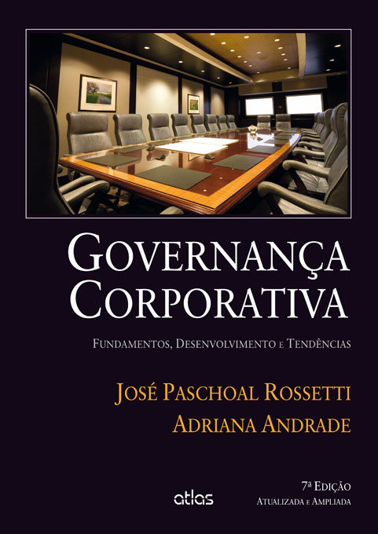
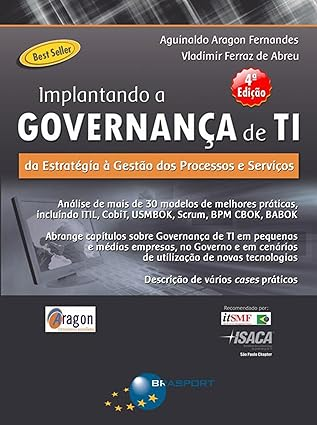

# Sobre estas anotações {.unnumbered}

—————————————————————————————————————————————

Estas anotações são apenas lembretes das aulas expostas em sala, durante a disciplina de Governança da Informação.

## ACESSO AO GITBOOK CELULAR

—————————————————————————————————————————————

#### <https://miguel7penteado.github.io/2025-2sem-GTI-Governanca>

## Leitores de formato de arquivo EPUB para SmartPhone

—————————————————————————————————————————————

### ANDROID

#### **Moon+ Reader**

{width="340"}

## Livros Texto da Disciplina

—————————————————————————————————————————————

### "Governança Corporativa" dos autores "**José Paschoal Rossetti e Adriana Andrade**"

|  |  |
|----|----|
| **Autor(es)** | [**José Paschoal Rossetti**](https://www.fdc.org.br/sobreafdc/professores/rossetti) **e [Adriana Andrade](https://tradeconbusiness.com.br/nossa-equipe/adriana-de-andrade-sole/)** |
| **Editora** | Atlas |
| **Idioma** | Português |
| **ISBN** | 9788522493050 |
| **Formato** | Capa dura |
| **Páginas** | 608 |
| **Código Biblioteca** |  |

### "Implantando a Governança de TI (4ª edição): Da estratégia à gestão de processos e serviços" dos autores "Aguinaldo Aragon Fernandes e Vladimir Ferraz de Abreu"

+-----------------------+-----------------------------------------------------------------------------------------------------------------------------------------------------------------+
| **Autor(es)**         | #### [Aguinaldo Aragon Fernandes](https://br.linkedin.com/in/aguinaldo-aragon-fernandes) e [Vladimir Ferraz de Abreu](https://br.linkedin.com/in/vladimirabreu) |
+-----------------------+-----------------------------------------------------------------------------------------------------------------------------------------------------------------+
| **Editora**           | BRASPORT                                                                                                                                                        |
+-----------------------+-----------------------------------------------------------------------------------------------------------------------------------------------------------------+
| **Idioma**            | Português                                                                                                                                                       |
+-----------------------+-----------------------------------------------------------------------------------------------------------------------------------------------------------------+
| **ISBN-13**           | 978-8574528441                                                                                                                                                  |
+-----------------------+-----------------------------------------------------------------------------------------------------------------------------------------------------------------+
| **Formato**           | Eletrônico                                                                                                                                                      |
+-----------------------+-----------------------------------------------------------------------------------------------------------------------------------------------------------------+
| **Páginas**           | 1198                                                                                                                                                            |
+-----------------------+-----------------------------------------------------------------------------------------------------------------------------------------------------------------+
| **Código Biblioteca** |                                                                                                                                                                 |
+-----------------------+-----------------------------------------------------------------------------------------------------------------------------------------------------------------+

## Calendário das aulas

—————————————————————————————————————————————

### 📅 Calendário da Disciplina - Campus Marquês de São Vicente

| Data       | Aula    | Tema                                       |
|------------|---------|--------------------------------------------|
| 05/08/2025 | Aula 1  | Aula Inaugural                             |
| 12/08/2025 | Aula 2  | O topo da Pirâmide                         |
| 19/08/2025 | Aula 3  | Assembléia dos Proprietários               |
| 26/08/2025 | Aula 4  | Conselhos da Empresa                       |
| 02/09/2025 | Aula 5  | C Level e Diretorias                       |
| 09/09/2025 | Aula 6  | Diretoria de Informática                   |
| 16/09/2025 | **NP1** | **Prova**                                  |
| 23/09/2025 | Aula 7  | Modelo COBIT 5.0                           |
| 30/09/2025 | Aula 8  | COBIT 5.0 - Os 5 Princípios                |
| 07/10/2025 | Aula 9  | COBIT 5.0 - Os 7 Habilitadores             |
| 14/10/2025 | Aula 10 | COBIT 5.0 - Implantação                    |
| 21/10/2025 | Aula 11 | COBIT 2019 - O que mudou em relação ao 5.0 |
| 28/10/2025 | Aula 12 | Revisão                                    |
| 04/11/2025 | **NP2** | **Prova**                                  |

------------------------------------------------------------------------

### 📅 Calendário da Disciplina - Campus Chácara Santo Antônio

| Data       | Aula    | Tema                                       |
|------------|---------|--------------------------------------------|
| 06/08/2025 | Aula 1  | Aula Inaugural                             |
| 13/08/2025 | Aula 2  | O topo da Pirâmide                         |
| 20/08/2025 | Aula 3  | Assembléia dos Proprietários               |
| 27/08/2025 | Aula 4  | Conselhos da Empresa                       |
| 03/09/2025 | Aula 5  | C Level e Diretorias                       |
| 10/09/2025 | Aula 6  | Diretoria de Informática                   |
| 17/09/2025 | **NP1** | **Prova**                                  |
| 24/09/2025 | Aula 7  | Modelo COBIT 5.0                           |
| 01/10/2025 | Aula 8  | COBIT 5.0 - Os 5 Princípios                |
| 08/10/2025 | Aula 9  | COBIT 5.0 - Os 7 Habilitadores             |
| 15/10/2025 | Aula 10 | COBIT 5.0 - Implantação                    |
| 22/10/2025 | Aula 11 | COBIT 2019 - O que mudou em relação ao 5.0 |
| 29/10/2025 | Aula 12 | Revisão                                    |
| 05/11/2025 | **NP2** | **Prova**                                  |

------------------------------------------------------------------------

## 📚 Ementa Resumida

-   Conhecer a Governança na Empresa

-   Conhecer a Governança de T.I.

-   Conhecer o Modelo COBIT 5.0

-   Vislumbrar o modelo COBIT 2019

    {width="331"}

------------------------------------------------------------------------

## 📝 Avaliação

-   **Provas (NP1 + NP2)**
-   **Prova Substitutiva**
-   **Exame**

## Alunos 2025 - 4o Semestre

—————————————————————————————————————————————

### Campus Chácara Santo Antônio

#### Turma TI3P40

| Matrícula |        Nome do aluno         |
|:---------:|:----------------------------:|
|  R191BJ3  |   ANDRESSA MARIA DA SILVA    |
|  R194GF6  | JOÃO VICTOR DE JESUS ANDRADE |
|  R1704D1  |  PALOMA FERNANDES D GERALDO  |
|  G7946I4  |    VINICIUS ALMEIDA SILVA    |

#### Turma TI4P40

| Matrícula |         Nome do aluno          |
|:---------:|:------------------------------:|
|  G958DB5  |    AGATHA CALUCIO SANTIAGO     |
|  G03IJD7  |   ALESSANDRA ALMEIDA RIBEIRO   |
|  G993FJ5  |  ANNA BEATRIZ TEIXEIRA SILVA   |
|  G9699B3  | CAMILA VICTORIA DE SOUZA SANTO |
|  G9787H7  |  LEONARDO GONCALVES R FONSECA  |
|  G978JB0  |   LIRIEL CHAIANE M OLIVEIRA    |
|  R0958I0  |      RENAN HENRIQUE SILVA      |
|  G94GFD1  |     VANESSA ALMEIDA SANTOS     |
|  G833EG6  | WESLEY PEREIRA DOS S DE SOUSA  |

### Campus Marquês de São Vicente

#### Turma TI3P13

| Matrícula |   Nome do aluno    |
|:---------:|:------------------:|
|  F35GAE8  | LUCAS SOUZA XAVIER |

#### Turma TI4P13

| Matrícula |         Nome do aluno         |
|:---------:|:-----------------------------:|
|  F358542  |    ANA JULIA DE O BARBOSA     |
|  R0416B5  |    CAUA MARTINS SILVESTRE     |
|  F359549  |       ERICA CALO SANTOS       |
|  R063HI0  |    FERNANDO ROCHA QUINHOLI    |
|  F359573  |  GABRIEL HENRIQUE M TEIXEIRA  |
|  R057BD6  |  GUILHERME JACOB M DE MACEDO  |
|  G960CJ8  | GUILHERME RENATO R DE QUEIROZ |
|  G978099  | ISABELA SASS MARTINS DE SOUZA |
|  F3591B9  |    JOAO VITOR SILVA SOUZA     |
|  G907582  |    KAROLINE VIEIRA ARAGAO     |
