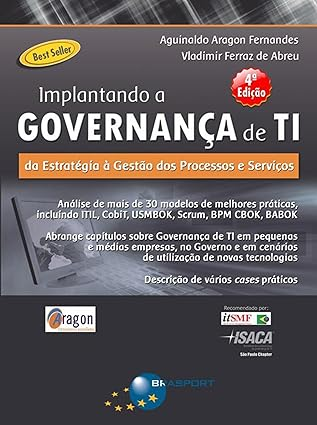

# Sobre estas anotações {.unnumbered}

—————————————————————————————————————————————

Estas anotações são apenas lembretes das aulas expostas em sala, durante a disciplina de Governança da Informação.

## ACESSO AO GITBOOK CELULAR

—————————————————————————————————————————————

#### <https://miguel7penteado.github.io/2025-2sem-GTI-Governanca>


## Leitores de formato de arquivo EPUB para SmartPhone

—————————————————————————————————————————————

### ANDROID

#### **Moon+ Reader**

{width="340"}

## Livros Texto da Disciplina

—————————————————————————————————————————————

### "Governança Corporativa" dos autores "**José Paschoal Rossetti e Adriana Andrade**"


+----------------------------------+------------------------------------------------------------------------------------------------------------------------------------------------------------------------------------+
| **Autor(es)**                    | [**José Paschoal Rossetti**](https://www.fdc.org.br/sobreafdc/professores/rossetti) **e [Adriana Andrade](https://tradeconbusiness.com.br/nossa-equipe/adriana-de-andrade-sole/)** |
+----------------------------------+------------------------------------------------------------------------------------------------------------------------------------------------------------------------------------+
| **Editora**                      | Atlas                                                                                                                                                                              |
+----------------------------------+------------------------------------------------------------------------------------------------------------------------------------------------------------------------------------+
| **Idioma**                       | Português                                                                                                                                                                          |
+----------------------------------+------------------------------------------------------------------------------------------------------------------------------------------------------------------------------------+
| **ISBN**                         | 9788522493050                                                                                                                                                                      |
+----------------------------------+------------------------------------------------------------------------------------------------------------------------------------------------------------------------------------+
| **Formato**                      | Capa dura                                                                                                                                                                          |
+----------------------------------+------------------------------------------------------------------------------------------------------------------------------------------------------------------------------------+
| **Páginas**                      | 608                                                                                                                                                                                |
+----------------------------------+------------------------------------------------------------------------------------------------------------------------------------------------------------------------------------+
| **Código Biblioteca**            |                                                                                                                                                                                    |
+----------------------------------+------------------------------------------------------------------------------------------------------------------------------------------------------------------------------------+

### "Implantando a Governança de TI (4ª edição): Da estratégia à gestão de processos e serviços" dos autores "Aguinaldo Aragon Fernandes e Vladimir Ferraz de Abreu"



+-----------------------+-----------------------------------------------------------------------------------------------------------------------------------------------------------------+
| **Autor(es)**         | #### [Aguinaldo Aragon Fernandes](https://br.linkedin.com/in/aguinaldo-aragon-fernandes) e [Vladimir Ferraz de Abreu](https://br.linkedin.com/in/vladimirabreu) |
+-----------------------+-----------------------------------------------------------------------------------------------------------------------------------------------------------------+
| **Editora**           | BRASPORT                                                                                                                                                        |
+-----------------------+-----------------------------------------------------------------------------------------------------------------------------------------------------------------+
| **Idioma**            | Português                                                                                                                                                       |
+-----------------------+-----------------------------------------------------------------------------------------------------------------------------------------------------------------+
| **ISBN-13**           | 978-8574528441                                                                                                                                                  |
+-----------------------+-----------------------------------------------------------------------------------------------------------------------------------------------------------------+
| **Formato**           | Eletrônico                                                                                                                                                      |
+-----------------------+-----------------------------------------------------------------------------------------------------------------------------------------------------------------+
| **Páginas**           | 1198                                                                                                                                                            |
+-----------------------+-----------------------------------------------------------------------------------------------------------------------------------------------------------------+
| **Código Biblioteca** |                                                                                                                                                                 |
+-----------------------+-----------------------------------------------------------------------------------------------------------------------------------------------------------------+

## Calendário das aulas

—————————————————————————————————————————————

##### AGOSTO DE 2025

| Data       | Dia da Semana | Aulas          | Conteúdo |
|------------|---------------|----------------|----------|
| 06/08/2025 | Quarta-Feira  | Aula Inaugural |          |
| 13/08/2025 | Quarta-Feira  | Aula 2         |          |
| 20/08/2025 | Quarta-Feira  | Aula 3         |          |
| 27/08/2025 | Quarta-Feira  | Aula 4         |          |

##### SETEMBRO DE 2025

| Data       | Dia da Semana | Aulas  | Conteúdo |
|------------|---------------|--------|----------|
| 03/09/2025 | Quarta-Feira  | Aula 5 |          |
| 10/09/2025 | Quarta-Feira  | Aula 6 |          |
| 17/09/2025 | Quarta-Feira  | NP1    | PROVA    |
| 24/09/2025 | Quarta-Feira  | Aula 7 |          |

##### OUTUBRO DE 2025

| Data       | Dia da Semana | Aulas   | Conteúdo |
|------------|---------------|---------|----------|
| 01/10/2025 | Quarta-Feira  | Aula 8  |          |
| 08/10/2025 | Quarta-Feira  | Aula 9  |          |
| 15/10/2025 | Quarta-Feira  | Aula 10 |          |
| 22/10/2025 | Quarta-Feira  | Aula 11 |          |
| 29/10/2025 | Quarta-Feira  | Aula 12 |          |

##### NOVEMBRO DE 2025

| Data       | Dia da Semana | Aulas | Conteúdo |
|------------|---------------|-------|----------|
| 05/11/2025 | Quarta-Feira  | NP2   | PROVA    |
| 12/11/2025 | Quarta-Feira  |       | N/A      |
| 19/11/2025 | Quarta-Feira  | SUB   | PROVA    |
| 26/11/2025 | Quarta-Feira  |       | N/A      |

##### DEZEMBRO DE 2025

| Data       | Dia da Semana | Aulas | Conteúdo |
|------------|---------------|-------|----------|
| 03/12/2025 | Quarta-Feira  |       | N/A      |
| 10/12/2025 | Quarta-Feira  | EXAME | PROVA    |
| 17/12/2025 | Quarta-Feira  |       | N/A      |
| 24/12/2025 | Quarta-Feira  |       | NATAL    |
| 31/12/2025 | Quarta-Feira  |       | Confrat  |

## Alunos 2025 - 2o Semestre

—————————————————————————————————————————————

### Campus Chácara Santo Antônio

#### Turma TI3P40

| Matrícula |        Nome do aluno         |
|:---------:|:----------------------------:|
|  R191BJ3  |   ANDRESSA MARIA DA SILVA    |
|  R194GF6  | JOÃO VICTOR DE JESUS ANDRADE |
|  R1704D1  |  PALOMA FERNANDES D GERALDO  |
|  G7946I4  |    VINICIUS ALMEIDA SILVA    |

#### Turma TI4P40

| Matrícula |         Nome do aluno          |
|:---------:|:------------------------------:|
|  G958DB5  |    AGATHA CALUCIO SANTIAGO     |
|  G03IJD7  |   ALESSANDRA ALMEIDA RIBEIRO   |
|  G993FJ5  |  ANNA BEATRIZ TEIXEIRA SILVA   |
|  G9699B3  | CAMILA VICTORIA DE SOUZA SANTO |
|  G9787H7  |  LEONARDO GONCALVES R FONSECA  |
|  G978JB0  |   LIRIEL CHAIANE M OLIVEIRA    |
|  R0958I0  |      RENAN HENRIQUE SILVA      |
|  G94GFD1  |     VANESSA ALMEIDA SANTOS     |
|  G833EG6  | WESLEY PEREIRA DOS S DE SOUSA  |

### Campus Marquês de São Vicente

#### Turma TI3P13

| Matrícula |   Nome do aluno    |
|:---------:|:------------------:|
|  F35GAE8  | LUCAS SOUZA XAVIER |

#### Turma TI4P13

| Matrícula |         Nome do aluno         |
|:---------:|:-----------------------------:|
|  F358542  |    ANA JULIA DE O BARBOSA     |
|  R0416B5  |    CAUA MARTINS SILVESTRE     |
|  F359549  |       ERICA CALO SANTOS       |
|  R063HI0  |    FERNANDO ROCHA QUINHOLI    |
|  F359573  |  GABRIEL HENRIQUE M TEIXEIRA  |
|  R057BD6  |  GUILHERME JACOB M DE MACEDO  |
|  G960CJ8  | GUILHERME RENATO R DE QUEIROZ |
|  G978099  | ISABELA SASS MARTINS DE SOUZA |
|  F3591B9  |    JOAO VITOR SILVA SOUZA     |
|  G907582  |    KAROLINE VIEIRA ARAGAO     |


```{r imprimir-01, eval=FALSE, include=FALSE}
rmarkdown::render("03-2025-08-19_20_.Rmd", output_dir="docs", output_file ="temporario.html" , output_format = "html_document") ; utils::browseURL("docs/temporario.html")
```

